# [로그라이크 프로젝트]

## 💻 팀원 목록

| 학번       | 이름  | 이메일                    |
|:---------|:----|:-----------------------|
| 22012139 | 김도경 | kjkkjs5252@gmail.com   |
| 22012140 | 김병규 | rlaqudrbabcd@gmail.com |
| 22112089 | 백승헌 | hun4758@gmail.com      |
| 22213499 | 정태현 | ghgh036034@gmail.com   |
| 22311884 | 유민서 | winteryu21@gmail.com   |
| 22313530 | 배원일 | dnjsdlf325@gmail.com   |

## 📜 Revision history

| Revision date | Version # | Description                       | Author |
|:--------------|:----------|:----------------------------------|:-------|
| 10/29/2025    | 1.00      | Use Case Diagram 및 Description 작성 | 유민서    |
| 11/07/2025    | 2.00      | 11월 1주차 검토 완료                     | 유민서    |

## = Contents =

* [1. Introduction](#1-introduction)
* [2. Use case analysis](#2-use-case-analysis)
* [3. Class diagram](#3-class-diagram)
* [4. Sequence diagram](#4-sequence-diagram)
* [5. State machine diagram](#5-state-machine-diagram)
* [6. User interface prototype](#6-user-interface-prototype)
* [7. Implementation requirements](#7-implementation-requirements)
* [8. Glossary](#8-glossary)
* [9. References](#9-references)

---

# 1. Introduction

&ensp;본 문서는 우리 팀이 개발하고자 하는 탑다운 시점 로그라이크 액션 게임 프로젝트의 Software Design Specification(SDS)이다. 게임 개발 과정에서 필요한 기능적 요구사항을 구체화하고, 시스템의 구조적 및 동작적 설계 내용을 명확히 제시하는 것을 목적으로 한다. 

&ensp;SDS는 게임의 핵심 시스템과 주요 기능을 정의하여 프로젝트 구성원이 공통된 이해를 바탕으로 일관성 있는 개발을 진행할 수 있도록 지원하며, 향후 유지보수 및 확장 개발 시 표준 참조 문서로 활용된다.

&ensp;Use Case Analysis는 사용자 관점에서의 주요 기능 및 시나리오를 정의하였고, Class Diagram은 시스템의 구조 및 클래스 간 관계를 나타낸다. 

&ensp;Sequence Diagram과 State Machine Diagram은 게임 시스템의 동작 흐름 및 상태 전이 과정을 기술하며, User Interface 설계는 게임의 화면 구성과 사용자 인터페이스 동작을 묘사하였다.
본 SDS 문서에서는 각 다이어그램과 구성 요소 간의 일관성 검토를 중요하게 생각했다. 특히, 메서드 명칭이나 호출 구조의 불일치는 설계 및 구현상의 오류로 이어질 수 있기 때문에 Class Diagram에 정의된 메서드 이름이 Sequence Diagram에서 동일하게 사용되었는지를 검토했다. 또한, UI Prototype의 화면 전환 흐름이 GameManager의 State Machine Diagram과 일치하는지 검토해야 하며, 게임의 상태가 UI 설계와 정확히 대응되어야 한다.

&ensp;본 프로젝트는 다음과 같은 개발 환경과 도구를 기반으로 진행된다. 게임 엔진은 Unity를 사용하고, 개발 언어는 C#을 사용한다. Unity 엔진을 활용한 개발은 빠른 프로토타이핑과 다양한 플랫폼 지원을 가능하게 한다. GitHub을 통한 형상 관리는 협업 효율성과 버전 추적의 용이성을 제공한다.

---

# 2. Use case analysis

## 2.1 Use Case Diagram

&ensp;본 2장에서는 사용자가 시스템을 통해 수행할 수 있는 기능들을 식별하고 명세하는 Use Case Diagram과 Use Case Description을 제공한다.

&ensp;아래의 Use Case Diagram은 사용자의 흐름에 따라 시스템을 '메인 화면', '인게임', '결과 화면'의 세 가지 패키지(Package)로 나누어 구성하였다. 이를 통해 각 시나리오에서 사용자가 수행할 수 있는 주요 기능(Use Case)과, 특정 조건에서만 발생하는 확장 관계(<<extend>>)를 시각적으로 명확히 파악할 수 있다.

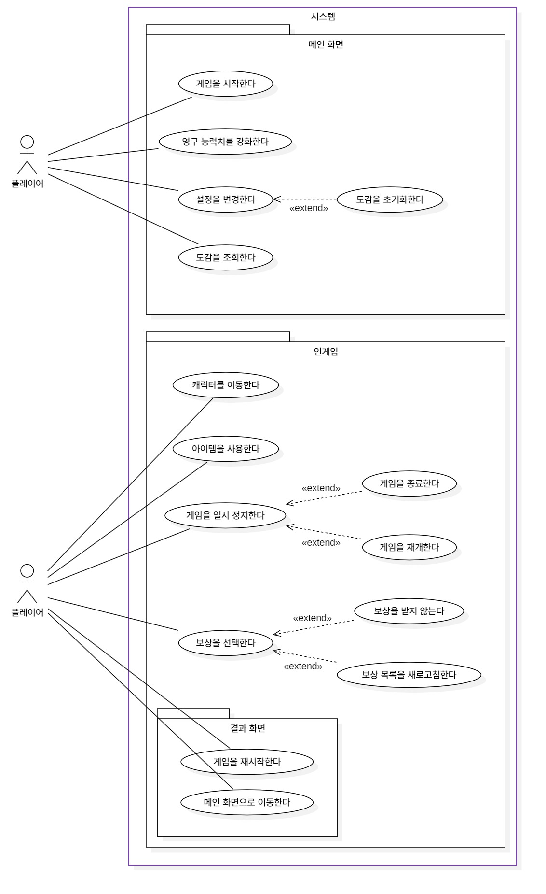

## 2.2 Use Case Descriptions

### Use case #[1] : 게임을 시작한다

| **GENERAL CHARACTERISTICS** |                                             |
|:----------------------------|:--------------------------------------------|
| **Summary**                 | 플레이어가 메인 화면에서 인게임 씬으로 진입하는 기능               |
| **Scope**                   | 메인 화면                                       |
| **Level**                   | User level                                  |
| **Author**                  | 유민서                                         |
| **Last Update**             | 2025. 10. 29                                |
| **Status**                  | Analysis                                    |
| **Primary Actor**           | 플레이어                                        |
| **Preconditions**           | 플레이어가 '메인화면' 씬에 있어야 한다.                     |
| **Trigger**                 | 플레이어가 '게임 시작' 버튼을 클릭했을 때                    |
| **Success Post Condition**  | 현재 씬이 '인게임'으로 전환된다.                         |
| **Failed Post Condition**   | 실패 조건 없음                                    |

| **MAIN SUCCESS SCENARIO** |                                                  |
|:--------------------------|:-------------------------------------------------|
| **Step**                  | **Action**                                       |
| S                         | 플레이어가 게임을 시작한다.                                  |
| 1                         | 이 Use case는 플레이어가 메인 화면에서 '게임 시작' 버튼을 누를 때 시작된다. |
| 2                         | 시스템은 씬을 '메인 화면'에서 '인게임'으로 전환한다.                  |
| 3                         | 시스템은 인게임 시스템(타이머, 몬스터 스폰 등)을 초기화하고 동작시킨다.        |
| 4                         | 이 Use case는 인게임 씬이 성공적으로 로드되면 종료된다.              |

| **RELATED INFORMATION** |              |
|:------------------------|:-------------|
| **Performance**         | 씬 로딩 시간 ≤ 3초 |
| **Frequency**           | 세션 당 1회      |
| **Concurrency**         |              |
| **Due Date**            |              |

### Use case #[2] : 게임을 일시 정지한다

| **GENERAL CHARACTERISTICS** |                                                 |
|:----------------------------|:------------------------------------------------|
| **Summary**                 | 플레이어가 게임의 모든 동작을 멈추고 일시 정지 화면을 호출하는 기능          |
| **Scope**                   | 인게임                                             |
| **Level**                   | User level                                      |
| **Author**                  | 유민서                                             |
| **Last Update**             | 2025. 11. 06.                                   |
| **Status**                  | Analysis                                        |
| **Primary Actor**           | 플레이어                                            |
| **Preconditions**           | 플레이어가 '인게임' 씬에서 게임을 플레이 중이어야 한다.                |
| **Trigger**                 | 플레이어가 ESC 키를 눌렀을 때                              |
| **Success Post Condition**  | 게임의 모든 인게임 시스템 동작이 일시 중단되고, 일시 정지 화면이 호출된다.     |
| **Failed Post Condition**   | 실패 조건 없음                                        |

| **MAIN SUCCESS SCENARIO** |                                                          |
|:--------------------------|:---------------------------------------------------------|
| **Step**                  | **Action**                                               |
| S                         | 플레이어가 게임을 일시 정지한다.                                       |
| 1                         | 이 Use case는 플레이어가 ESC 키를 누르거나, 게임 프로세스가 포커스를 잃었을 때 시작된다. |
| 2                         | 시스템은 시간 측정, 몬스터 이동 등 모든 인게임 시스템 동작을 중단시킨다.               |
| 3                         | 시스템은 일시 정지 화면을 호출하며, 현재 진행 상황(보유 장비 등)을 요약하여 표시한다.       |
| 4                         | 시스템은 플레이어의 '계속하기' 또는 '게임 종료' 선택을 대기한다.                   |

| **EXTENSION SCENARIOS** |                                                                                                                  |
|:------------------------|:-----------------------------------------------------------------------------------------------------------------|
| **Step**                | **Branching Action**                                                                                             |
| 4                       | 4a. 플레이어가 '계속하기' 버튼을 클릭한다.   …4a1. 시스템은 일시 정지 화면을 닫고, 중단되었던 모든 인게임 시스템 동작을 재개한다. ...4a2. Use Case가 종료된다. |
| 4                       | 4b. 플레이어가 '게임 종료' 버튼을 클릭한다.   ...4b1. 시스템은 전체 게임 시스템을 종료한다.                                                  |

| **RELATED INFORMATION** |                 |
|:------------------------|:----------------|
| **Performance**         | 즉시 반응 ≤ 0.1초    |
| **Frequency**           | 플레이어의 판단에 따라 다름 |
| **<Concurrency>**       | 제한 없음           |
| **Due Date**            |                 |

### Use case #[3] : 보상을 선택한다

| **GENERAL CHARACTERISTICS** |                                                 |
|:----------------------------|:------------------------------------------------|
| **Summary**                 | 플레이어가 레벨 업 또는 보스 처치 시 나타나는 3개의 보상 중 하나를 선택하는 기능 |
| **Scope**                   | 인게임                                             |
| **Level**                   | User level                                      |
| **Author**                  | 유민서                                             |
| **Last Update**             | 2025. 10. 29.                                   |
| **Status**                  | Analysis                                        |
| **Primary Actor**           | 플레이어                                            |
| **Preconditions**           | 플레이어의 캐릭터가 레벨 업 하거나, 보물 상자를 획득해야 한다.            |
| **Trigger**                 | 시스템이 '보상 화면'을 호출했을 때                            |
| **Success Post Condition**  | 플레이어가 선택한 보상이 캐릭터에 적용되고, 보상 화면이 닫힌 후 게임이 재개된다.  |
| **Failed Post Condition**   | 실패 조건 없음                                        |

| **MAIN SUCCESS SCENARIO** |                                                |
|:--------------------------|:-----------------------------------------------|
| **Step**                  | **Action**                                     |
| S                         | 플레이어가 보상을 선택한다.                                |
| 1                         | 이 Use case는 시스템이 보상 화면을 호출할 때 시작된다.            |
| 2                         | 시스템은 3개의 선택 가능한 보상 목록을 표시한다.                   |
| 3                         | 플레이어가 3개의 보상 중 하나를 선택하고 클릭한다.                  |
| 4                         | 시스템은 선택된 보상('장비 획득' 또는 '기존 장비 강화')을 캐릭터에 적용한다. |
| 5                         | 시스템은 보상 화면을 닫고 게임을 재개한다.                       |
| 6                         | 이 Use case는 보상 적용이 완료되면 종료된다.                  |

| **EXTENSION SCENARIOS** |                                                                                                                                             |
|:------------------------|:--------------------------------------------------------------------------------------------------------------------------------------------|
| **Step**                | **Branching Action**                                                                                                                        |
| 3                       | 3a. 플레이어가 '보상 목록 새로고침' 버튼을 클릭한다 …3a1. 시스템은 'Use Case #[4] : 보상을 새로 고침한다'를 실행한다. …3a2. 'Use Case #[4]'가 성공적으로 종료되면, 3단계(보상 선택)로 돌아간다. |
| 3                       | 3b. 플레이어가 '건너뛰기'를 선택한다. …3b1. 시스템은 보상 화면을 닫고 플레이어에게 일정량의 경험치를 지급한다. ...3b2. Use case가 종료된다.                                         |

| **RELATED INFORMATION** |                      |
|:------------------------|:---------------------|
| **Performance**         | 즉시 반응 ≤ 0.1초         |
| **Frequency**           | 레벨 업 또는 보스 처치 시마다 발생 |
| **Concurrency**         | 제한 없음                |
| **Due Date**            |                      |

### Use case #[4] : 보상을 새로 고침한다.

| **GENERAL CHARACTERISTICS** |                                                                                                                                                                                                                                                                       |
|:----------------------------|:----------------------------------------------------------------------------------------------------------------------------------------------------------------------------------------------------------------------------------------------------------------------|
| **Summary**                 | 보상목록을 재화를 이용하여 새로고침 하는 기능                                                                                                                                                                                                                                             |
| **Scope**                   | 인게임                                                                                                                                                                                                                                                                   |
| **Level**                   | User level                                                                                                                                                                                                                                                            |
| **Author**                  | 김도경                                                                                                                                                                                                                                                                   |
| **Last Update**             | 2025. 11. 07.                                                                                                                                                                                                                                                         |
| **Status**                  | Analysis                                                                                                                                                                                                                                                              |
| **Primary Actor**           | 플레이어                                                                                                                                                                                                                                                                  |
| **Preconditions**           | (조건1) 플레이어가 보상 화면에 있어야 한다 (조건2) 플레이어의 재화가 '새로고침'에 필요한 양보다 많거나 같아야 한다. (조건3) 다음 조건 중 하나를 만족해야 함: - 플레이어의 장비 슬롯에 여유가 있다. - 플레이어의 장비 중 최대 레벨이 아닌 것이 하나 이상 있다.  > (참고): 사전 조건 2 또는 3이 충족되지 않으면, 이 Use Case는 시작될 수 없다. (이는 UI에서 '새로고침' 버튼이 비활성화됨을 의미한다.) |
| **Trigger**                 | 플레이어가 '새로고침' 버튼을 눌렀을때                                                                                                                                                                                                                                                 |
| **Success Post Condition**  | 보상 목록 3개가 전부 다른 것으로 새로고침 된다.                                                                                                                                                                                                                                          |
| **Failed Post Condition**   | 실패 조건 없음                                                                                                                                                                                                                                                              |

| **MAIN SUCCESS SCENARIO** |                                          |
|:--------------------------|:-----------------------------------------|
| **Step**                  | **Action**                               |
| S                         | 플레이어가 보상을 '새로고침' 한다.                     |
| 1                         | 이 Use case는 플레이어가 '새로고침' 버튼을 눌렀을 때 시작된다. |
| 2                         | 시스템은 플레이어의 재화를 소모한다.                     |
| 2                         | 시스템은 3개의 보상 목록을 새로고침하여 다시 표시한다.          |
| 3                         | 이 Use case가 종료된다.                        |

| **EXTENSION SCENARIOS** |                     |
|:------------------------|:--------------------|
| **Step**                | **BranchingAction** |
|

| **RELATED INFORMATION** |                        |
|:------------------------|:-----------------------|
| **Performance**         | 새로 고침 시간 ≤ 1초          |
| **Frequency**           | 플레이어가 새로고침 버튼을 누를 때 발생 |
| **Concurrency**         | 제한 없음                  |
| **Due Date**            |                        |

### Use case #[5] : 보상을 건너뛴다.

| **GENERAL CHARACTERISTICS** |                            |
|:----------------------------|:---------------------------|
| **Summary**                 | 보상목록을 건너뛰는 기능              |
| **Scope**                   | 인게임                        |
| **Level**                   | User level                 |
| **Author**                  | 김도경                        |
| **Last Update**             | 2025. 11. 07.              |
| **Status**                  | Analysis                   |
| **Primary Actor**           | 플레이어                       |
| **Preconditions**           | 플레이어가 보상 화면에 있어야한다.        |
| **Trigger**                 | 플레이어가 '건너뛰기' 버튼을 눌렀을 때     |
| **Success Post Condition**  | 보상 목록이 닫히고 일정량의 경험치를 획득한다. |
| **Failed Post Condition**   | 실패 조건 없음                   |

| **MAIN SUCCESS SCENARIO** |                                          |
|:--------------------------|:-----------------------------------------|
| **Step**                  | **Action**                               |
| S                         | 플레이어가 보상을 '건너뛰기' 한다.                     |
| 1                         | 이 Use case는 플레이어가 '건너뛰기' 버튼을 눌렀을 때 시작된다. |
| 2                         | 시스템은 보상 화면을 닫고 플레이어에게 일정량의 경험치를 지급한다.    |
| 3                         | Use Case가 종료된다.                          |

| **EXTENSION SCENARIOS** |                     |
|:------------------------|:--------------------|
| **Step**                | **BranchingAction** |
|

| **RELATED INFORMATION** |                          |
|:------------------------|:-------------------------|
| **Performance**         | 건너뛰기 시간 ≤ 1초             |
| **Frequency**           | 플레이어가 '건너뛰기' 버튼을 누를 때 발생 |
| **Concurrency**         | 제한 없음                    |
| **Due Date**            |                          |

### Use case #[6] : 캐릭터를 이동한다

| **GENERAL CHARACTERISTICS** |                                                  |
|:----------------------------|:-------------------------------------------------|
| **Summary**                 | 플레이어가 키보드를 조작하여 캐릭터를 맵 상에서 8방향으로 자유롭게 이동시키는 기능   |
| **Scope**                   | 인게임                                              |
| **Level**                   | User level                                       |
| **Author**                  | 유민서                                              |
| **Last Update**             | 2025. 11. 06.                                    |
| **Status**                  | Analysis                                         |
| **Primary Actor**           | 플레이어                                             |
| **Preconditions**           | 플레이어가 '인게임' 씬에서 게임을 플레이 중이며, 캐릭터가 움직일 수 있는 상태이다. |
| **Trigger**                 | 플레이어가 W, A, S, D 키 중 하나 이상을 누르고 있을 때             |
| **Success Post Condition**  | 캐릭터가 플레이어가 입력한 방향으로 이동한다.                        |
| **Failed Post Condition**   | 실패 조건 없음                                         |

| **MAIN SUCCESS SCENARIO** |                                                     |
|:--------------------------|:----------------------------------------------------|
| **Step**                  | **Action**                                          |
| S                         | 플레이어가 캐릭터를 이동한다.                                    |
| 1                         | 이 Use case는 플레이어가 W, A, S, D 중 하나 이상의 키를 누를 때 시작된다. |
| 2                         | 시스템은 플레이어의 키 입력(상하좌우 또는 대각선)을 감지한다.                 |
| 3                         | 캐릭터는 해당 방향으로 CHA.Stat.1에 정의된 '이동 속도'에 맞춰 이동한다.      |
| 4                         | 이 Use case는 플레이어가 키에서 손을 떼어 이동 입력을 멈출 때 종료된다.       |

| **EXTENSION SCENARIOS** |                                                                   |
|:------------------------|:------------------------------------------------------------------|
| **Step**                | **Branching Action**                                              |
| 3                       | 3a. 캐릭터가 이동 중 경험치 구슬 범위 내에 접근한다. …3a1. 경험치 구슬이 캐릭터 방향으로 끌려온다. |
| 3                       | 3b. 캐릭터가 이동 중 아이템 범위 내에 접근한다.  ...3b1. 해당 아이템의 갯수를 1개 증가시킨다.  |

| **RELATED INFORMATION** |                     |
|:------------------------|:--------------------|
| **Performance**         | 입력 지연 ≤ 0.05초       |
| **Frequency**           | 인게임 플레이 내내 지속적으로 발생 |
| **Concurrency**         | 제한 없음               |
| **Due Date**            |                     |

### Use case #[7] : 영구 능력치를 강화한다

| **GENERAL CHARACTERISTICS** |                                                |
|:----------------------------|:-----------------------------------------------|
| **Summary**                 | 플레이어가 능력치 강화화면에서 캐릭터의 기본 능력치를 올리는 기능           |
| **Scope**                   | 메인 화면                                          |
| **Level**                   | User level                                     |
| **Author**                  | 김병규                                            |
| **Last Update**             | 2025. 11. 06.                                  |
| **Status**                  | Analysis                                       |
| **Primary Actor**           | 플레이어                                           |
| **Preconditions**           | '캐릭터 강화' 패널이 띄워져 있으며, 강화에 요구되는 충분한 재화가 있어야 한다. |
| **Trigger**                 | 플레이어가 강화하려는 능력치의 버튼을 클릭했을 때                    |
| **Success Post Condition**  | 선택한 강화 단계가 한 단계 증가한다.                          |
| **Failed Post Condition**   | 실패 조건 없음                                       |

| **MAIN SUCCESS SCENARIO** |                                                          |
|:--------------------------|:---------------------------------------------------------|
| **Step**                  | **Action**                                               |
| S                         | 플레이어가 캐릭터의 능력치를 강화한다.                                    |
| 1                         | 이 Use case는 플레이어가 캐릭터 강화화면에서 강화를 원하는 능력치의 버튼을 누를 때 시작된다. |
| 2                         | 시스템은 플레이어가 선택한 능력치 강화를 한 단계 증가시킨다.                       |
| 3                         | 이 Use case는 능력치를 증가시킨 후 종료된다.                            |

| **EXTENSION SCENARIOS** |                                                                                              |
|:------------------------|:---------------------------------------------------------------------------------------------|
| **Step**                | **Branching Action**                                                                         |
| 2                       | 2a. 플레이어가 강화에 필요한 충분한 재화를 가지고 있지 않다.  ...2a1. 능력치의 변화는 없으며, 강화에 필요한 재화가 부족함을 시각적으로 표시한다. |
| 2                       | 2b. 플레이어가 선택한 능력치가 이미 최대 강화에 도달했다.  ...2b1. 능력치의 변화는 없으며, 해당 능력치 강화 버튼이 비활성화된다.          |

| **RELATED INFORMATION** |                             |
|:------------------------|:----------------------------|
| **Performance**         | 즉시 반응 ≤ 0.1초                |
| **Frequency**           | 플레이어가 능력치 강화 버튼을 클릭 할때마다 발생 |
| **Concurrency**         | 제한 없음                       |
| **Due Date**            |                             |

### Use case #[8] : 도감을 조회한다.

| **GENERAL CHARACTERISTICS** |                                          |
|:----------------------------|:-----------------------------------------|
| **Summary**                 | 게임에 등장한 오브젝트들(몬스터, 장비, 아이템)의 정보를 조회하는 기능 |
| **Scope**                   | 메인 화면                                    |
| **Level**                   | User level                               |
| **Author**                  | 김병규                                      |
| **Last Update**             | 2025. 11. 06.                            |
| **Status**                  | Analysis                                 |
| **Primary Actor**           | 플레이어                                     |
| **Preconditions**           | 플레이어가 '메인 화면' 씬에 있어야 한다.                 |
| **Trigger**                 | 플레이어가 '도감' 버튼을 클릭했을 때                    |
| **Success Post Condition**  | 현재 씬이 도감 화면으로 전환된다.                      |
| **Failed Post Condition**   | 실패 조건 없음                                 |

| **MAIN SUCCESS SCENARIO** |                                                         |
|:--------------------------|:--------------------------------------------------------|
| **Step**                  | **Action**                                              |
| S                         | 플레이어가 오브젝트의 상세정보를 조회한다.                                 |
| 1                         | 이 Use case는 플레이어가 메인 화면의 '도감' 버튼을 누를 때 시작된다.            |
| 2                         | 시스템은 오브젝트를 종류별(몬스터, 장비, 아이템)로 조회할 수 있는 화면을 제공한다.        |
| 3                         | 플레이어는 오브젝트 종류와 조회할 오브젝트를 선택하여 해당 오브젝트의 그림, 상세 정보를 확인한다. |
| 4                         | 이 Use case는 단계 3을 반복하다가 플레이어가 '뒤로 가기' 버튼을 누르면 종료된다.     |

| **EXTENSION SCENARIOS** |                                                                                                               |
|:------------------------|:--------------------------------------------------------------------------------------------------------------|
| **Step**                | **Branching Action**                                                                                          |
| 3                       | 3a. 플레이어가 게임에서 잡지 못한 몬스터나 획득한 적 없는 장비, 아이템의 정보는 확인할 수 없다.   ...3a1 해당 오브젝트들은 실루엣으로만 표시하고 상세 정보를 표시하지 않는다. |

| **RELATED INFORMATION** |                      |
|:------------------------|:---------------------|
| **Performance**         | 즉시 반응 ≤ 0.1초         |
| **Frequency**           | 플레이어 당 게임 플레이에 평균 2번 |
| **Concurrency**         | 제한 없음                |
| **Due Date**            |                      |

### Use case #[9] : 설정을 변경한다

| **GENERAL CHARACTERISTICS** |                                           |
|:----------------------------|:------------------------------------------|
| **Summary**                 | 게임의 설정을 플레이어가 본인 환경에 맞게 변경하는 기능           |
| **Scope**                   | 메인 화면                                     |
| **Level**                   | User level                                |
| **Author**                  | 김병규                                       |
| **Last Update**             | 2025. 11. 06.                             |
| **Status**                  | Analysis                                  |
| **Primary Actor**           | 플레이어                                      |
| **Preconditions**           | 플레이어가 플레이어가 메인 화면 혹은 인게임의 일시 정지상태에 있어야한다. |
| **Trigger**                 | 플레이어가 '설정' 버튼을 클릭했을 때                     |
| **Success Post Condition**  | 플레이어가 선택한 설정에 따라 화면 크기, 음향 등이 변경된다.       |
| **Failed Post Condition**   | 실패 조건 없음                                  |

| **MAIN SUCCESS SCENARIO** |                                              |
|:--------------------------|:---------------------------------------------|
| **Step**                  | **Action**                                   |
| S                         | 플레이어가 게임의 설정을 변경한다.                          |
| 1                         | 이 Use case는 플레이어가 '설정' 버튼을 누르면 시작된다.         |
| 2                         | 시스템은 '설정' 버튼을 눌렀던 화면위에 설정 패널을 띄운다.           |
| 3                         | 플레이어는 각종 설정(화면 크기, 해상도, 음향)을 본인 환경에 맞게 설정한다. |
| 4                         | 플레이어가 '적용하기' 버튼을 누르면 입력한 설정으로 환경이 변경된다.      |
| 5                         | 이 Use case는 단계 플레이어가 '닫기' 버튼을 누르면 종료된다.      |

| **EXTENSION SCENARIOS** |                                                                               |
|:------------------------|:------------------------------------------------------------------------------|
| **Step**                | **Branching Action**                                                          |
| 3                       | 3a. 설정창에서 '도감 초기화' 버튼을 누른다.   ...3a1 현재 도감의 상태를 해금된 오브젝트가 없는 초기 상태로 되돌린다. |
| 3                       | 3b. 설정창에서 '불륨' 슬라이드를 조절한다.   ...3b1 슬라이드의 위치에 따라 불륨 수치가 조절된다.             |
| 3                       | 3c. 설정창에서 '전체화면' 버튼을 토글한다.   ...3c1 현재 상태에 따라 전체화면, 창모드로 전환된다.            |

| **RELATED INFORMATION** |                      |
|:------------------------|:---------------------|
| **Performance**         | 설정 변경 시간 ≤ 1초        |
| **Frequency**           | 플레이어 당 게임 플레이에 평균 1번 |
| **Concurrency**         | 제한 없음                |
| **Due Date**            |                      |

### Use case #[10] : 도감을 초기화한다.

| **GENERAL CHARACTERISTICS** |                           |
|:----------------------------|:--------------------------|
| **Summary**                 | 플레이어가 모은 도감을 초기화하는 기능     |
| **Scope**                   | 메인 화면                     |
| **Level**                   | User level                |
| **Author**                  | 김도경                       |
| **Last Update**             | 2025. 11. 07.             |
| **Status**                  | Analysis                  |
| **Primary Actor**           | 플레이어                      |
| **Preconditions**           | 플레이어가 설정창을 열고 있어야한다.      |
| **Trigger**                 | 플레이어가 '도감 초기화' 버튼을 클릭했을 때 |
| **Success Post Condition**  | 도감이 아무것도 없는 상태로 초기화된다.    |
| **Failed Post Condition**   | 실패 조건 없음                  |

| **MAIN SUCCESS SCENARIO** |                                           |
|:--------------------------|:------------------------------------------|
| **Step**                  | **Action**                                |
| S                         | 플레이어가 도감을 초기화한다.                          |
| 1                         | 이 Use case는 플레이어가 '도감 초기화' 버튼을 눌렀을때 시작된다. |
| 2                         | 시스템이 도감을 초기화한다.                           |
| 3                         | 이 Use case는 '도감 초기화' 버튼을 누르면 종료된다.        |

| **RELATED INFORMATION** |                         |
|:------------------------|:------------------------|
| **Performance**         | 도감 초기화 시간 ≤ 1초          |
| **Frequency**           | 플레이어가 '도감 초기화' 버튼을 누를 때 |
| **Concurrency**         | 제한 없음                   |
| **Due Date**            |                         |

### Use case #[11] : 아이템을 사용한다.

| **GENERAL CHARACTERISTICS** |                                  |
|:----------------------------|:---------------------------------|
| **Summary**                 | 게임 중 얻은 아이템들을 사용하는 기능            |
| **Scope**                   | 인게임                              |
| **Level**                   | User level                       |
| **Author**                  | 김병규                              |
| **Last Update**             | 2025. 11. 06.                    |
| **Status**                  | Analysis                         |
| **Primary Actor**           | 플레이어                             |
| **Preconditions**           | 플레이어가 '인게임' 씬에서 게임을 플레이 중이어야 한다. |
| **Trigger**                 | 플레이어가 아이템 사용에 할당된 키를 입력했을 때      |
| **Success Post Condition**  | 입력한 키에 따른 아이템을 사용한다.             |
| **Failed Post Condition**   | 아이템이 사용되지 않는다.                   |

| **MAIN SUCCESS SCENARIO** |                                                          |
|:--------------------------|:---------------------------------------------------------|
| **Step**                  | **Action**                                               |
| S                         | 플레이어가 인게임에서 획득한 아이템을 사용한다.                               |
| 1                         | 이 Use case는 플레이어가 아이템 사용 키(숫자키 1,2,3)를 누를 때 시작된다.        |
| 2                         | 시스템은 입력받은 키에 해당하는 아이템의 효과를 게임에 적용하고, 해당 아이템의 개수를 하나 줄인다. |
| 3                         | 이 Use case는 아이템의 효과가 사용되고 나면 종료된다.                       |

| **EXTENSION SCENARIOS** |                                                                  |
|:------------------------|:-----------------------------------------------------------------|
| **Step**                | **Branching Action**                                             |
| 2                       | 2a. 플레이어가 입력한 키에 해당하는 아이템의 개수가 0개이다.   ...2a1 아이템이 사용되지 않는다. |

| **RELATED INFORMATION** |                     |
|:------------------------|:--------------------|
| **Performance**         | 즉시 반응 ≤ 0.1초        |
| **Frequency**           | 플레이어 당 인게임 중 평균 10번 |
| **Concurrency**         | 제한 없음               |
| **Due Date**            |                     |

### Use case #[12] : 게임을 재시작한다

| **GENERAL CHARACTERISTICS** |                              |
|:----------------------------|:-----------------------------|
| **Summary**                 | 플레이어가 결과 화면에서 게임을 다시 시작하는 기능 |
| **Scope**                   | 인게임                          |
| **Level**                   | User level                   |
| **Author**                  | 김도경                          |
| **Last Update**             | 2025. 11. 06.                |
| **Status**                  | Analysis                     |
| **Primary Actor**           | 플레이어                         |
| **Preconditions**           | 게임 오버나 게임 클리어 결과 화면이어야 한다.   |
| **Trigger**                 | 플레이어가 '재시작' 버튼을 클릭했을 때       |
| **Success Post Condition**  | 게임의 상태가 초기화 되고, 다시 시작된다.     |
| **Failed Post Condition**   | 실패 조건 없음                     |

| **MAIN SUCCESS SCENARIO** |                                              |
|:--------------------------|:---------------------------------------------|
| **Step**                  | **Action**                                   |
| S                         | 플레이어가 게임을 처음부터 다시 시작한다.                      |
| 1                         | 이 Use case는 플레이어가 결과 화면의 '재시작' 버튼을 누르면 시작된다. |
| 2                         | 시스템은 인게임 시스템(타이머, 몬스터 스폰 등)을 초기화하고 다시 동작시킨다. |
| 3                         | 이 Use case는 인게임 시스템이 다시 실행된 후 종료된다.          |

| **RELATED INFORMATION** |              |
|:------------------------|:-------------|
| **Performance**         | 로딩 시간 ≤ 1초   |
| **Frequency**           | 플레이어 당 평균 3번 |
| **Concurrency**         | 제한 없음        |
| **Due Date**            |              |

### Use case #[13] : 메인 화면으로 이동한다

| **GENERAL CHARACTERISTICS** |                               |
|:----------------------------|:------------------------------|
| **Summary**                 | 플레이어가 결과 화면에서 메인 화면으로 진입하는 기능 |
| **Scope**                   | 인게임                           |
| **Level**                   | User level                    |
| **Author**                  | 김병규                           |
| **Last Update**             | 2025. 11. 06.                 |
| **Status**                  | Analysis                      |
| **Primary Actor**           | 플레이어                          |
| **Preconditions**           | 게임 오버나 게임 클리어 결과 화면이어야 한다.    |
| **Trigger**                 | 플레이어가 '메인 화면으로' 버튼을 클릭했을 때    |
| **Success Post Condition**  | 현재 씬이 '메인 화면'으로 전환된다.         |
| **Failed Post Condition**   | 실패 조건 없음                      |

| **MAIN SUCCESS SCENARIO** |                                                  |
|:--------------------------|:-------------------------------------------------|
| **Step**                  | **Action**                                       |
| S                         | 플레이어가 게임을 끝내고 메인 화면으로 돌아간다.                      |
| 1                         | 이 Use case는 플레이어가 결과 화면의 '메인 화면으로' 버튼을 누르면 시작된다. |
| 2                         | 시스템은 씬을 '인게임'에서 '메인 화면'으로 전환한다.                  |
| 3                         | 이 Use case는 메인 화면 씬이 성공적으로 로드되면 종료된다.            |

| **RELATED INFORMATION** |              |
|:------------------------|:-------------|
| **Performance**         | 씬 로딩 시간 ≤ 3초 |
| **Frequency**           | 세션 당 1회      |
| **Concurrency**         | 제한 없음        |
| **Due Date**            |              |
---

# 3. Class diagram

&ensp;본 3장은 시스템의 정적 구조를 모델링한 클래스 다이어그램을 제공한다. 시스템의 복잡성을 관리하고 설계를 명확히 하기 위해, 전체 클래스는 기능적 결합도를 기준으로 6개의 주요 패키지(Core, Player, UI, Monster 등)로 구분된다.

&ensp;아래의 다이어그램은 각 클래스가 가지는 주요 속성(Attributes)과 연산(Operations)을 정의하고, 클래스 간의 상속, 집합, 의존 관계를 시각적으로 보여준다. 이어지는 절에서는 이 다이어그램을 바탕으로, 각 패키지의 핵심 클래스들을 상세히 기술한다.

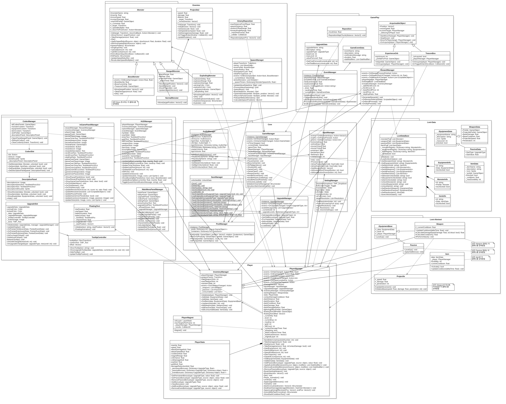

## 📂 3.2.1 Core 관련 클래스

### 📦AudioManager
> **Description:**
> 게임의 모든 사운드를 관리하는 매니저 클래스

**🟢Attributes (속성)**

| Name            | Description              | Type                            | Visibility      |
|:----------------|:-------------------------|:--------------------------------|:----------------|
| `Instance`      | `AudioManager`의 싱글톤 인스턴스 | `AudioManager`                  | `Public Static` |
| `bgmSource`     | 배경 음악 재생에 사용되는 컴포넌트      | `AudioSource`                   | `Private`       |
| `sfxSource`     | 효과음 재생에 사용되는 컴포넌트        | `AudioSource`                   | `Private`       |
| `bgmClips`      | 인스펙터에 할당된 BGM 클립 배열      | `AudioClip[]`                   | `Private`       |
| `sfxClips`      | 인스펙터에 할당된 SFX 클립 배열      | `AudioClip[]`                   | `Private`       |
| `bgmDictionary` | BGM 클립 이름으로 검색하기 위한 딕셔너리 | `Dictionary<string, AudioClip>` | `Private`       |
| `sfxDictionary` | SFX 클립 이름으로 검색하기 위한 딕셔너리 | `Dictionary<string, AudioClip>` | `Private`       |
| `masterVolume`  | 전체 마스터 볼륨 레벨             | `float`                         | `Private`       |
| `bgmVolume`     | BGM 개별 볼륨 레벨             | `float`                         | `Private`       |
| `sfxVolume`     | SFX 개별 볼륨 레벨             | `float`                         | `Private`       |

**🔷Operations (메서드)**

| Name                            | Description                         | Type (Return) | Visibility |
|:--------------------------------|:------------------------------------|:--------------|:-----------|
| `InitializeAudioDictionary()`   | 배열의 내용을 클립을 이름으로 초기화하는 메서드          | `void`        | `Private`  |
| `PlayBGM(clipName: string)`     | 지정된 이름의 BGM 재생하는 메서드                | `void`        | `Public`   |
| `PlaySfx(clipName: string)`     | 지정된 이름의 SFX 클립을 재생하는 메서드            | `void`        | `Public`   |
| `StopBGM()`                     | BGM을 끄는 메서드                         | `void`        | `Public`   |
| `SetMasterVolume(level: float)` | 마스터 볼륨을 설정하고, 이 값을 반영하는 메서드         | `void`        | `Public`   |
| `SetBgmVolume(level: float)`    | BGM 개별 볼륨을 설정하고, 이 값을 반영하는 메서드      | `void`        | `Public`   |
| `SetSfxVolume(level: float)`    | SFX 개별 볼륨을 설정하고, 이 값을 반영하는 메서드      | `void`        | `Public`   |
| `LoadVolumeSettings()`          | PlayerPrefs에 저장되어 있는 설정 값을 불러오는 메서드 | `void`        | `Public`   |
| `UpdateAudioSourceVolumes()`    | 개별 사운드에 마스터 불륨을 적용하는 메서드            | `void`        | `Public`   |

### 📦GameManager
> **Description:**
> Manager 클래스들을 종합 관리하는 마스터 클래스

**🟢Attributes (속성)**

| Name                  | Description                     | Type                      | Visibility      |
|:----------------------|:--------------------------------|:--------------------------|:----------------|
| `Instance`            | `GameManager`의 씬을 넘나드는 싱글톤 인스턴스 | `GameManager`             | `Public Static` |
| `OnTimeChanged`       | 게임 시간이 변경될 때 발생하는 이벤트           | `event Action<float>`     | `Public`        |
| `OnGameStateChanged`  | 게임 상태가 변경될 때 발생하는 이벤트           | `event Action<GameState>` | `Public`        |
| `IsTimerStopped`      | 타이머만 멈출지 여부를 설정하는 플래그           | `bool`                    | `Public`        |
| `_currentState`       | 현재 게임 상태를 저장하는 백킹 필드            | `GameState`               | `Private`       |
| `_gameTime`           | 현재 플레이 시간을 저장하는 백킹 필드           | `float`                   | `Private`       |
| `_playerManager`      | `PlayerManager` 인스턴스 참조         | `PlayerManager`           | `Private`       |
| `_rewardManager`      | `RewardManager` 인스턴스 참조         | `RewardManager`           | `Private`       |
| `_inGamePanelManager` | `InGamePanelManager` 인스턴스 참조    | `InGamePanelManager`      | `Private`       |
| `_inputManager`       | `InputManager` 인스턴스 참조          | `InputManager`            | `Private`       |

**🔷Operations (메서드)**

| Name                                               | Description                                          | Type (Return) | Visibility |
|:---------------------------------------------------|:-----------------------------------------------------|:--------------|:-----------|
| `PauseGame()`                                      | 게임을 일시정지하고, 게임시간을 멈추고, 일시정지 패널을 표시하는 메서드             | `void`        | `Public`   |
| `ResumeGame()`                                     | 게임을 재개하고, 게임 시간을 흐르게 하고, 일시정지 패널을 닫는 메서드             | `void`        | `Public`   |
| `HandlePauseInput()`                               | `Playing` 상태와 `Paused` 상태를 토글하는 메서드                  | `void`        | `Private`  |
| `GameOver()`                                       | 게임 오버 처리 메서드                                         | `void`        | `Public`   |
| `GameClear()`                                      | 게임 클리어 처리 메서드                                        | `void`        | `Public`   |
| `StartGame()`                                      | 상태를 초기화하고  새 게임을 시작하는 메서드                            | `void`        | `Public`   |
| `GoToMainMenu()`                                   | 상태 초기화 후 메인 메뉴 씬을 로드하는 메서드                           | `void`        | `Public`   |
| `RestartGame()`                                    | 게임을 다시 시작하는 메서드                                      | `void`        | `Public`   |
| `Shutdown()`                                       | 애플리케이션을 종료하는 메서드                                     | `void`        | `Public`   |
| `HandlePlayerLeveledUp()`                          | 플레이어 레벨업 또는 보물상자 획득 시 호출되며, 보상 시스템을 시작, 게임을 멈추는 메서드  | `void`        | `Private`  |
| `HandleRewardFinished()`                           | 보상을 받고나서, 보상 패널을 닫고 게임 재개하는 메서드                      | `void`        | `Private`  |
| `OnSceneLoaded(scene: Scene, mode: LoadSceneMode)` | 씬 로드 시마다 호출되어 이전 씬 이벤트 구독을 해제하고, 인게임 씬인 경우 초기화하는 메서드 | `void`        | `Private`  |
| `InitializeInGameManagers()`                       | 인게임 씬 로드 후 매니저들을 찾아 연결하고 필요한 이벤트를 구독하는 메서드           | `IEnumerator` | `Private`  |
| `UnsubscribeInGameEvents()`                        | 씬 전환 또는 파괴 시 인게임 매니저들의 이벤트 구독을 안전하게 해제하는 메서드         | `void`        | `Private`  |

### 📦InputManager
> **Description:**
> 사용자의 입력을 받아와 처리하고, 이벤트 형태로 필요한 곳에 분배하는 매니저 클래스

**🟢Attributes (속성)**

| Name              | Description                 | Type                    | Visibility |
|:------------------|:----------------------------|:------------------------|:-----------|
| `OnMovementInput` | 이동 입력이 변경될 때마다 호출되는 이벤트     | `event Action<Vector2>` | `Public`   |
| `OnPausePressed`  | 일시정지 키(ESC)가 눌렸을 때 호출되는 이벤트 | `event Action`          | `Public`   |
| `GetItemUseInput` | 아이템 슬롯 키가 눌렸을 때 호출되는 이벤트    | `event Action<int>`     | `Public`   |
| `horizontalInput` | 현재 수평 입력 값                  | `float`                 | `Private ` |
| `verticalInput`   | 현재 수직 입력 값                  | `float`                 | `Private ` |
| `mouseXInput`     | 현재 마우스 X축 입력 값              | `float`                 | `Private ` |
| `mouseYInput`     | 현재 마우스 Y축 입력 값              | `float`                 | `Private ` |
| `jumpInput`       | 점프 입력 상태                    | `bool`                  | `Private`  |
| `pauseInput`      | 일시정지 입력 상태 (ESC 키)          | `bool`                  | `Private`  |
| `dashInput`       | 대시 입력 상태 (Space 키)          | `bool`                  | `Private`  |
| `useItemInput`    | 사용하려는 아이템 슬롯 번호             | `int`                   | `Private`  |

**🔷Operations (메서드)**

| Name                                | Description                                        | Type (Return) | Visibility |
|:------------------------------------|:---------------------------------------------------|:--------------|:-----------|
| `Init()`                            | 모든 입력 값을 초기화하는 메서드                                 | `void`        | `Public`   |
| `ProcessInput()`                    | 매 프레임 입력 상태를 받아와 필드에 저장하고, 유효한 입력에 대해 이벤트 방송하는 메서드 | `void`        | `Public`   |
| `IsKeyPressed(keyCode: KeyCode)`    | 특정 키가 눌리고 있는지 확인하는 메서드                             | `bool`        | `Public`   |
| `IsKeyDown(keyCode: KeyCode)`       | 특정 키가 눌렸는지 확인하는 메서드                                | `bool`        | `Public`   |
| `GetMouseCoord()`                   | 현재 마우스 커서의 씬 좌표를 반환하는 메서드                          | `Vector2`     | `Public`   |
| `IsMouseButtonPressed(button: int)` | 특정 마우스 버튼을 누르고 있는지 확인하는 메서드                        | `bool`        | `Public`   |
| `IsMouseButtonDown(button: int)`    | 특정 마우스 버튼이 눌렸는지 확인하는 메서드                           | `bool`        | `Public`   |

### 📦PoolManager
> **Description:**
> 오브젝트를 미리 생성하거나 재활용하여 성능 부하를 줄이는 오브젝트 풀링 시스템의 중앙 관리 클래스

**🟢Attributes (속성)**

| Name          | Description                        | Type                                 | Visibility      |
|:--------------|:-----------------------------------|:-------------------------------------|:----------------|
| `Instance`    | `PoolManager`의 싱글톤 인스턴스            | `PoolManager`                        | `Public Static` |
| `_pools`      | Instance ID를 통해 풀 관리용 딕셔너리         | `Dictionary<int, Queue<GameObject>>` | `Private`       |
| `_containers` | Hierarchy 정리를 위한, 풀별 부모를 관리하는 딕셔너리 | `Dictionary<int, Transform>`         | `Private`       |

**🔷Operations (메서드)**

| Name                                                               | Description                             | Type (Return) | Visibility |
|:-------------------------------------------------------------------|:----------------------------------------|:--------------|:-----------|
| `Get(prefab: GameObject, position: Vector3, rotation: Quaternion)` | 풀에서 오브젝트를 가져와 활성화하고 위치/회전을 설정하는 메서드     | `GameObject`  | `Public`   |
| `ReturnToPool(obj: GameObject, prefab: GameObject)`                | 사용이 끝난 오브젝트를 비활성화하고 해당 프리팹의 풀에 반환하는 메서드 | `void`        | `Public`   |
| `Preload(prefab: GameObject, count: int)`                          | 특정 프리팹에 대해 지정된 개수만큼 오브젝트를 미리 생성하는 메서드   | `void`        | `Public`   |
| `InitPool(prefab: GameObject)`                                     | 풀이 들어갈 부모를 초기화 하는 메서드                   | `void`        | `Private`  |

### 📦SaveManager
> **Description:**
> 게임 내용, 게임 재화 그리고 강화레벨 등 게임의 영구적인 데이터를 저장하고 불러오는 클래스

**🟢Attributes (속성)**

| Name                     | Description                             | Type           | Visibility |
|:-------------------------|:----------------------------------------|:---------------|:-----------|
| `UnlockData`             | `HashSet<string>`을 JSON 직렬화하기 위한 래퍼 클래스 | `class`        | `Private`  |

**🔷Operations (메서드)**

| Name                                                                   | Description                                | Type (Return)                                   | Visibility       |
|:-----------------------------------------------------------------------|:-------------------------------------------|:------------------------------------------------|:-----------------|
| `Save()`                                                               | `PlayerPrefs`에 임시 저장된 모든 데이터를 영구 저장하는 메서드  | `void`                                          | `Public Static`  |
| `DeleteAll()`                                                          | `PlayerPrefs`에 저장된 데이터 삭제하는 메서드            | `void`                                          | `Public Static`  |
| `HasKey(key: string)`                                                  | 지정된 키에 해당하는 데이터가 있는지 확인하는 메서드              | `bool`                                          | `Public Static`  |
| `SaveGold(amount: int)`                                                | 현재 골드 저장하는 메서드                             | `void`                                          | `Public Static`  |
| `LoadGold()`                                                           | 저장된 골드를 불러오는 메서드                           | `int`                                           | `Public Static`  |
| `SaveUpgradeLevel(upgradeType: UpgradeType, level: int)`               | 특정 능력치의 강화 레벨을 저장하는 메서드                    | `void`                                          | `Public Static`  |
| `LoadUpgradeLevel(upgradeType: UpgradeType)`                           | 특정 능력치의 강화 레벨을 불러오는 메서드                    | `int`                                           | `Public Static`  |
| `GetUpgradeKey(upgradeType: UpgradeType)`                              | `UpgradeType`을 기반으로 고유한 저장 키 문자열을 생성하는 메서드 | `string`                                        | `Private Static` |
| `SaveUnlockedMonsters(unlockedIds: HashSet<string>)`                   | 몬스터 언락 ID 목록을 저장하는 메서드                     | `void`                                          | `Public Static`  |
| `LoadUnlockedMonsters()`                                               | 몬스터 언락 ID 목록을 불러오는 메서드                     | `HashSet<string>`                               | `Public Static`  |
| `SaveUnlockedEquipment(unlockedIds: HashSet<string>)`                  | 장비 언락 ID 목록을 저장하는 메서드                      | `void`                                          | `Public Static`  |
| `LoadUnlockedEquipment()`                                              | 장비 언락 ID 목록을 불러오는 메서드                      | `HashSet<string>`                               | `Public Static`  |
| `SaveUnlockedItems(unlockedIds: HashSet<string>)`                      | 아이템 언락 ID 목록을 저장하는 메서드                     | `void`                                          | `Public Static`  |
| `LoadUnlockedItems()`                                                  | 아이템 언락 ID 목록을 불러오는 메서드                     | `HashSet<string>`                               | `Public Static`  |
| `SaveVolume(volumeType: string, value: float)`                         | 마스터, BGM, SFX 볼륨 값을 저장하는 메서드               | `void`                                          | `Public Static`  |
| `LoadVolume(volumeType: string, defaultValue = 1.0f: float )`          | 지정된 볼륨 타입의 값을 불러오는 메서드                     | `float`                                         | `Public Static`  |
| `SaveResoulutionSettings(width: int, height: int, isFullScreen: bool)` | 설정한 해상도를 저장하는 메서드                          | `void`                                          | `public static`  |
| `LoadResoulutionSettings()`                                            | 설정한 해상도를 불러오는 메서드                          | `(width: int, height: int, isFullScreen: bool)` | `public static`  |

### 📦SettingManager
> **Description:**
> UI 컴포넌트와 AudioManager를 연결하여 해상도, 전체화면 상태, 오디오 볼륨 등 게임의 환경 설정을 관리하고 적용하는 클래스

**🟢Attributes (속성)**

| Name                 | Description               | Type               | Visibility |
|:---------------------|:--------------------------|:-------------------|:-----------|
| `resolutionDropdown` | 해상도 목록을 표시하는 UI 드롭다운 컴포넌트 | `TMP_Dropdown`     | `Private`  |
| `fullScreenToggle`   | 전체화면 여부를 설정하는 UI 토글 컴포넌트  | `Toggle`           | `Private`  |
| `masterSlider`       | 마스터 볼륨 설정용 UI 슬라이더 컴포넌트   | `Slider`           | `Private`  |
| `bgmSlider`          | BGM 볼륨 설정용 UI 슬라이더 컴포넌트   | `Slider`           | `Private`  |
| `sfxSlider`          | SFX 볼륨 설정용 UI 슬라이더 컴포넌트   | `Slider`           | `Private`  |
| `resolutionIndex`    | 선택된 해상도 번호                | `int`              | `Private`  |
| `isFullScreen`       | 전체화면 여부 설정                | `bool`             | `Private`  |
| `targetResolution`   | Unity에서 지원하는 해상도 목록       | `List<Resolution>` | `Private`  |

**🔷Operations (메서드)**

| Name                           | Description                           | Type (Return) | Visibility |
|:-------------------------------|:--------------------------------------|:--------------|:-----------|
| `SetResolution(index: int)`    | UI 드롭다운에서 선택된 해상도 번호를 임시 변수에 저장하는 메서드 | `void`        | `Public`   |
| `PickFullScreen(isFull: bool)` | UI 토글에서 선택된 전체화면 여부를 임시 변수에 저장하는 메서드  | `void`        | `Public`   |
| `ApplyResolution()`            | 선택된 해상도 옵션을 적용하는 메서드                  | `void`        | `Public`   |
| `Init_Resolution()`            | 시스템에서 지원하는 해상도 목록을 가져와 ui에 반영하는 메서드   | `void`        | `Private`  |
| `Init_VolumeSettings()`        | 저장된 사운드 세팅을 가져와서 ui를 초기화 하는 메서드       | `void`        | `Private`  |
| `LoadAndApplySavedSettings()`  | 해상도 설정을 불러오고 적용, ui를 초기화 하는 메서드       | `void`        | `Private`  |

### 📦UpgradeManager
> **Description:**
> 플레이어 능력치 강화하는 클래스

**🟢Attributes (속성)**

| Name                | Description                    | Type                             | Visibility      |
|:--------------------|:-------------------------------|:---------------------------------|:----------------|
| `Instance`          | `UpgradeManager`의 싱글톤 인스턴스     | `UpgradeManager`                 | `Public Static` |
| `OnGoldChanged`     | 현재 골드가 변경될 때 발생하는 이벤트          | `event Action<int>`              | `Public`        |
| `OnUpgradeChanged`  | 특정 업그레이드의 레벨이 변경될 때 발생하는 이벤트   | `event Action<UpgradeType, int>` | `Public`        |
| `availableUpgrades` | 업그레이드 데이터 리스트                  | `List<UpgradeData>`              | `Private`       |
| `_currentGold`      | 현재 플레이어가 보유한 골드 양              | `int`                            | `Private`       |
| `_upgradeLevels`    | 각 업그레이드의 레벨을 저장하는 딕셔너리         | `Dictionary<UpgradeType, int>`   | `Private`       |

**🔷Operations (메서드)**

| Name                                 | Description                             | Type (Return) | Visibility |
|:-------------------------------------|:----------------------------------------|:--------------|:-----------|
| `GetUpgradeLevel(type: UpgradeType)` | 특정 업그레이드 타입의 현재 레벨을 반환하는 메서드            | `int`         | `Public`   |
| `GetStatBonus(type: UpgradeType)`    | 특정 업그레이드 타입의 스텟 보너스를 반환하는 메서드           | `float`       | `Public`   |
| `Purchase(data: UpgradeData)`        | 업그레이드의 조건을 만족하면 구매하고 이벤트를 방송 하는 메서드     | `bool`        | `Public`   |
| `Refund(data: UpgradeData)`          | 조건을 만족하면 업그레이드 구매를 환불 해주고 이벤트를 방송하는 메서드 | `bool`        | `Public`   |
| `RefreshGold()`                      | 저장된 골드 값을 불러와 현재 골드를 갱신하는 메서드           | `void`        | `public`   |
| `LoadData()`                         | 저장된 강화 레벨과 골드를 가지고와 UI에 반영하는 메서드        | `void`        | `Private`  |

---

## 📂 3.2.2 Enemies 관련 클래스

### 📦BossMonster
> **Description:**
> Monster 클래스를 상속받는 보스 몬스터 클래스.   
보스 전용 체력바 UI 연동을 위한 이벤트와 사망 시 보상 생성 로직을 포함.

**🟢Attributes (속성)**

| Name              | Description          | Type                   | Visibility |
|:------------------|:---------------------|:-----------------------|:-----------|
| `OnBossHpChanged` | 보스 체력 변경 시 발생하는 이벤트  | `Action<float, float>` | `public`   |
| `TreasurePrefab`  | 보스 사망 시 드롭할 보물상자 프리팹 | `GameObject`           | `public`   |

**🔷Operations (메서드)**

| Name                            | Description                                  | Type (Return) | Visibility |
|:--------------------------------|:---------------------------------------------|:--------------|:-----------|
| `Move(targetPosition: Vector2)` | 타겟을 향해 이동하며, 위치에 따라 스프라이트를 좌우 반전             | `void`        | `public`   |
| `TakeDamage(amount: float)`     | 데미지를 입고 피격 효과를 재생하며, OnBossHpChanged 이벤트를 호출 | `void`        | `public`   |
| `Die()`                         | 사망 로그 출력 및 보물상자를 생성한 뒤, 부모의 사망 처리(풀 반환)를 수행  | `void`        | `public`   |

### 📦EnemyReposition
> **Description:**
> 몬스터가 플레이어로부터 일정 거리 이상 멀어지면, 플레이어 진행 방향 앞쪽으로 방향을 설정한다.

**🟢Attributes (속성)**

| Name                    | Description                  | Type         | Visibility |
|:------------------------|:-----------------------------|:-------------|:-----------|
| `maxDistanceFromPlayer` | 재배치가 트리거되는 플레이어와의 최대 거리 임계값  | `float`      | `private`  |
| `spawnDistance`         | 재배치 시 설정되는 플레이어로부터의 거리       | `float`      | `private`  |
| `randomOffsetRange`     | 몬스터 간 겹침 방지를 위한 랜덤 위치 오프셋 범위 | `float`      | `private`  |
| `forwardAngleRange`     | 플레이어 진행 방향 기준 재배치 허용 각도(좌우)  | `float`      | `private`  |
| `_maxDistanceSqr`       | 거리 비교 최적화 위해 계산하는 거리의 제곱값    | `float`      | `private`  |
| `_collider`             | 몬스터의 콜라이더 참조(비활성화 확인용)       | `Collider2D` | `private`  |

**🔷Operations (메서드)**

| Name                             | Description                                 | Type (Return) | Visibility |
|:---------------------------------|:--------------------------------------------|:--------------|:-----------|
| `Reposition(playerPos: Vector3)` | 플레이어 이동방향 기반으로 전방 부채꼴 범위내 랜덤 위치 계산해서 몬스터 이동 | `void`        | `private`  |

### 📦Monster
> **Description:**
> 몬스터 공통 속성을 정의하는 추상 클래스.

**🟢Attributes (속성)**

| Name                  | Description         | Type              | Visibility  |
|:----------------------|:--------------------|:------------------|:------------|
| `monsterName`         | 몬스터 이름 (도감 및 식별용)   | `string`          | `protected` |
| `description`         | 몬스터 설명              | `string`          | `private`   |
| `unlocked`            | 몬스터 해금 상태           | `bool`            | `protected` |
| `maxHp`               | 최대 체력               | `float`           | `protected` |
| `moveSpeed`           | 이동 속도               | `float`           | `protected` |
| `contactDamage`       | 플레이어와 충돌 시 입히는 데미지  | `float`           | `protected` |
| `fadeInDuration`      | 페이드인 효과 지속시간 정의     | `float`           | `protected` |
| `expOrbPrefab`        | 사망 시 드롭할 경험치 구슬 프리팹 | `GameObject`      | `public`    |
| `_currentHp`          | 현재 체력               | `float`           | `protected` |
| `_target`             | 추적 대상(플레이어)         | `Transform`       | `protected` |
| `_returnToPoolAction` | 몬스터 사망 시 풀로 복귀      | `Action<Monster>` | `protected` |
| `_spriteRenderer`     | 피격 효과용 스프라이트 렌더러    | `SpriteRenderer`  | `protected` |
| `_originalColor`      | 피격 효과용 색상 저장        | `Color`           | `protected` |
| `_speedMultiplier`    | 현재 속도 배율 (디버프 등 적용) | `float`           | `protected` |

**🔷Operations (메서드)**

| Name                                                                   | Description                                  | Type (Return) | Visibility  |
|:-----------------------------------------------------------------------|:---------------------------------------------|:--------------|:------------|
| `Init(target: Transform, returnCallback: Action<Monster>)`             | 스폰 시 타겟 설정, 풀링 콜백 연결, 상태 초기화 수행              | `void`        | `public`    |
| `Move(targetPosition: Vector2)`                                        | 대상 위치로 이동 (자식 클래스에서 구체적인 이동 로직 구현)           | `void`        | `public`    |
| `TakeDamage(amount: float)`                                            | 데미지를 입고 피격 효과 실행, 체력이 0 이하가 되면 Die 호출        | `void`        | `public`    |
| `Die()`                                                                | 사망 처리, 경험치/재화/킬카운트 반영, 도감 해금 및 오브젝트 풀 반환을 수행 | `void`        | `public`    |
| `ApplySpeedDebuff(source: object, slowAmount: float, duration: float)` | 특정 소스로부터 이동 속도 감소 디버프를 적용(중첩 시 시간 갱신)        | `void`        | `public`    |
| `RemoveSpeedDebuff(source: object)`                                    | 속도 디버프를 제거하고 속도 배율을 재계산                      | `void`        | `public`    |
| `SpawnFadeIn()`                                                        | 스폰 시 투명 상태에서 서서히 나타나는 페이드인 연출 수행             | `IEnumerator` | `protected` |
| `DropExpOrb()`                                                         | 경험치 구슬 프리팹을 PoolManager를 통해 드롭               | `void`        | `public`    |
| `UpGold(amount: int)`                                                  | GameManager를 통해 플레이어의 골드를 증가시킴               | `void`        | `public`    |
| `UpKillCount(amount: int)`                                             | GameManager를 통해 플레이어의 킬 카운트를 증가시킴            | `void`        | `public`    |
| `OnCollisionStay2D(collision: Collision2D)`                            | 플레이어와 충돌 유지 시 지속적인 데미지를 입힘                   | `void`        | `protected` |
| `HitFlash()`                                                           | 피격 시 스프라이트를 일시적으로 붉게 점멸시키는 연출 수행             | `IEnumerator` | `protected` |
| `UpdateSpeedDebuffs()`                                                 | 매 프레임 감속 디버프 시간을 갱신하고 만료된 디버프를 제거함           | `void`        | `private`   |
| `RecalculateSpeedMultiplier()`                                         | 현재 활성화된 디버프 중 가장 강한 효과를 기준으로 속도 배율을 재계산함     | `void`        | `private`   |

### 📦NormalMonster
> **Description:**
> Monster 클래스를 상속받는 일반 몬스터 클래스. 플레이어를 향해 단순 이동하며, 이동방향에 따라 스프라이트 방향을 설정한다

**🔷Operations (메서드)**

| Name                            | Description                                                  | Type   | Visibility |
|:--------------------------------|:-------------------------------------------------------------|:-------|:-----------|
| `Move(targetPosition: Vector2)` | CurrentMoveSpeed를 사용하여 타겟 위치로 이동하며, 타겟의 X좌표에 따라 스프라이트를 좌우 반전 | `void` | `public`   |

### 📦ExplodingMonster
> **Description:**
> Monster 클래스를 상속받는 자폭 몬스터 클래스. 플레이어에게 접근하여 일정 범위 내에 들어오면 자폭 시퀀스를 시작하고, 잠시 후 폭발하여 광역 데미지를 입힌다

**🟢Attributes (속성)**

| Name                  | Description          | Type         | Visibility |
|:----------------------|:---------------------|:-------------|:-----------|
| `explosionDelay`      | 폭발 시퀀스 시작 후 폭발까지의 시간 | `float`      | `private`  |
| `explosionRange`      | 자폭 공격의 범위            | `float`      | `private`  |
| `explosionDamage`     | 자폭 공격의 데미지           | `float`      | `private`  |
| `warningColor`        | 폭발 경고 시 표시할 색상       | `Color`      | `private`  |
| `explosionColor`      | 폭발 순간 표시할 색상         | `Color`      | `private`  |
| `_explosionIndicator` | 폭발 범위를 표시하는 오브젝트     | `GameObject` | `private`  |
| `_isExploding`        | 현재 폭발 시퀀스가 진행 중인지 여부 | `bool`       | `private`  |

**🔷Operations (메서드)**

| Name                            | Description                  | Type (Return) | Visibility |
|:--------------------------------|:-----------------------------|:--------------|:-----------|
| `Move(targetPosition: Vector2)` | 플레이어를 향해 이동하되, 폭발 중이면 이동을 멈춤 | `void`        | `public`   |
| `Die()`                         | 사망 처리. 폭발 중이 아닐 때만 실행됨       | `void`        | `public`   |
| `CreateExplosionIndicator()`    | 폭발 범위를 표시할 원형 인디케이터 생성       | `void`        | `private`  |
| `ExplosionSequence()`           | 경고 효과 후 폭발을 일으키는 코루틴         | `IEnumerator` | `private`  |
| `Explode()`                     | 범위 내 플레이어에게 데미지를 입히는 메서드     | `void`        | `private`  |

### 📦RangedMonster
> **Description:**
> Monster 클래스를 상속받는 원거리 공격 몬스터 클래스. 플레이어와 일정 거리를 유지하며 투사체를 발사하여 공격한다

**🟢Attributes (속성)**

| Name               | Description    | Type         | Visibility |
|:-------------------|:---------------|:-------------|:-----------|
| `attackRange`      | 공격을 시작하는 최대 거리 | `float`      | `private`  |
| `fireRate`         | 공격(투사체 발사) 주기  | `float`      | `private`  |
| `projectilePrefab` | 발사할 투사체 프리팹    | `GameObject` | `private`  |
| `_attackTimer`     | 공격 쿨타임 계산용 타이머 | `float`      | `private`  |

**🔷Operations (메서드)**

| Name                            | Description                               | Type (Return) | Visibility |
|:--------------------------------|:------------------------------------------|:--------------|:-----------|
| `Move(targetPosition: Vector2)` | 플레이어와 일정 거리를 유지하도록 이동 (너무 멀면 접근, 적당하면 정지) | `void`        | `public`   |
| `HandleAttack()`                | 사정거리 내에 있고 쿨타임이 되면 투사체 발사                 | `void`        | `private`  |
| `ShootProjectile()`             | 투사체 인스턴스를 생성하고 초기화                        | `void`        | `private`  |
| `UpdateSpriteDirection()`       | 타겟 위치에 따라 스프라이트 좌우 반전                     | `void`        | `private`  |

### 📦Projectile2
> **Description:**
> 적 몬스터가 발사하는 투사체 클래스. 초기화된 방향 또는 타겟을 향해 직선으로 이동하며, 플레이어와 충돌 시 데미지를 입히고 파괴된다

**🟢Attributes (속성)**

| Name             | Description           | Type        | Visibility |
|:-----------------|:----------------------|:------------|:-----------|
| `speed`          | 투사체의 이동 속도            | `float`     | `private`  |
| `damage`         | 플레이어 충돌 시 입히는 피해량     | `float`     | `private`  |
| `lifetime`       | 투사체가 발사된 후 자동 소멸되는 시간 | `float`     | `private`  |
| `_target`        | 투사체가 날아갈 대상           | `Transform` | `private`  |
| `_moveDirection` | 투사체가 날아갈 방향           | `Vector2`   | `private`  |

**🔷Operations (메서드)**

| Name                                  | Description                                   | Type (Return) | Visibility |
|:--------------------------------------|:----------------------------------------------|:--------------|:-----------|
| `Init(target: Transform)`             | 타겟의 위치를 계산하여 이동 방향을 설정하고, 스프라이트 회전을 업데이트      | `void`        | `public`   |
| `Init(direction: Vector2)`            | 지정된 방향 벡터로 이동 방향을 설정하고, 스프라이트 회전을 업데이트        | `void`        | `public`   |
| `SetSize(scale: float)`               | 투사체의 크기 설정                                    | `void`        | `public`   |
| `SetSpeed(newSpeed: float)`           | 투사체의 속도 설정                                    | `void`        | `public`   |
| `SetDamage(newDamage: float)`         | 투사체의 데미지 설정                                   | `void`        | `public`   |
| `OnTriggerEnter2D(other: Collider2D)` | 플레이어와 충돌 시 데미지를 입히고 투사체를 파괴                   | `void`        | `private`  |
| `UpdateRotation()`                    | 이동 방향(_moveDirection)에 맞춰 투사체 스프라이트의 회전값을 갱신함 | `void`        | `private`  |

### 📦SpawnManager
> **Description:**
> WaveData를 기반으로 몬스터 스폰을 총괄. 시간 흐름에 따라 웨이브를 갱신하고 MonsterSpawnInfo에 설정된 시간에 따라 몬스터를 생성한다.
> 보스 몬스터의 등장 및 처치 이벤트도 관리하며, PoolManager와 연동하여 몬스터 오브젝트 풀링을 처리

**🟢Attributes (속성)**

| Name                  | Description                   | Type                                  | Visibility |
|:----------------------|:------------------------------|:--------------------------------------|:-----------|
| `playerTransform`     | 플레이어 위치 참조                    | `Transform`                           | `private`  |
| `waves`               | 게임 진행에 따른 웨이브 데이터 리스트         | `List<WaveData>`                      | `private`  |
| `firstBossPrefab`     | 주기적으로 등장할 보스 몬스터 프리팹          | `BossMonster`                         | `private`  |
| `secondBossPrefab`    | 주기적으로 등장할 보스 몬스터 프리팹          | `BossMonster`                         | `private`  |
| `spawnRadius`         | 플레이어 기준 몬스터 생성 거리             | `float`                               | `private`  |
| `bossSpawnCycle`      | 보스 등장 주기                      | `float`                               | `private`  |
| `initialPerTypeSize`  | 몬스터 종류별 초기 풀링 개수              | `int`                                 | `private`  |
| `OnBossSpawned`       | 보스 등장 및 처치 알림 이벤트             | `event Action<bool, BossMonster>`     | `public`   |
| `_currentWave`        | 현재 진행 중인 웨이브 데이터              | `WaveData`                            | `private`  |
| `_isBossActive`       | 필드에 보스가 존재하는지 나타내는 필드         | `bool`                                | `private`  |
| `_isSecondBossActive` | 필드에 보스가 존재하는지 나타내는 필드         | `bool`                                | `private`  |
| `_activeMonsters`     | 현재 필드에 활성화된 몬스터 리스트(최대 수량 제한) | `List<Monster>`                       | `private`  |
| `_spawnTimers`        | 각 몬스터 종류별 스폰 쿨타임 관리 딕셔너리      | `Dictionary<MonsterSpawnInfo, float>` | `private`  |

**🔷Operations (메서드)**

| Name                                                     | Description                                          | Type (Return) | Visibility |
|:---------------------------------------------------------|:-----------------------------------------------------|:--------------|:-----------|
| `UpdateWaveData(time: float)`                            | 현재 게임 시간에 맞는 웨이브 데이터를 리스트에서 찾아 현재 웨이브 갱신             | `void`        | `private`  |
| `ProcessWaveSpawning()`                                  | 현재 웨이브의 모든 MonsterSpawnInfo를 순회하며 각자의 주기에 맞춰 몬스터를 스폰 | `void`        | `private`  |
| `SpawnBoss(bossPrefab: BossMonster, isSecondBoss: bool)` | 보스 몬스터를 생성하고 OnBossSpawned 이벤트를 호출하며, 게임 타이머를 일시 정지  | `void`        | `private`  |
| `BossDied(boss: Monster)`                                | 보스 사망 시 호출되는 콜백. 타이머를 재개하고 보스 처치 이벤트를 방송             | `void`        | `private`  |
| `SpawnMonster(prefab: Monster, position: Vector2)`       | PoolManager에 요청하여 몬스터 오브젝트를 가져오고 초기화하여 필드에 배치        | `void`        | `public`   |
| `ReturnToPool(monster: Monster, prefab: Monster)`        | 몬스터 사망 시 활성 리스트에서 제거하고 PoolManager로 반환 요청            | `void`        | `public`   |
| `PreloadAllWaveMonsters()`                               | 게임 시작 시 waves에 등록된 모든 몬스터 프리팹을 PoolManager를 통해 미리 생성 | `void`        | `private`  |
| `CalculateSpawnPosition()`                               | 플레이어 위치를 기준으로 spawnRadius 거리의 랜덤한 위치를 계산하여 반환        | `Vector2`     | `public`   |

## 📂 3.2.3 Gameplay 관련 클래스

### 📦AcquireableObject
> **Description:**
> 플레이어가 획득 가능한 오브젝트의 기본 추상 클래스

**🟢Attributes (속성)**

| Name                | Description        | Type            | Visibility  |
|:--------------------|:-------------------|:----------------|:------------|
| `Position`          | 오브젝트 자신의 위치        | `Vector2`       | `Public`    |
| `moveSpeed`         | 플레이어에게 끌려갈 때의 속도   | `float`         | `Public`    |
| `currentTarget`     | `PlayerMager` 참조   | `PlayerManager` | `Protected` |
| `_isMovingToPlayer` | 플레이어에게 끌려가는 중인지 여부 | `bool`          | `Private`   |

**🔷Operations (메서드)**

| Name                                  | Description                      | Type (Return)   | Visibility |
|:--------------------------------------|:---------------------------------|:----------------|:-----------|
| `StartMoveTo(target: PlayerManager)`  | 플레이어 쪽으로 이동하는 메서드                | `void`          | `Public`   |
| `StopMove()`                          | 이동을 멈추는 메서드                      | `void`          | `Public`   |
| `MoveToPlayer(target: PlayerManager)` | 플레이어에게 이동한 다음 가까워지면 획득 처리 하는 메서드 | `void`          | `Public`   |
| `OnAcquire(player: PlayerManager)`    | 획득 시 실제로 발생하는 효과를 정의하는 추상 메서드    | `abstract void` | `Public`   |

### 📦ExperienceOrb
> **Description:**
> 몬스터 처치 시 드랍되며, 플레이어가 획득하면 경험치를 제공하는 오브젝트
PoolManager를 통해 재활용된다.

**🟢Attributes (속성)**

| Name             | Description         | Type         | Visibility |
|:-----------------|:--------------------|:-------------|:-----------|
| `expAmount`      | 획득 시 제공하는 경험치 양     | `int`        | `private`  |
| `_prefabForPool` | 풀링 반환을 위한 원본 프리팹 참조 | `GameObject` | `private`  |

**🔷Operations (메서드)**

| Name                               | Description                            | Type (Return) | Visibility |
|:-----------------------------------|:---------------------------------------|:--------------|:-----------|
| `Init(prefab: GameObject)`         | 풀에서 생성된 후 초기화하는 메서드                    | `void`        | `public`   |
| `OnAcquire(player: PlayerManager)` | 플레이어에게 경험치를 지급하고 이동을 멈춘 뒤 풀로 반환하거나 파괴함 | `void`        | `public`   |

### 📦TreasureBox
> **Description:**
> 보스 몬스터 처치 시 드랍되거나 맵에 배치되는 보물상자 오브젝트

**🟢Attributes (속성)**

| Name             | Description    | Type            | Visibility |
|:-----------------|:---------------|:----------------|:-----------|
| `_isAcquired`    | 이미 획득된 상태인지 여부 | `bool`          | `private`  |
| `_playerManager` | 플레이어 매니저 참조    | `PlayerManager` | `private`  |

**🔷Operations (메서드)**

| Name                                       | Description                                  | Type (Return) | Visibility |
|:-------------------------------------------|:---------------------------------------------|:--------------|:-----------|
| `OnAcquire(player: PlayerManager)`         | 보물상자를 획득 처리하고 PlayerManager를 통해 보상 획득 로직을 호출 | `void`        | `public`   |
| `OnTriggerEnter2D(collision: Collision2D)` | 플레이어와의 충돌을 감지하여 획득 로직을 실행하는 메서드              | `void`        | `private`  |

### 📦EventManager
> **Description:**
> 게임이 진행되는 동안 발생하는 이벤트를 관리하는 클래스

**🟢Attributes (속성)**

| Name               | Description               | Type                   | Visibility      |
|:-------------------|:--------------------------|:-----------------------|:----------------|
| `Instance`         | `EventManager`의 싱글톤 인스턴스  | `EventManager`         | `Public Static` |
| `playerManager`    | `PlayerManager` 참조        | `PlayerManager`        | `Private`       |
| `possibleEvents`   | 발생 가능한 모든 게임 이벤트 데이터 리스트  | `List<GameEventData>`  | `Private`       |
| `minEventInterval` | 이벤트 발생 최소 주기              | `float`                | `Private`       |
| `maxEventInterval` | 이벤트 발생 최대 주기              | `float`                | `Private`       |
| `OnToggleEvent`    | 이벤트 시작/종료 시 구독자에게 알리는 이벤트 | `event Action<string>` | `Public`        |
| `_timer`           | 현재 이벤트 주기를 측정하는 타이머       | `float`                | `Private`       |
| `_nextEventTime`   | 다음 이벤트가 발생해야 할 시간         | `float`                | `Private`       |
| `_currentEvent`    | 현재 활성화된 이벤트 데이터           | `GameEventData`        | `Private`       |

**🔷Operations (메서드)**

| Name                                            | Description                                       | Type (Return) | Visibility |
|:------------------------------------------------|:--------------------------------------------------|:--------------|:-----------|
| `SetNextEventTime()`                            | 다음 이벤트 발생시간을 설정하고 타이머를 초기화하는 메서드                  | `void`        | `Private`  |
| `TriggerRandomEvent()`                          | 이벤트 리스트에서 무작위로 하나의 이벤트를 선택하는 메서드                  | `void`        | `Public`   |
| `StartEvent(eventData: GameEventData)`          | 선택된 이벤트를 실행하는 메서드                                 | `void`        | `Public`   |
| `ProcessEventRoutine(eventData: GameEventData)` | 이벤트 시작부터 끝날때까지 모든 단계를 순차적으로 처리하는 코루틴 메서드          | `IEnumerator` | `Private`  |
| `EndEvent(eventData: GameEventData)`            | 이벤트를 종료시, 활성화 된 모든 이벤트의 효과를 해제하고 다음 이벤트를 준비하는 메서드 | `void`        | `Private`  |

### 📦GameEventData
> **Description:**
> 게임 이벤트에 대한 데이터 구조를 담는 Scriptable Object 클래스

**🟢Attributes (속성)**

| Name                  | Description                      | Type                 | Visibility |
|:----------------------|:---------------------------------|:---------------------|:-----------|
| `eventName`           | 이벤트의 이름                          | `string`             | `Public`   |
| `description`         | 이벤트에 대한 상세 설명                    | `string`             | `Public`   |
| `notificationMessage` | 이벤트 시작/종료 시 UI에 표시될 메시지          | `string`             | `Public`   |
| `duration`            | 이벤트가 지속될 시간                      | `float`              | `Public`   |
| `statModifiers`       | 수정할 능력치 종류와 수치 값을 가진 구조체를 담는 리스트 | `List<StatModifier>` | `Public`   |

### 📦Reposition
> **Description:**
> 청크를 재배치함으로써 무한맵처럼 보이게 하는 클래스

**🟢Attributes (속성)**

| Name        | Description | Type    | Visibility |
|:------------|:------------|:--------|:-----------|
| `chunkSize` | 맵 청크 하나의 크기 | `float` | `Private`  |

**🔷Operations (메서드)**

| Name                                     | Description                        | Type (Return) | Visibility |
|:-----------------------------------------|:-----------------------------------|:--------------|:-----------|
| `RepositionMapChunk(distance: Vector3 )` | 플레이어와 청크 간의 거리를 기반으로 청크를 재배치하는 메서드 | `void`        | `Private`  |

### 📦RewardManager
> **Description:**
> 레벨업 후 보상 항목을 무작위로 생성하고, 리롤 및 스킵 기능을 관리하여 선택된 보상을 플레이어에게 지급하는 보상 시스템 클래스

**🟢Attributes (속성)**

| Name                      | Description             | Type                                   | Visibility |
|:--------------------------|:------------------------|:---------------------------------------|:-----------|
| `OnRewardProcessFinished` | 보상 선택/스킵 완료 시 발생하는 이벤트  | `event Action`                         | `Public`   |
| `OnRewardTextUIChanged`   | 보상 패널의 텍스트 정보 갱신 이벤트    | `event Action<int,int,float>`          | `Public`   |
| `OnRewardUIChanged`       | 보상 카드 목록 갱신 이벤트         | `event Action<List<ScriptableObject>>` | `Public`   |
| `playerManager`           | `PlayerManager` 참조      | `PlayerManager`                        | `Private`  |
| `lootDataBase`            | `LootDataBase` 참조       | `LootDataBase`                         | `Private`  |
| `inventoryManager`        | `InventoryManager` 참조   | `InventoryManager`                     | `Private`  |
| `_maxRerollCount`         | 최대 리롤 횟수                | `int`                                  | `Private`  |
| `_rerollCount`            | 현재 남은 리롤 횟수             | `int`                                  | `Private`  |
| `_baseRerollPrice`        | 기본 리롤 비용                | `int`                                  | `Private`  |
| `_rerollPrice`            | 현재 리롤에 필요한 골드 비용        | `int`                                  | `Private`  |
| `_skipExpRatio`           | 보상 스킵 시 얻는 최대 경험치 대비 비율 | `float`                                | `Private`  |

**🔷Operations (메서드)**

| Name                                       | Description                  | Type (Return) | Visibility |
|:-------------------------------------------|:-----------------------------|:--------------|:-----------|
| `GenerateRewards()`                        | 3개의 무작위 보상 생성하는 메서드          | `void`        | `Public`   |
| `OnRewardSelected(data: ScriptableObject)` | 보상을 선택하면 선택 장비/아이템을 추가하는 메서드 | `void`        | `Public`   |
| `OnRerollPressed()`                        | 리롤버튼을 누르면 새로운 보상을 생성하는 메서드   | `void`        | `Public`   |
| `OnSkipPressed()`                          | 스킵버튼을 누르면 경험치를 지급하는 메서드      | `void`        | `Public`   |

### 📦UpgradeData
> **Description:**
> 레벨당 스탯 보너스 값과 레벨에 따른 비용 증가 수식을 포함하여, 영구적인 능력치 업그레이드의 모든 정보를 정의하는 Scriptable Object 데이터 클래스

**🟢Attributes (속성)**

| Name            | Description       | Type          | Visibility |
|:----------------|:------------------|:--------------|:-----------|
| `upgradeName`   | 업그레이드의 이름         | `string`      | `Private`  |
| `description`   | 업그레이드에 대한 상세 설명   | `string`      | `Private`  |
| `upgradeType`   | 업그레이드하는 스텟 종류     | `UpgradeType` | `Private`  |
| `baseCost`      | 업그레이드의 기본 비용      | `int`         | `Private`  |
| `maxLevel`      | 도달 가능한 최대 레벨      | `int`         | `Private`  |
| `valuePerLevel` | 레벨당 획득하는 스탯 보너스 값 | `float`       | `Private`  |

**🔷Operations (메서드)**

| Name                                  | Description                         | Type (Return) | Visibility |
|:--------------------------------------|:------------------------------------|:--------------|:-----------|
| `GetCostForLevel(currentLevel: int )` | 레벨당 비용 증가시키는 메서드                    | `int`         | `Public`   |
| `GetTotalBonus(currentLevel: int )`   | 현재 레벨까지 누적된 총 스텟 보너스를 계산해서 반환하는 메서드 | `float`       | `Public`   |

## 📂 3.2.4 Loot-Abstract 관련 클래스

### 📦EquipmentBase
> **Description:**
> 모든 장비(Weapon, Passive)가 상속받는 추상 클래스

**🟢Attributes (속성)**

| Name      | Description                    | Type            | Visibility  |
|:----------|:-------------------------------|:----------------|:------------|
| `_data`   | 장비의 Scriptable Object를 할당하는 필드 | `EquipmentData` | `protected` |
| `_level`  | 장비의 레벨을 저장하는 필드                | `int`           | `protected` |
| `_player` | 플레이어 매니저 인스턴스 참조               | `PlayerManager` | `protected` |

**🔷Operations (메서드)**

| Name                                                     | Description          | Type (Return) | Visibility |
|:---------------------------------------------------------|:---------------------|:--------------|:-----------|
| `LevelUp()`                                              | 장비의 레벨을 증가시키는 가상 메서드 | `void`        | `public`   |

### 📦Item
> **Description:**
> 모든 아이템이 상속받는 추상 클래스

**🟢Attributes (속성)**

| Name              | Description                     | Type            | Visibility |
|:------------------|:--------------------------------|:----------------|:-----------|
| `data`            | 아이템의 Scriptable Object를 할당하는 필드 | `ItemData`      | `private`  |
| `_player`         | 플레이어 매니저 인스턴스 참조                | `PlayerManager` | `private`  |
| `durability`      | 아이템을 사용할 수 있는 횟수                | `int`           | `private`  |
| `currentCooldown` | 아이템의 남은 재사용 가능 시간을 저장하는 필드      | `float`         | `private`  |

**🔷Operations (메서드)**

| Name                               | Description           | Type (Return) | Visibility |
|:-----------------------------------|:----------------------|:--------------|:-----------|
| `Activate()`                       | 아이템의 사용을 처리하는 가상 메서드  | `bool`        | `public`   |
| `UpdateCooldown(deltaTime: float)` | 아이템의 쿨다운 시간을 갱신하는 메서드 | `void`        | `public`   |

### 📦Passive
> **Description:**
> 모든 패시브 장비가 상속 받는 추상 클래스

**🔷Operations (메서드)**

| Name                                                     | Description                 | Type (Return) | Visibility |
|:---------------------------------------------------------|:----------------------------|:--------------|:-----------|
| `LevelUp()`                                              | 장비의 레벨을 증가시키는 오버라이드 메서드     | `void`        | `public`   |
| `ApplyStatBonus()`                                       | 장비의 효과를 플레이어 캐릭터에게 적용하는 메서드 | `void`        | `private`  |

### 📦Projectile
> **Description:**
> 플레이어의 무기가 지원하는 모든 투사체의 추상 클래스

**🟢Attributes (속성)**

| Name           | Description                      | Type    | Visibility  |
|:---------------|:---------------------------------|:--------|:------------|
| `_speed`       | 투사체의 속도를 정의하는 필드                 | `float` | `protected` |
| `_damage`      | 투사체의 데미지를 정의하는 필드                | `float` | `protected` |
| `_penetration` | 투사체가 적을 관통할 수 있는 횟수의 -1을 정의하는 필드 | `int`   | `protected` |

**🔷Operations (메서드)**

| Name                                                            | Description             | Type (Return) | Visibility  |
|:----------------------------------------------------------------|:------------------------|:--------------|:------------|
| `UpdateMovement()`                                              | 투사체의 이동 로직을 구현하는 가상 메서드 | `void`        | `protected` |
| `InitializeBase(speed: float, damage: float, penetration: int)` | 투사체의 기본 속성을 초기화하는 메서드   | `void`        | `protected` |

---

### 📦Weapon
> **Description:**
> 모든 무기가 상속 받는 추상 클래스

**🟢Attributes (속성)**

| Name               | Description              | Type    | Visibility  |
|:-------------------|:-------------------------|:--------|:------------|
| `_currentCooldown` | 무기의 남은 재사용 대기시간을 저장하는 필드 | `float` | `protected` |

**🔷Operations (메서드)**

| Name                                                       | Description               | Type (Return) | Visibility  |
|:-----------------------------------------------------------|:--------------------------|:--------------|:------------|
| `UpdateCooldown(deltaTime: float)`                         | 무기의 재사용 대기시간을 갱신하는 가상 메서드 | `void`        | `public`    |
| `CalculateDamage(baseDamage: float, isCritical: out bool)` | 무기의 최종 데미지를 계산하는 메서드      | `float`       | `protected` |
| `CalculateCooldown()`                                      | 무기의 최종 재사용 대기시간을 계산하는 메서드 | `float`       | `protected` |
| `PerformAttack()`                                          | 실제 공격 로직을 구현하는 가상 메서드     | `void`        | `protected` |

## 📂 3.2.5 Loot-Data 관련 클래스

### 📦EquipmentData
> **Description:**
> 모든 장비의 정보를 정의하는 데이터 컨테이너 클래스 (ScriptableObject)

**🟢Attributes (속성)**

| Name             | Description            | Type     | Visibility |
|:-----------------|:-----------------------|:---------|:-----------|
| `_equipmentName` | 장비의 이름을 저장하는 필드        | `string` | `private`  |
| `_description`   | 장비의 설명을 저장하는 필드        | `string` | `private`  |
| `_icon`          | 장비의 아이콘 스프라이트를 저장하는 필드 | `Sprite` | `private`  |
| `_maxLevel`      | 장비의 최대 레벨을 정의하는 필드     | `int`    | `private`  |
| `unlocked`       | 장비의 획득 이력을 나타내는 필드     | `bool`   | `private`  |

### 📦EquipmentInfo
> **Description:**
> 도감의 장비 부문 데이터베이스 관리용 클래스

**🟢Attributes (속성)**

| Name         | Description                    | Type            | Visibility |
|:-------------|:-------------------------------|:----------------|:-----------|
| `Id`         | 장비의 고유 Id를 저장하는 필드             | `string`        | `public`   |
| `Data`       | 장비의 Scriptable Object를 저장하는 필드 | `EquipmentData` | `public`   |
| `IsUnlocked` | 장비의 획득 이력을 나타내는 필드             | `bool`          | `public`   |

### 📦ItemData
> **Description:**
> 아이템의 정보를 정의하는 데이터 컨테이너 클래스 (ScriptableObject)

**🟢Attributes (속성)**

| Name             | Description               | Type         | Visibility |
|:-----------------|:--------------------------|:-------------|:-----------|
| `_itemName`      | 아이템의 이름을 저장하는 필드          | `string`     | `private`  |
| `_description`   | 아이템의 설명을 저장하는 필드          | `string`     | `private`  |
| `_icon`          | 아이템의 아이콘 스프라이트를 저장하는 필드   | `Sprite`     | `private`  |
| `_prefab`        | 구현된 아이템의 프리팹을 저장하는 필드     | `GameObject` | `private`  |
| `unlocked`       | 아이템의 획득 이력을 나타내는 필드       | `bool`       | `private`  |
| `_cooldown`      | 아이템의 재사용 대기시간을 정의하는 필드    | `float`      | `private`  |
| `_maxDurability` | 아이템의 최대 사용 가능 횟수를 정의하는 필드 | `int`        | `private`  |

### 📦ItemInfo
> **Description:**
> 도감의 아이템 부문 데이터베이스 관리용 클래스

**🟢Attributes (속성)**

| Name         | Description                     | Type       | Visibility |
|:-------------|:--------------------------------|:-----------|:-----------|
| `Id`         | 아이템의 고유 Id를 저장하는 필드             | `string`   | `public`   |
| `Data`       | 아이템의 Scriptable Object를 저장하는 필드 | `ItemData` | `public`   |
| `IsUnlocked` | 아이템의 획득 이력을 나타내는 필드             | `bool`     | `public`   |

### 📦LootDataBase
> **Description:**
> 몬스터, 장비, 아이템의 데이터를 관리하고 상태를 관리하는 클래스

**🟢Attributes (속성)**

| Name                 | Description     | Type                                | Visibility |
|:---------------------|:----------------|:------------------------------------|:-----------|
| `_instance`          | 싱글톤 인스턴스        | `LootDataBase`                      | `private`  |
| `monsterPool`        | 몬스터 데이터 목록      | `List<Monster>`                     | `private`  |
| `weaponPool`         | 장비 데이터 목록       | `List<EquipmentData>`               | `private`  |
| `passivePool`        | 패시브 데이터 목록      | `List<EquipmentData>`               | `private`  |
| `itemPool`           | 아이템 데이터 목록      | `List<ItemData>`                    | `private`  |
| `_monsterRegistry`   | 몬스터 데이터의 이름과 정보 | `Dictionary<string, MonsterInfo>`   | `private`  |
| `_equipmentRegistry` | 장비 데이터의 이름과 정보  | `Dictionary<string, EquipmentInfo>` | `private`  |
| `_itemRegistry`      | 아이템 데이터의 이름과 정보 | `Dictionary<string, ItemInfo>`      | `private`  |
| `_isInitialized`     | 초기화 완료 여부 판단    | `bool`                              | `private`  |

**🔷Operations (메서드)**

| Name                              | Description                | Type (Return)         | Visibility |
|:----------------------------------|:---------------------------|:----------------------|:-----------|
| `Initialize()`                    | 데이터베이스 초기화                 | `void`                | `public`   |
| `LoadUnlockStates()`              | SaveManager에서 unlock 상태 로드 | `void`                | `public`   |
| `GetMonsterInfo(id: string)`      | 몬스터 정보 조회                  | `MonsterInfo`         | `public`   |
| `GetEquipmentInfo(id: string)`    | 장비 정보 조회                   | `EquipmentInfo`       | `public`   |
| `GetItemInfo(id: string)`         | 아이템 정보 조회                  | `ItemInfo`            | `public`   |
| `GetAllMonsters()`                | 모든 몬스터 정보 리스트              | `List<MonsterInfo>`   | `public`   |
| `GetAllWeapons()`                 | 모든 무기 정보 리스트               | `List<EquipmentInfo>` | `public`   |
| `GetAllPassives()`                | 모든 패시브 정보 리스트              | `List<EquipmentInfo>` | `public`   |
| `GetAllItemInfos()`               | 모든 아이템 정보 리스트              | `List<ItemInfo>`      | `public`   |
| `IsMonsterUnlocked(id: string)`   | 몬스터 unlock 여부 확인           | `bool`                | `public`   |
| `IsEquipmentUnlocked(id: string)` | 장비 unlock 여부 확인            | `bool`                | `public`   |
| `IsItemUnlocked(id: string)`      | 아이템 unlock 여부 확인           | `bool`                | `public`   |
| `UnlockMonster(id: string)`       | 몬스터 unlock                 | `void`                | `public`   |
| `UnlockEquipment(id: string)`     | 장비 unlock                  | `void`                | `public`   |
| `UnlockItem(id: string)`          | 아이템 unlock                 | `void`                | `public`   |
| `GetRandomWeapon()`               | 랜덤 무기 데이터 가져오기             | `EquipmentData`       | `public`   |
| `GetRandomPassive()`              | 랜덤 패시브 데이터 가져오기            | `EquipmentData`       | `public`   |
| `GetRandomItem()`                 | 랜덤 아이템 가져오기                | `ItemData`            | `public`   |
| `SaveUnlockStates()`              | unlock 상태를 SaveManager에 저장 | `void`                | `private`  |

### 📦MonsterInfo
> **Description:**
> 몬스터 런타임 데이터를 나타내는 클래스

**🟢Attributes (속성)**

| Name         | Description | Type        | Visibility |
|:-------------|:------------|:------------|:-----------|
| `Id`         | 몬스터의 이름     | `string`    | `public`   |
| `Prefab`     | 몬스터 프리팹     | `Monster`   | `public`   |
| `IsUnlocked` | 몬스터 해금 여부   | `bool`      | `public`   |

### 📦PassiveData
> **Description:**
> 패시브 아이템 전용 데이터 클래스

**🟢Attributes (속성)**

| Name        | Description | Type          | Visibility |
|:------------|:------------|:--------------|:-----------|
| `StatType`  | 증가할 스탯      | `UpgradeType` | `public`   |
| `StatValue` | 스탯 증가량      | `float`       | `public`   |

### 📦WeaponData
> **Description:**
> 무기 전용 데이터 클래스

**🟢Attributes (속성)**

| Name               | Description | Type         | Visibility |
|:-------------------|:------------|:-------------|:-----------|
| `Prefab`           | 무기 프리팹      | `GameObject` | `public`   |
| `ProjectilePrefab` | 무기의 투사체 프리팹 | `GameObject` | `public`   |
| `BaseDamage`       | 기본 데미지      | `float`      | `public`   |
| `BaseCooldown`     | 기본 쿨타임      | `float`      | `public`   |
| `ProjectileSpeed`  | 투사체 속도      | `float`      | `public`   |
| `Penetration`      | 관통하는 적 수    | `int`        | `public`   |

## 📂 3.2.6 Player 관련 클래스

### 📦InventoryManager
> **Description:**
> 무기, 패시브 장비, 소모성 아이템의 보유 및 슬롯 한도를 관리하고, 획득 시 레벨업 또는 신규 추가를 처리하며, 아이템 사용 로직을 수행하는 플레이어의  관리 클래스

**🟢Attributes (속성)**

| Name                 | Description                     | Type            | Visibility |
|:---------------------|:--------------------------------|:----------------|:-----------|
| `playerManager`      | `PlayerManager` 참조              | `PlayerManager` | `Private`  |
| `weaponParent`       | 무기 및 패시브 오브젝트가 생성될 부모           | `Transform`     | `Private`  |
| `maxWeaponSlots`     | 보유 가능한 최대 무기 슬롯 개수              | `int`           | `Private`  |
| `maxPassiveSlots`    | 보유 가능한 최대 패시브 슬롯 개수             | `int`           | `Private`  |
| `maxItemSlots`       | 보유 가능한 최대 소모성 아이템 슬롯 개수         | `int`           | `Private`  |
| `OnInventoryChanged` | 인벤토리 내용 변경 시 UI 갱신을 위해 호출되는 이벤트 | `event Action`  | `Public`   |
| `_weapons`           | 현재 플레이어가 보유한 `Weapon` 인스턴스 리스트  | `List<Weapon>`  | `Private`  |
| `_passives`          | 현재 플레이어가 보유한 `Passive` 인스턴스 리스트 | `List<Passive>` | `Private`  |
| `_consumables`       | 현재 플레이어가 보유한 `Item` 인스턴스 리스트    | `List<Item>`    | `Private`  |

**🔷Operations (메서드)**

| Name                                | Description                  | Type (Return)   | Visibility |
|:------------------------------------|:-----------------------------|:----------------|:-----------|
| `Add(data: EquipmentData)`          | 장비를 추가하거나 보유 중이면 레벨 업시키는 메서드 | `void`          | `Public`   |
| `Add(data: ItemData)`               | 소모성 아이템을 추가하는 메서드            | `void`          | `Public`   |
| `FindItem(data: EquipmentData)`     | 할성화된 무기와 패시브의 데이터를 반환하는 메서드  | `EquipmentBase` | `Public`   |
| `UseItem(slotIndex: int)`           | 아이템을 사용 메서드                  | `void`          | `Public`   |
| `AddWeapon(data: WeaponData)`       | 무기를 추가하는 메서드                 | `void`          | `Private`  |
| `AddPassive(data: PassiveData)`     | 인벤토리에 패시브 아이템을 추가하는 메서드      | `void`          | `Private`  |
| `AddConsumable(data: ItemData)`     | 아이템을 추가하는 메서드                | `void`          | `Private`  |

### 📦PlayerMagnet
> **Description:**
> 플레이어 자석 기능 클래스

**🟢Attributes (속성)**

| Name                 | Description                  | Type            | Visibility |
|:---------------------|:-----------------------------|:----------------|:-----------|
| `orbLayer`           | 감지 대상이 되는 경험치의 레이어 마스크       | `LayerMask`     | `Private`  |
| `maxTargetsPerFrame` | 한 번의 감지로 처리할 수 있는 최대 오브젝트 수  | `int`           | `Private`  |
| `_playerManager`     | 플레이어의 능력치와 위치 정보를 가져오기 위한 참조 | `PlayerManager` | `Private`  |
| `_results`           | 주위 획득 가능 오브젝트 저장 배열          | `Collider2D[]`  | `Private`  |

**🔷Operations (메서드)**

| Name       | Description            | Type (Return) | Visibility |
|:-----------|:-----------------------|:--------------|:-----------|
| `Magnet()` | 획득 가능한 오브젝트를 끌어당기는 메서드 | `void`        | `private`  |

### 📦PlayerManager
> **Description:**
> 플레이어의 핵심 상태 및 능력치를 관리하고, 이동, 피해 처리, 레벨업, 대시 등 캐릭터의 모든 생명 주기 및 로직을 제어하는 중앙 관리 클래스

**🟢Attributes (속성)**

| Name                           | Description                     | Type                         | Visibility |
|:-------------------------------|:--------------------------------|:-----------------------------|:-----------|
| `OnHpChanged`                  | HP 변경 시 호출되는 이벤트                | `event Action<float, float>` | `Public`   |
| `OnExpChanged`                 | 경험치 변경 시 호출되는 이벤트               | `event Action<float, float>` | `Public`   |
| `OnGoldChanged`                | 골드 변경 시 호출되는 이벤트                | `event Action<int>`          | `Public`   |
| `OnKillCountChanged`           | 킬 카운트 변경 시 호출되는 이벤트             | `event Action<int>`          | `Public`   |
| `OnPlayerLeveledUp`            | 레벨 업 시 호출되는 이벤트                 | `event Action`               | `Public`   |
| `OnPlayerGetTreasure`          | 보물 상자 획득 시 호출되는 이벤트             | `event Action`               | `Public`   |
| `FacingDirection`              | 플레이어가 현재 바라보는 방향                | `Vector2`                    | `Public`   |
| `inputManager`                 | `InputManager` 참조               | `InputManager`               | `Private`  |
| `inventoryManager`             | `InventoryManager` 참조           | `InventoryManager`           | `Private`  |
| `startingWeapon`               | 게임 시작 시 지급될 기본 무기 데이터           | `WeaponData`                 | `Private`  |
| `stats`                        | 플레이어 능력치 데이터                    | `PlayerStats`                | `Private`  |
| `contactDamageCooldown`        | 피격 후 무적시간                       | `float`                      | `Private`  |
| `dashDistance`                 | 대시 시 이동할 거리                     | `float`                      | `Private`  |
| `dashDuration`                 | 대시가 지속되는 시간                     | `float`                      | `Private`  |
| `dashCooldown`                 | 대시 후 재사용까지의 쿨다운 시간              | `float`                      | `Private`  |
| `dashDamage`                   | 대시 데미지                          | `float`                      | `Private`  |
| `dashDamageRadius`             | 대시 데미지 범위                       | `float`                      | `Private`  |
| `lightningEffectPrefab`        | 대시 번개 이펙트 프리펩                   | `Gameobject`                 | `private`  |
| `floatingTextOffPrefab`        | 대시 쿨타임 알림창 프리펩                  | `Gameobject`                 | `private`  |
| `floatingTextOffset`           | 대시 알림 시작 위치 offset              | `Vector3`                    | `private`  |
| `_upgradeManager`              | `UpgradeManager` 참조             | `UpgradeManager`             | `Private`  |
| `_rb`                          | 플레이어 객체의 RigidBody2D 속성         | `Rigidbody2`                 | `Private`  |
| `_currentHp`                   | 현재 HP                           | `float`                      | `Private`  |
| `_anime`                       | 플레이어 객체의 Animator 속성            | `Animator`                   | `Private`  |
| `_sprite`                      | 플레이어 객체의 SpriteRenderer 속성      | `SpriteRenderer`             | `Private`  |
| `_level`                       | 현재 레벨                           | `int`                        | `Private`  |
| `_currentExp`                  | 현재 경험치                          | `int`                        | `Private`  |
| `_maxExp`                      | 다음 레벨에 필요한 최대 경험치               | `int`                        | `Private`  |
| `_gold`                        | 현재 보유 골드                        | `int`                        | `Private`  |
| `_killCount`                   | 현재 킬 카운트                        | `int`                        | `Private`  |
| `_contactDamageTimer`          | 충돌 무적 시간 타이머                    | `float`                      | `Private`  |
| `_invincibilityFlashCoroutine` | 무적 시간 깜빡임 전용 코루틴 참조             | `Coroutine`                  | `Private`  |
| `_originalSpriteColor`         | 기존 스프라이트 색상 저장                  | `Color`                      | `Private`  |
| `_isDashing`                   | 현재 대시 중인지 여부                    | `bool`                       | `Private`  |
| `_dashCooldownTimer`           | 대시 재사용 쿨다운 타이머                  | `float`                      | `Private`  |
| `_lastMoveDirection`           | 플레이어가 마지막으로 이동했던 방향             | `Vector2`                    | `Private`  |
| `_originalLayer`               | 대시 충돌 무시를 위해 저장해 둔 플레이어의 원래 레이어 | `int`                        | `Private`  |

**🔷Operations (메서드)**

| Name                                                                       | Description                      | Type (Return) | Visibility |
|:---------------------------------------------------------------------------|:---------------------------------|:--------------|:-----------|
| `HandleItemUseInput(slotNumber: int)`                                      | 아이템 사용 메서드                       | `void`        | `Private`  |
| `TakeDamage(amount: float)`                                                | 몬스터 공격으로 인한 데미지를 받는 메서드          | `void`        | `Public`   |
| `Heal(amount: float)`                                                      | 플레이의 HP를 회복 시키는 메서드              | `void`        | `Public`   |
| `TakeDamage(amount: float, isContactDamage: bool)`                         | 몬스터 충돌로 인한 데미지를 받는 메서드           | `void`        | `Public`   |
| `GainExp(amount: int)`                                                     | 경험치를 획득하는 메서드                    | `void`        | `Public`   |
| `GainGold(amount: int)`                                                    | 골드 획득하는 메서드                      | `void`        | `Public`   |
| `SpendGold(amount: int)`                                                   | 골드 소비하는 메서드                      | `bool`        | `Public`   |
| `GainTreasure()`                                                           | 보물 상자 획득 메서드                     | `void`        | `Public`   |
| `GainKillCount(amount: int)`                                               | 킬 카운트를 증가시키는 메서드                 | `void`        | `Public`   |
| `AddEquipment(data: EquipmentData)`                                        | 장비를 획득하는 메서드                     | `void`        | `Public`   |
| `AddItem(data: ItemData)`                                                  | 아이템을 획득하는 메서드                    | `void`        | `Public`   |
| `AddPassiveBonus(type: UpgradeType, source: object, value: float)`         | 패시브 아이템 등에 의한 스탯 보너스를 적용하는 메서드   | `void`        | `Public`   |
| `ApplyEventModifiers(eventSource: object, modifiers: List<StatModifier>)`  | 이벤트 발생시 플레이어 능력치를 오르게 하는 메서드     | `void`        | `Public`   |
| `RemoveEventModifiers(eventSource: object, modifiers: List<StatModifier>)` | 이벤트 종료시 증가된 능력치를 제거하는 메서드        | `void`        | `Public`   |
| `RemovePassiveBonus(type: UpgradeType, source: object)`                    | 패시브 아이템  의한 스탯 보너스 능력치를 제거하는 메서드 | `void`        | `Public`   |
| `EquipStartingWeapon()`                                                    | 기본무기 지급 메서드                      | `void`        | `Private`  |
| `Move(direction: Vector2)`                                                 | 플레이어 이동시키는 메서드                   | `void`        | `Private`  |
| `Die()`                                                                    | 플레이어 사망을 처리하는 메서드                | `void`        | `Private`  |
| `Player_Animation()`                                                       | 플레이어 애니메이션 동작 메서드                | `void`        | `Private`  |
| `LevelUp()`                                                                | 플레이어 레벨 업 시키는 메서드                | `void`        | `Private`  |
| `ApplyUpgradeBonuses()`                                                    | 플레이어 스텟을 강화하는 메서드                | `void`        | `Private`  |
| `TryDash()`                                                                | 플레이어를 대시시키는 메서드                  | `void`        | `Private`  |
| `DashCoroutine(direction: Vector2)`                                        | 대시 행동 로작 정의 메서드                  | `IEnumerator` | `Private`  |
| `DealDashDamage(damagedMonsters: HashSet<Monster>)`                        | 주변 적에게 대시 피해를 입히는 메서드            | `void`        | `Private`  |
| `SpawnLightningEffect(startPos: Vector2, endPos: Vector2)`                 | 대시 경로에 번개 이펙트를 생성하는 메서드          | `void`        | `Private`  |
| `InvincibilityFlashCoroutine()`                                            | 무적 시간동안 플레이어를 깜빡이는 메서드           | `IEnumerator` | `Private`  |
| `ShowDashCooldownText()`                                                   | 대시 쿨다운을 알려주는 텍스트를 띄워주는 메서드       | `void`        | `Private`  |

### 📦PlayerStats
> **Description:**
> 플레이어의 능력치를 정의하는 클래스

**🟢Attributes (속성)**

| Name                  | Description           | Type                                                 | Visibility |
|:----------------------|:----------------------|:-----------------------------------------------------|:-----------|
| `maxHp`               | 기본 최대 HP              | `float`                                              | `Private`  |
| `speed`               | 기본 이동 속도              | `float`                                              | `Private`  |
| `attackDamageMult`    | 기본 공격 피해 배율           | `float`                                              | `Private`  |
| `attackSpeedMult`     | 기본 공격 속도 배율           | `float`                                              | `Private`  |
| `cooldownMult`        | 기본 쿨다운 감소 배율          | `float`                                              | `Private`  |
| `magnetRange`         | 기본 아이템 획득 범위          | `float`                                              | `Private`  |
| `critChance`          | 기본 치명타 확률             | `float`                                              | `Private`  |
| `critDamageMult`      | 기본 치명타 피해 배율          | `float`                                              | `Private`  |
| `expMult`             | 기본 경험치 획득 배율          | `float`                                              | `Private`  |
| `goldMult`            | 기본 골드 획득 배율           | `float`                                              | `Private`  |
| `damageReductionMult` | 기본 피해 감소율             | `float`                                              | `Private`  |
| `_permanentBonuses`   | 업그레이드 전용 능력치 보너스      | `Dictionary<UpgradeType, float>`                     | `Private`  |
| `_passiveBonuses`     | 패시브 장비 전용 능력치 보너스     | `Dictionary<UpgradeType, Dictionary<object, float>>` | `Private`  |
| `_eventBonuses`       | 이벤트 버프/디버프 전용 능력치 보너스 | `Dictionary<UpgradeType, Dictionary<object, float>>` | `Private`  |

**🔷Operations (메서드)**

| Name                                                               | Description                                            | Type (Return) | Visibility |
|:-------------------------------------------------------------------|:-------------------------------------------------------|:--------------|:-----------|
| `SetPermanentBonus(type: UpgradeType, value: float)`               | 업그레이드에 의한 능력치 보너스를 설정하는 메서드                            | `void`        | `Public`   |
| `SetPassiveBonus(type: UpgradeType, source: object, value: float)` | 패시브 장비에 의한 능력치 보너스를 설정하는 메서드                           | `void`        | `Public`   |
| `RemovePassiveBonus(type: UpgradeType, source: object)`            | 패시브 장비에 의한능력치 보너스를 제거하는 메서드                            | `void`        | `Public`   |
| `GetBonus(type: UpgradeType)`                                      | 영구 업그레이드, 패시브 장비, 이벤트에 의해 적용된 능력치 보너스를 합산한 값을 반환하는 메서드 | `float`       | `Public`   |
| `ClearBonuses()`                                                   | 영구, 패시브 보너스 목록을 모두 초기화 하는 메서드                          | `void`        | `Public`   |
| `AddEventBonus(type: source: object, value: float)`                | 이벤트에 의한 능력치 보너스를 적용하는 메서드                              | `void`        | `Public`   |
| `RemoveEventBonus(type: UpgradeType, source: object)`              | 이벤트 능력치 보너스를 제거하는 메서드                                  | `void`        | `Public`   |

## 📂 3.2.7 UI 관련 클래스

### 📦CodexManager

> **Description:**
> 몬스터/장비/아이템 도감 UI 전체를 관리하는 매니저 클래스  
> 각 도감 탭(몬스터, 장비, 아이템) 패널을 전환하고, `LootDataBase` 정보를 기반으로 `CodexSlot`을 동적 생성하여  
> 스크롤 뷰에 배치하며, 선택된 슬롯의 상세 정보를 `DescriptionPanel`에 표시하도록 연결하는 역할을 담당한다.

**🟢Attributes (속성)**

| Name               | Description                                  | Type               | Visibility |
|:-------------------|:---------------------------------------------|:-------------------|:-----------|
| `allCodexPanels`   | 몬스터/장비/아이템 도감 탭에 해당하는 모든 패널 배열               | `GameObject[]`     | `Private`  |
| `monsterContent`   | 몬스터 도감 슬롯이 배치될 ScrollView의 Content Transform | `Transform`        | `Private`  |
| `equipmentContent` | 장비(무기/패시브) 도감 슬롯이 배치될 Content Transform      | `Transform`        | `Private`  |
| `itemContent`      | 아이템 도감 슬롯이 배치될 Content Transform             | `Transform`        | `Private`  |
| `slotPrefab`       | 도감 슬롯 UI 프리팹(`CodexSlot` 컴포넌트 포함)            | `GameObject`       | `Private`  |
| `descriptionPanel` | 선택된 도감 슬롯의 상세 정보를 출력하는 설명 패널                 | `DescriptionPanel` | `Private`  |

**🔷Operations (메서드)**

| Name                                 | Description                                                                                       | Type (Return) | Visibility |
|:-------------------------------------|:--------------------------------------------------------------------------------------------------|:--------------|:-----------|
| `OpenPanel(targetPanel: GameObject)` | 전달받은 패널만 활성화하고 나머지 도감 패널은 비활성화하여 탭 전환을 처리하고, 선택 효과음을 재생하는 메서드                                     | `void`        | `Public`   |
| `RefreshCodex()`                     | 기존 도감 슬롯을 모두 제거한 뒤, `LootDataBase`에서 몬스터/장비/아이템 정보를 조회하여 슬롯을 동적 생성하고 `DescriptionPanel`과 연결하는 메서드 | `void`        | `Public`   |
| `ClearContent(content: Transform)`   | 전달받은 Content Transform의 모든 자식 슬롯 오브젝트를 제거하여 도감 UI를 초기화하는 유틸리티 메서드                                 | `void`        | `Private`  |

### 📦CodexSlot
> **Description:**
> 도감 UI 그리드 안에서 각 칸(슬롯)을 표현하는 컴포넌트.  
> 몬스터 / 아이템 / 장비 타입에 따라 아이콘을 설정하고, 슬롯 클릭 시 `DescriptionPanel`에 상세 정보를 띄우도록 버튼 이벤트를 연결하는 역할을 한다.

**🟢Attributes (속성)**

| Name                | Description                      | Type               | Visibility |
|:--------------------|:---------------------------------|:-------------------|:-----------|
| `slot`              | 슬롯 전체를 클릭하기 위한 버튼 컴포넌트           | `Button`           | `Private`  |
| `slotIcon`          | 도감 슬롯에 표시되는 아이콘 이미지              | `Image`            | `Private`  |
| `slotSilhouette`    | 미해금 상태일 때 사용되는 실루엣(잠금) 아이콘 스프라이트 | `Sprite`           | `Private`  |
| `_descriptionPanel` | 슬롯이 클릭되었을 때 상세 정보를 표시할 대상 패널 참조  | `DescriptionPanel` | `Private`  |

**🔷Operations (메서드)**

| Name                                            | Description                                                                       | Type (Return) | Visibility |
|:------------------------------------------------|:----------------------------------------------------------------------------------|:--------------|:-----------|
| `SetMonster(data: Monster, unlocked: bool)`     | 몬스터 도감 슬롯을 설정. 해금 여부에 따라 실제 아이콘 또는 실루엣을 설정하고, 클릭 시 몬스터 상세 정보를 보여주도록 버튼 이벤트를 등록한다. | `void`        | `Public`   |
| `SetItem(data: ItemData, unlocked: bool)`       | 아이템 도감 슬롯을 설정. 해금 여부에 따라 아이콘/실루엣을 설정하고, 클릭 시 아이템 상세 정보 표시 이벤트를 등록한다.              | `void`        | `Public`   |
| `SetEquip(data: EquipmentData, unlocked: bool)` | 장비 도감 슬롯을 설정. 해금 여부에 따라 아이콘/실루엣을 설정하고, 클릭 시 장비 상세 정보 표시 이벤트를 등록한다.                | `void`        | `Public`   |
| `SetDescriptionPanel(panel: DescriptionPanel)`  | 이 슬롯이 참조할 `DescriptionPanel`을 주입하여, 클릭 시 해당 패널을 통해 상세 정보를 출력할 수 있도록 연결하는 초기화 메서드  | `void`        | `Public`   |

### 📦DescriptionPanel
> **Description:**
> 도감에서 선택된 슬롯의 상세 정보를 화면에 표시하는 패널 UI 컴포넌트.  
> 몬스터 / 아이템 / 장비 타입에 따라 아이콘, 이름, 설명 텍스트를 갱신하며,  
> 해금 여부에 따라 실제 정보 또는 실루엣·잠금 문구를 보여준다. 필요 시 패널을 숨기는 기능도 제공한다.

**🟢Attributes (속성)**

| Name                    | Description                       | Type              | Visibility |
|:------------------------|:----------------------------------|:------------------|:-----------|
| `descriptionIcon`       | 상세 정보에 표시될 아이콘 이미지(몬스터/아이템/장비 공용) | `Image`           | `Private`  |
| `descriptionNameText`   | 상세 정보 상단에 표시되는 이름 텍스트             | `TextMeshProUGUI` | `Private`  |
| `descriptionText`       | 상세 설명(효과, 설정 등)을 출력하는 본문 텍스트      | `TextMeshProUGUI` | `Private`  |
| `descriptionSilhouette` | 미해금 상태일 때 사용되는 공통 실루엣(잠금) 스프라이트   | `Sprite`          | `Private`  |

**🔷Operations (메서드)**

| Name                                             | Description                                                               | Type (Return) | Visibility |
|:-------------------------------------------------|:--------------------------------------------------------------------------|:--------------|:-----------|
| `ShowMonster(data: Monster, unlocked: bool)`     | 몬스터 상세 정보를 패널에 표시. 해금 여부에 따라 아이콘/이름/설명을 실제 데이터 또는 잠금 표현으로 설정하고 패널을 활성화한다. | `void`        | `Public`   |
| `ShowItem(data: ItemData, unlocked: bool)`       | 아이템 상세 정보를 패널에 표시. 해금 여부에 따라 아이콘/이름/설명을 설정하고 패널을 활성화한다.                   | `void`        | `Public`   |
| `ShowEquip(data: EquipmentData, unlocked: bool)` | 장비 상세 정보를 패널에 표시. 해금 여부에 따라 아이콘/이름/설명을 설정하고 패널을 활성화한다.                    | `void`        | `Public`   |
| `Hide()`                                         | 상세 정보 패널 전체를 비활성화하여 화면에서 숨기는 메서드                                          | `void`        | `Public`   |

### 📦FloatingText
> **Description:**
> 플레이어 머리 위 등에 잠깐 떠올랐다가 사라지는 연출용 텍스트를 담당하는 컴포넌트.  
> 시작 위치에서 위로 천천히 상승(rise)하면서, 일정 시간 동안 페이드인 → 유지 → 페이드아웃 애니메이션을 수행하고 애니메이션이 끝나면 스스로 `Destroy` 되는 일회성 UI 오브젝트 역할을 한다.

**🟢Attributes (속성)**

| Name             | Description                        | Type          | Visibility |
|:-----------------|:-----------------------------------|:--------------|:-----------|
| `riseDuration`   | 텍스트가 화면에 존재하는 총 지속 시간              | `float`       | `Private`  |
| `riseSpeed`      | 텍스트가 위로 상승하는 속도                    | `float`       | `Private`  |
| `fadeInDuration` | 생성 후 완전히 보이기까지 걸리는 페이드인 구간 시간      | `float`       | `Private`  |
| `fadeOutStart`   | 전체 진행도(0~1) 중 페이드아웃을 시작할 지점 비율     | `float`       | `Private`  |
| `_textMesh`      | 실제 텍스트를 표시하는 `TextMeshPro` 컴포넌트 참조 | `TextMeshPro` | `Private`  |
| `_elapsedTime`   | 생성 이후 누적 경과 시간                     | `float`       | `Private`  |
| `_originalColor` | 텍스트의 원래 색상(알파 변경 전 기본 색상)          | `Color`       | `Private`  |
| `_startPosition` | 텍스트가 떠오르기 시작하는 월드 좌표 시작 위치         | `Vector3`     | `Private`  |

**🔷Operations (메서드)**

| Name                                               | Description                                                                                    | Type (Return) | Visibility |
|:---------------------------------------------------|:-----------------------------------------------------------------------------------------------|:--------------|:-----------|
| `Initialize(text: string, startPosition: Vector3)` | 표시할 텍스트와 시작 위치를 설정하고, 초기 색상을 완전 투명(알파 0)으로 만든 뒤 애니메이션을 시작할 준비를 하는 초기화 메서드                      | `void`        | `Public`   |
| `FloatingAnimation()`                              | 경과 시간에 따라 텍스트의 상승 위치와 알파 값을 계산하여 페이드인/유지/페이드아웃 애니메이션을 적용하고, 지정 시간이 지나면 오브젝트를 삭제하는 내부 애니메이션 메서드 | `void`        | `Private`  |

### 📦HUDManager
> **Description:**
> 게임 플레이 중 화면에 표시되는 HUD(UI)를 총괄 관리하는 매니저 컴포넌트.  
> HP/EXP 바, 타이머, 골드/처치 수, 장비·아이템 슬롯, 보스 체력바, 퀘스트 패널 등  
> 다양한 UI 요소를 `PlayerManager`, `GameManager`, `InventoryManager`, `SpawnManager`, `EventManager`의 이벤트에 따라 갱신·표시한다.

**🟢Attributes (속성)**

| Name               | Description                              | Type               | Visibility |
|:-------------------|:-----------------------------------------|:-------------------|:-----------|
| `playerManager`    | 플레이어 현재 HP/EXP/골드/킬 수 등의 정보를 제공하는 매니저 참조 | `PlayerManager`    | `Private`  |
| `inventoryManager` | 장비 및 소비 아이템 정보를 관리하는 인벤토리 매니저 참조         | `InventoryManager` | `Private`  |
| `spawnManager`     | 보스 스폰 이벤트를 발생시키는 스폰 매니저 참조               | `SpawnManager`     | `Private`  |
| `eventManager`     | 퀘스트 알림 등 커스텀 이벤트를 방송하는 이벤트 매니저           | `EventManager`     | `Private`  |
| `hpSlider`         | 플레이어 HP를 표시하는 슬라이더                       | `Slider`           | `Private`  |
| `expSlider`        | 플레이어 경험치를 표시하는 슬라이더                      | `Slider`           | `Private`  |
| `timerText`        | 생존 시간(타이머)을 “MM:SS” 형식으로 표시하는 텍스트        | `TextMeshProUGUI`  | `Private`  |
| `goldText`         | 현재 보유 골드를 표시하는 텍스트                       | `TextMeshProUGUI`  | `Private`  |
| `killCountText`    | 누적 처치 수를 표시하는 텍스트                        | `TextMeshProUGUI`  | `Private`  |
| `weaponSlots`      | 공격형 장비(무기) 아이콘을 표시하는 이미지 슬롯 배열 (최대 6개)   | `Image[]`          | `Private`  |
| `passiveSlots`     | 패시브 장비 아이콘을 표시하는 이미지 슬롯 배열 (최대 6개)       | `Image[]`          | `Private`  |
| `itemSlots`        | 소비 아이템 아이콘을 표시하는 이미지 슬롯 배열 (최대 3개)       | `Image[]`          | `Private`  |
| `bossHpBarPanel`   | 보스 등장 시 표시되는 보스 HP 바 패널 오브젝트             | `GameObject`       | `Private`  |
| `bossNameText`     | 현재 보스 이름을 표시하는 텍스트                       | `TextMeshProUGUI`  | `Private`  |
| `bossHpBarSlider`  | 보스 체력을 비율로 표시하는 슬라이더                     | `Slider`           | `Private`  |
| `questInfo`        | 퀘스트 안내/알림을 보여주는 퀘스트 패널 오브젝트              | `GameObject`       | `Private`  |
| `questInfoText`    | 현재 퀘스트 또는 알림 내용을 출력하는 텍스트                | `TextMeshProUGUI`  | `Private`  |

**🔷Operations (메서드)**

| Name                                                | Description                                                                                        | Type (Return) | Visibility |
|:----------------------------------------------------|:---------------------------------------------------------------------------------------------------|:--------------|:-----------|
| `UpdateHpBar(currentHp: float, maxHp: float)`       | `PlayerManager.OnHpChanged` 이벤트를 받아 HP 슬라이더 값을 `currentHp / maxHp` 비율로 갱신한다.                       | `void`        | `Private`  |
| `UpdateExpBar(currentExp: float, maxExp: float)`    | `PlayerManager.OnExpChanged` 이벤트를 받아 EXP 슬라이더 값을 `currentExp / maxExp` 비율로 갱신한다.                   | `void`        | `Private`  |
| `UpdateTimerText(time: float)`                      | `GameManager.OnTimeChanged` 이벤트를 받아 경과 시간을 초 단위로 입력받아 “MM:SS” 포맷으로 변환 후 타이머 텍스트를 갱신한다.             | `void`        | `Private`  |
| `UpdateGoldText(amount: int)`                       | `PlayerManager.OnGoldChanged` 이벤트를 받아 골드 텍스트를 현재 값으로 갱신한다.                                         | `void`        | `Private`  |
| `UpdateKillCountText(amount: int)`                  | `PlayerManager.OnKillCountChanged` 이벤트를 받아 처치 수 텍스트를 현재 값으로 갱신한다.                                  | `void`        | `Private`  |
| `InitHUD()`                                         | 게임 시작 시 HP/EXP/타이머/골드/킬 수의 초기값을 설정하고, 보스 HP 바 패널과 퀘스트 패널을 비활성화하며, 인벤토리 UI를 초기 갱신한다.                | `void`        | `Private`  |
| `UpdateInventoryUI()`                               | `InventoryManager.OnInventoryChanged` 이벤트를 받아 무기, 패시브, 아이템 슬롯을 각각 현재 인벤토리 상태에 맞게 아이콘/활성화 여부를 갱신한다. | `void`        | `Private`  |
| `UpdateSlots(slots: Image[], icons: List<Sprite>)`  | 주어진 슬롯 배열과 아이콘 리스트를 기반으로, 각 슬롯에 아이콘을 매칭하거나 비활성화하는 헬퍼 메서드(남는 슬롯은 숨김 처리).                            | `void`        | `Private`  |
| `ShowBossHpBarPanel(show: bool, boss: BossMonster)` | 보스 등장/퇴장 시 호출되어 보스 HP 바 패널을 보이거나 숨기고, 보스 이름과 HP 바를 초기 설정하며, 보스 HP 변경 이벤트에 구독/해제한다.                 | `void`        | `Private`  |
| `UpdateBossHpBar(currentHp: float, maxHp: float)`   | `BossMonster.OnBossHpChanged` 이벤트를 받아 보스 HP 바 슬라이더 값을 `currentHp / maxHp` 비율로 갱신한다.                | `void`        | `Private`  |
| `ToggleQuestInfo(notificationMessage: string)`      | `EventManager.OnToggleEvent` 이벤트를 받아 퀘스트 패널의 활성/비활성 상태를 토글하고, 전달된 메시지로 퀘스트 텍스트를 갱신한다.              | `void`        | `Private`  |

### 📦InGamePanelManager
> **Description:**
> 인게임 동안 표시되는 일시정지 패널, 보상 선택 패널, 게임오버 패널을 관리하는 UI 매니저 컴포넌트.  
> `GameManager`가 호출하는 공개 메서드를 통해 각 패널의 표시/숨김을 제어하고,  
> `RewardManager`, `InventoryManager`, `GameManager`에서 제공하는 데이터로 패널 내부 텍스트와 아이콘을 갱신한다.

**🟢Attributes (속성)**

| Name                    | Description                                | Type               | Visibility |
|:------------------------|:-------------------------------------------|:-------------------|:-----------|
| `rewardManager`         | 보상 UI 상태 및 선택 이벤트를 제공하는 `RewardManager` 참조 | `RewardManager`    | `Private`  |
| `inventoryManager`      | 무기/패시브 인벤토리 정보를 제공하는 `InventoryManager` 참조 | `InventoryManager` | `Private`  |
| `playerImage`           | 일시정지/게임오버 패널에서 표시할 플레이어 이미지 스프라이트          | `Sprite`           | `Private`  |
| `pausePanel`            | 일시정지(UI) 전체 패널 오브젝트                        | `GameObject`       | `Private`  |
| `pausePlayerImage`      | 일시정지 패널에 표시되는 플레이어 이미지                     | `Image`            | `Private`  |
| `pauseTimerText`        | 일시정지 패널의 타이머 텍스트(플레이 시간)                   | `TextMeshProUGUI`  | `Private`  |
| `pauseWeaponSlots`      | 일시정지 패널의 공격형 장비 슬롯 이미지 배열 (최대 6개)          | `Image[]`          | `Private`  |
| `pausePassiveSlots`     | 일시정지 패널의 패시브 장비 슬롯 이미지 배열 (최대 6개)          | `Image[]`          | `Private`  |
| `rewardPanel`           | 보상 선택 패널 오브젝트                              | `GameObject`       | `Private`  |
| `rewardSlots`           | 각 보상 카드를 선택하기 위한 버튼 슬롯 배열                  | `Button[]`         | `Private`  |
| `rewardsIcon`           | 보상 카드에 표시되는 아이콘 이미지 배열                     | `Image[]`          | `Private`  |
| `rewardsDescription`    | 각 보상의 설명 텍스트(UI Text) 배열                   | `Text[]`           | `Private`  |
| `rerollCostText`        | 리롤 비용을 표시하는 텍스트                            | `TextMeshProUGUI`  | `Private`  |
| `rerollCountText`       | 남은 리롤 횟수를 표시하는 텍스트                         | `TextMeshProUGUI`  | `Private`  |
| `skipExpRatio`          | 스킵 시 획득할 경험치 비율을 표시하는 텍스트                  | `TextMeshProUGUI`  | `Private`  |
| `gameOverPanel`         | 게임오버 패널 오브젝트                               | `GameObject`       | `Private`  |
| `gameOverPlayerImage`   | 게임오버 패널에 표시되는 플레이어 이미지                     | `Image`            | `Private`  |
| `gameOverTitleText`     | 게임오버 패널의 제목 텍스트(클리어/사망 등)                  | `TextMeshProUGUI`  | `Private`  |
| `gameOverTimerText`     | 게임오버 시점까지의 플레이 시간을 표시하는 타이머 텍스트            | `TextMeshProUGUI`  | `Private`  |
| `gameOverGoldText`      | 게임오버 시 보유 골드를 표시하는 텍스트                     | `TextMeshProUGUI`  | `Private`  |
| `gameOverKillCountText` | 게임오버 시 총 킬 수를 표시하는 텍스트                     | `TextMeshProUGUI`  | `Private`  |
| `gameOverWeaponSlots`   | 게임오버 패널의 공격형 장비 슬롯 이미지 배열                  | `Image[]`          | `Private`  |
| `gameOverPassiveSlots`  | 게임오버 패널의 패시브 장비 슬롯 이미지 배열                  | `Image[]`          | `Private`  |

**🔷Operations (메서드)**

| Name                                                      | Description                                                                                                      | Type (Return) | Visibility |
|:----------------------------------------------------------|:-----------------------------------------------------------------------------------------------------------------|:--------------|:-----------|
| `ShowPausePanel(show: bool)`                              | `GameManager`가 호출하는 인터페이스. 일시정지 패널을 열거나 닫으며, 열릴 때 `UpdatePausePanel()`을 호출해 타이머·인벤토리·이미지를 최신 상태로 갱신한다.           | `void`        | `Public`   |
| `ShowRewardPanel(show: bool)`                             | 보상 패널의 활성/비활성 상태를 제어하는 메서드. `RewardManager`에서 내용이 셋업된 패널을 표시하거나 숨긴다.                                             | `void`        | `Public`   |
| `ShowGameOverPanel(show: bool, clear: bool)`              | 게임오버 또는 클리어 시 호출되며, `clear` 여부에 따라 제목/내용을 설정하기 위해 `UpdateGameOverPanel(clear)`을 호출한 뒤 게임오버 패널을 표시/숨긴다.           | `void`        | `Public`   |
| `OnClickMainMenu()`                                       | 게임오버/일시정지 패널 내 ‘메인메뉴’ 버튼 클릭 시 호출되어 `GameManager.Instance.GoToMainMenu()`를 실행한다.                                  | `void`        | `Public`   |
| `OnClickRestart()`                                        | ‘다시하기’ 버튼 클릭 시 호출되어 `GameManager.Instance.RestartGame()`을 실행한다.                                                  | `void`        | `Public`   |
| `OnClickResume()`                                         | ‘계속하기’ 버튼 클릭 시 호출되어 `GameManager.Instance.ResumeGame()`을 실행, 일시정지를 해제한다.                                         | `void`        | `Public`   |
| `UpdateRewardTextUI(cost: int, count: int, ratio: float)` | 리롤 비용/횟수/스킵 경험치 비율을 UI에 반영하고, 비용 부족·리롤 불가 상태일 때는 텍스트 색상을 빨간색으로 표시하는 내부 콜백 메서드.                                   | `void`        | `Private`  |
| `UpdateRewardUI(rewards: List<ScriptableObject>)`         | 전달된 보상 리스트(ItemData/EquipmentData)에 따라 아이콘과 설명 텍스트를 설정하고, 각 보상 버튼에 `rewardManager.OnRewardSelected()` 리스너를 등록한다. | `void`        | `Private`  |
| `UpdatePausePanel()`                                      | 일시정지 패널의 플레이어 이미지, 현재까지의 게임 시간, 인벤토리(무기/패시브 슬롯)를 최신 상태로 갱신하는 헬퍼 메서드.                                             | `void`        | `Private`  |
| `UpdateGameOverPanel(clear: bool)`                        | 게임오버 패널의 제목(클리어/사망), 플레이 시간, 골드, 킬 수, 인벤토리 슬롯 이미지를 설정하는 메서드.                                                     | `void`        | `Private`  |
| `UpdateInventoryUI(weapons: Image[], passives: Image[])`  | 현재 `InventoryManager`의 무기/패시브 리스트를 읽어 전달된 슬롯 배열에 아이콘을 채우고, 남는 슬롯은 비활성화하는 인벤토리 UI 갱신 메서드.                         | `void`        | `Private`  |
| `UpdateSlots(slots: Image[], icons: List<Sprite>)`        | 슬롯 배열과 아이콘 리스트를 순회하며 슬롯에 스프라이트를 설정하거나 비활성화하는 공용 헬퍼 함수.                                                           | `void`        | `Private`  |

### 📦MainMenuPanelManager
> **Description:**
> 여기에 클래스 설명 작성

**🟢Attributes (속성)**

| Name              | Description              | Type              | Visibility |
|:------------------|:-------------------------|:------------------|:-----------|
| `mainPanel`       | 메인메뉴 패널                  | `GameObject`      | `private`  |
| `lobbyPanel`      | 로비 패널                    | `GameObject`      | `private`  |
| `upgradePanel`    | 강화 패널                    | `GameObject`      | `private`  |
| `codexPanel`      | 도감 패널                    | `GameObject`      | `private`  |
| `settingPanel`    | 설정 패널                    | `GameObject`      | `private`  |
| `pressAnyKeyText` | 게임시작 시 '아무 키를 눌러 시작' 텍스트 | `Text`            | `private`  |
| `upgradeGoldText` | 강화 패널의 골드 텍스트            | `TextMeshProUGUI` | `private`  |
| `_isPanelShown`   | 타이틀 패널이 표시되었는지 여부        | `bool`            | `private`  |
| `_upgradeManager` | 업그레이드 매니저                | `UpgradeManager`  | `private`  |

**🔷Operations (메서드)**

| Name                            | Description                   | Type (Return) | Visibility |
|:--------------------------------|:------------------------------|:--------------|:-----------|
| `HandleLobbyInput()`            | 아무 키나 눌렀을 때 로비 패널로 전환하는 메서드   | `void`        | `public`   |
| `ToggleUpgradePanel()`          | 강화 패널을 표시하거나 숨기는 메서드          | `void`        | `public`   |
| `ToggleSettingPanel()`          | 설정 패널을 표시하거나 숨기는 메서드          | `void`        | `public`   |
| `ToggleCodexPanel()`            | 도감 패널을 표시하거나 숨기는 메서드          | `void`        | `public`   |
| `Onclick_StartGame()`           | 게임을 시작하는 메서드                  | `void`        | `public`   |
| `CheckAndShowTitlePanel()`      | 게임 최초 실행 시에만 타이틀 패널을 표시하는 메서드 | `void`        | `private`  |
| `CalculateAlpha()`              | 텍스트 깜빡임을 위한 투명도를 계산하는 메서드     | `float`       | `private`  |
| `UpdateBlinkText(alpha: float)` | 텍스트를 깜빡임 효과로 업데이트하는 메서드       | `void`        | `private`  |
| `UpdateGoldText(amount: int)`   | 강화 패널의 골드 텍스트를 업데이트하는 메서드     | `void`        | `private`  |

### 📦TooltipController
> **Description:**
> 툴팁 표시 및 위치를 관리하는 클래스

**🟢Attributes (속성)**

| Name          | Description | Type            | Visibility |
|:--------------|:------------|:----------------|:-----------|
| `tooltipRect` | 툴팁의 위치      | `RectTransform` | `private`  |
| `contentText` | 툴팁의 텍스트     | `TMP_Text`      | `private`  |
| `offset`      | 툴팁의 오프셋     | `Vector2`       | `private`  |

**🔷Operations (메서드)**

| Name                                                                  | Description                   | Type (Return) | Visibility |
|:----------------------------------------------------------------------|:------------------------------|:--------------|:-----------|
| `ShowTooltip(text: string)`                                           | 툴팁을 표시하는 메서드                  | `void`        | `public`   |
| `ShowUpgradeTooltip(data: UpgradeData, currentLevel: int, cost: int)` | 업그레이드 정보를 툴팁으로 표시하는 메서드       | `void`        | `public`   |
| `HideTooltip()`                                                       | 툴팁을 숨기는 메서드                   | `void`        | `public`   |
| `UpdateTooltipPosition()`                                             | 툴팁의 위치를 마우스 위치에 따라 업데이트하는 메서드 | `void`        | `private`  |

### 📦UpgradeSlot
> **Description:**
> 강화 슬롯의 UI를 관리하는 클래스

**🟢Attributes (속성)**

| Name                 | Description | Type                | Visibility |
|:---------------------|:------------|:--------------------|:-----------|
| `upgradeData`        | 강화 데이터      | `UpgradeData`       | `private`  |
| `normalColor`        | 정상 상태의 색상   | `Color`             | `private`  |
| `lockedColor`        | 잠긴 상태의 색상   | `Color`             | `private`  |
| `_data`              | 업그레이드 데이터   | `UpgradeData`       | `private`  |
| `_upgradeManager`    | 업그레이드 매니저   | `UpgradeManager`    | `private`  |
| `_tooltipController` | 툴팁 컨트롤러     | `TooltipController` | `private`  |
| `_buttonImage`       | 강화 버튼 이미지   | `Image`             | `private`  |
| `_texts`             | 강화 텍스트 리스트  | `TMP_Text[]`        | `private`  |

**🔷Operations (메서드)**

| Name                                                     | Description                     | Type (Return) | Visibility |
|:---------------------------------------------------------|:--------------------------------|:--------------|:-----------|
| `Initialize(data: UpgradeData, manager: UpgradeManager)` | 슬롯을 초기화하는 메서드                   | `void`        | `public`   |
| `UpdateDisplay()`                                        | 슬롯의 표시 내용을 업데이트하는 메서드           | `void`        | `public`   |
| `OnPointerClick(eventData: PointerEventData)`            | 슬롯을 클릭했을 때 이벤트를 처리하는 메서드        | `void`        | `public`   |
| `OnPointerEnter(eventData: PointerEventData)`            | 마우스가 슬롯 위에 올라갔을 때 툴팁을 표시하는 메서드  | `void`        | `public`   |
| `OnPointerExit(eventData: PointerEventData)`             | 마우스가 슬롯 위에서 벗어났을 때 툴팁을 제거하는 메서드 | `void`        | `public`   |
| `OnPurchaseClicked()`                                    | 구매 버튼을 클릭했을 때 호출되는 메서드          | `void`        | `private`  |
| `OnRefundClicked()`                                      | 환불 버튼을 클릭했을 때 호출되는 메서드          | `void`        | `private`  |
| `RefreshTooltip()`                                       | 툴팁을 업데이트하는 메서드                  | `void`        | `private`  |
| `OnGoldChanged(newGold: int)`                            | 골드가 변경되었을 때 호출되는 메서드            | `void`        | `private`  |
| `OnUpgradeChanged(type: UpgradeType, newLevel: int)`     | 업그레이드가 변경되었을 때 호출되는 메서드         | `void`        | `private`  |

---

# 4. Sequence diagram

&ensp;본 4장은 2장의 유스케이스 다이어그램(Use Case Diagram)에서 식별된 주요 기능들의 동적 상호작용을 시퀀스 다이어그램(Sequence Diagram)으로 기술한다.

&ensp;시퀀스 다이어그램은 특정 유스케이스가 실행되는 동안, 시스템을 구성하는 객체(Object) 또는 컴포넌트(Component)들이 시간의 흐름(Lifeline)에 따라 주고받는 메시지(Message)를 순차적으로 보여준다. 이를 통해 각 기능의 실행 흐름과 객체 간의 의존 관계를 명확히 파악할 수 있다.

&ensp;이어지는 절에서는 '게임 시작 및 일시정지', '보상 선택 및 처리', '캐릭터 이동', '능력치 강화' 등 13개의 핵심 시나리오에 대한 시퀀스 다이어그램과 상세 설명을 제공한다.

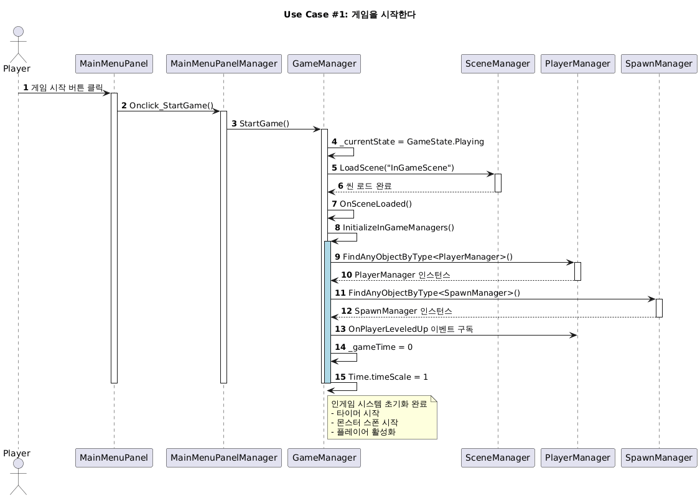

&ensp;위 그림은 사용자가 게임을 시작하는 Use Case를 나타내는 Sequence Diagram이다. Player가 Main Menu Panel에 '게임 시작' 버튼을 누르면 MainMenuPanelManager에게 이벤트가 전달된다. MainMenuPanelManager는 GameManager에게 StartGame() 함수를 호출하고, GameManager는 게임 상태를 Playing으로 변경한 후 SceneManager를 통해 인게임 씬을 로드한다. 씬 로드가 완료되면 OnSceneLoaded() 콜백이 호출되어 InitializeInGameManagers()를 통해 PlayerManager, SpawnManager 등 인게임 매니저들을 찾아 연결하고 이벤트를 구독한다. 게임 시간을 0으로 초기화하고 Time.timeScale을 1로 설정하여 게임이 시작된다.

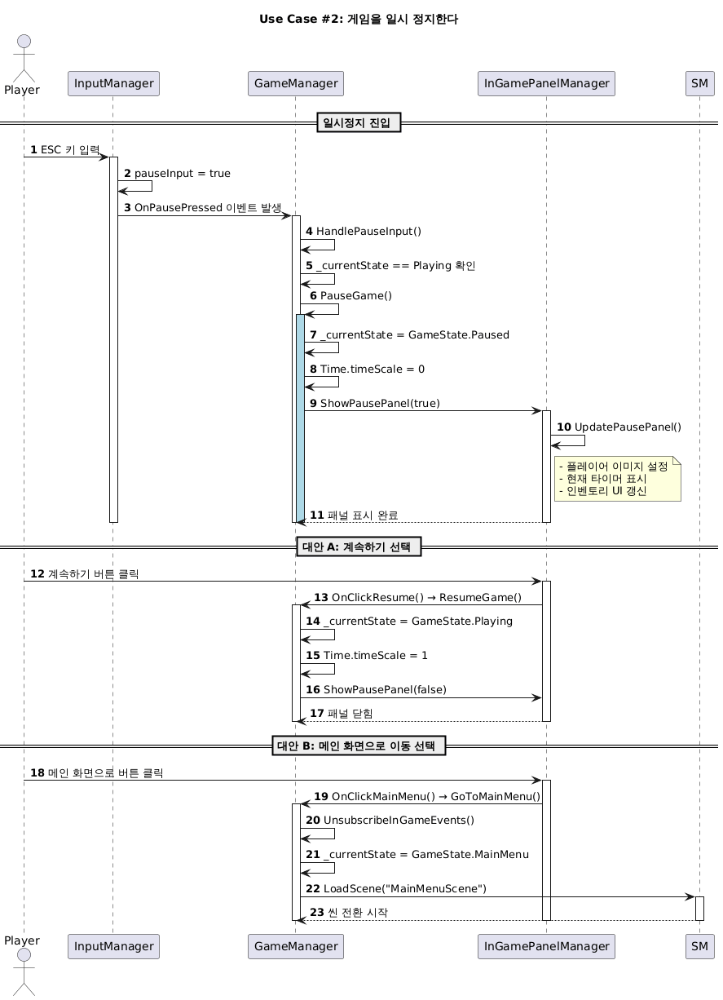

&ensp;위 그림은 게임을 일시정지 했을 때 나타나는 Sequence Diagram이다. 플레이어가 ESC를 누르면 InputManager가 매 프레임 검사하는 pauseInput을 통해 입력을 감지하고, OnPausePressed 이벤트를 발생시킨다. GameManager는 이 이벤트를 구독하고 있다가 HandlePauseInput()을 호출하고, 현재 상태가 Playing이면 PauseGame()을 실행한다. PauseGame()은 게임 상태를 Paused로 변경하고 Time.timeScale을 0으로 설정하여 게임 진행을 멈춘 뒤, InGamePanelManager의 ShowPausePanel()를 호출해 일시정지 UI를 표시한다.

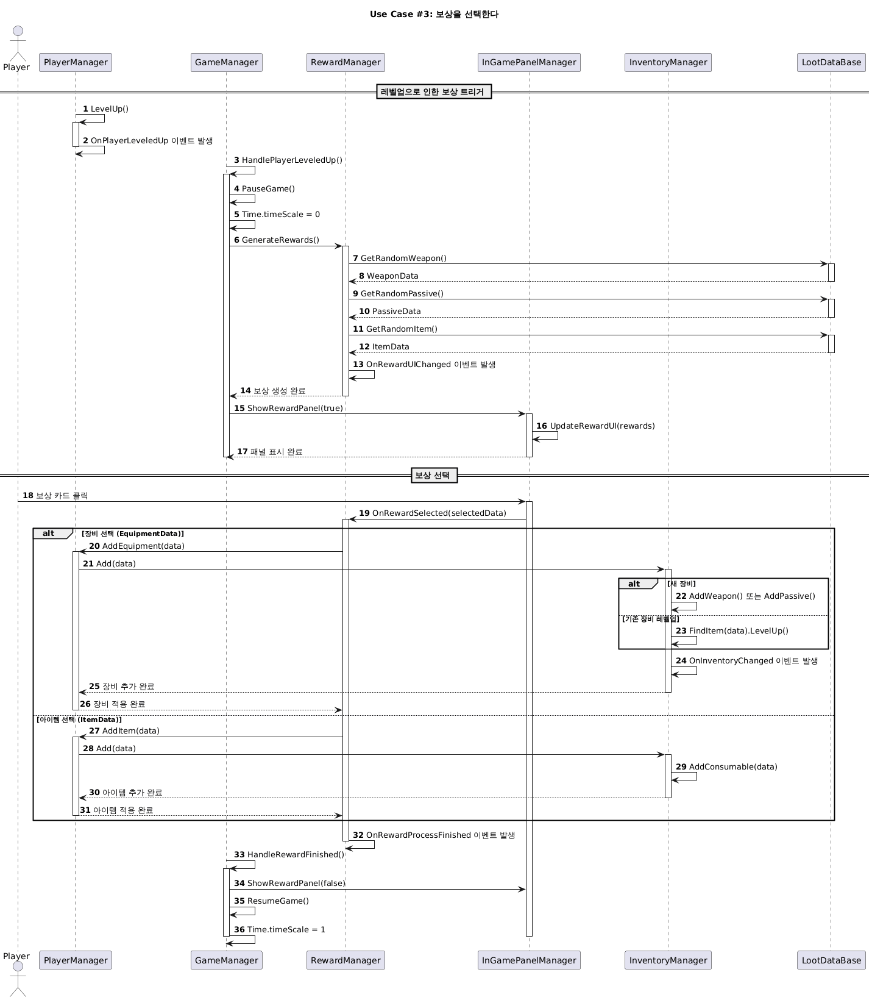

&ensp;위 그림은 플레이어가 보상을 선택하는 상황의 Sequence Diagram이다. 플레이어가 게임을 하다가 레벨업을 하면 PlayerManager가 OnPlayerLeveledUp 이벤트를 발생시킨다. GameManager가 이 이벤트를 구독하고 있다가 HandlePlayerLeveledUp()을 실행하고, PauseGame()을 호출해 게임을 일시정지 시킨다. 그 후 RewardManager의 GenerateRewards()를 통해 LootDataBase에서 무기, 패시브, 아이템 데이터를 가져와 보상 목록을 생성하고, InGamePanelManager의 ShowRewardPanel()를 통해 보상 선택 패널을 표시한다.

 플레이어가 보상 중 하나를 선택하면 RewardManager의 OnRewardSelected(data)가 호출된다. 선택된 데이터가 장비이면 PlayerManager의 AddEquipment()를 통해 InventoryManager에 장비를 추가하거나 기존 장비를 레벨업시킨다. 아이템이면 AddItem()을 통해 소모성 아이템을 추가한다. 보상 처리가 끝나면 RewardManager는 OnRewardProcessFinished 이벤트를 발생시키고, GameManager는 HandleRewardFinished()를 호출하여 보상 패널을 닫고 ResumeGame()으로 게임을 다시 시작한다.

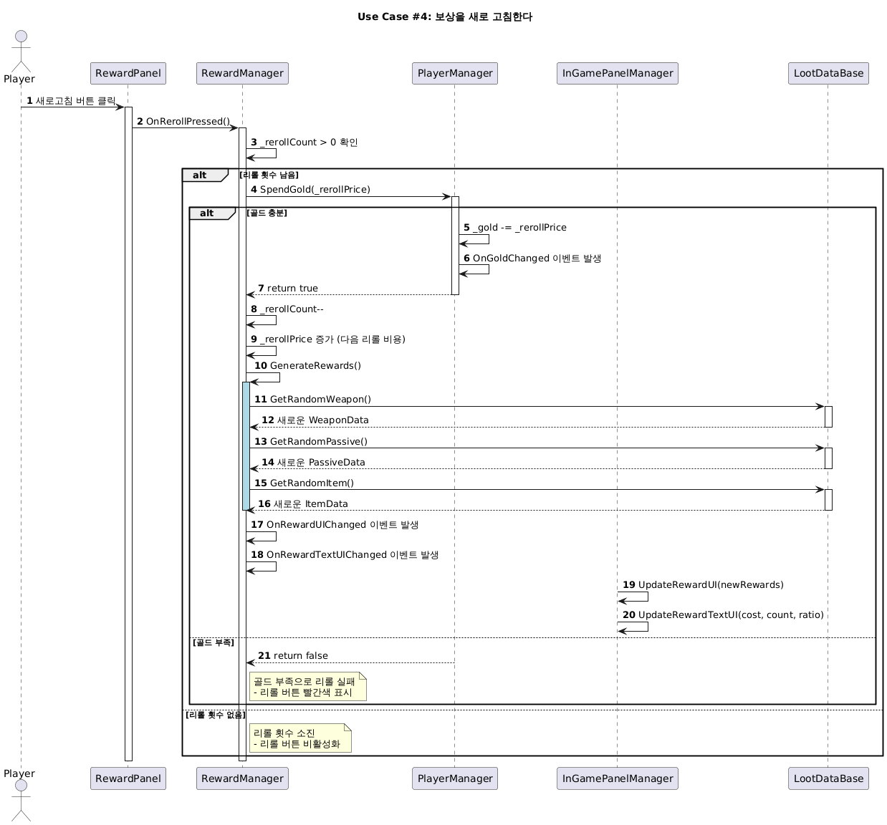

&ensp; 위 그림은 사용자가 보상을 새로 고침하는 Use Case를 나타내는 Sequence Diagram이다. Player가 보상을 받지 않고 ReRoll을 요청하면 RewardManager의 OnRerollPressed()가 호출된다. 먼저 남은 리롤 횟수가 0보다 큰지 확인하고, PlayerManager의 SpendGold(_rerollPrice)를 통해 현재 지불이 가능한지 확인한다. 현재 Player의 재화가 충분하고 지불이 가능하면 골드를 차감하고 리롤 횟수를 감소시킨 뒤, GenerateRewards()를 호출해 LootDataBase에서 새로운 무기, 패시브, 아이템 데이터를 가져와 보상을 다시 생성한다. OnRewardUIChanged와 OnRewardTextUIChanged 이벤트를 통해 InGamePanelManager가 새로운 보상 목록과 리롤 비용/횟수를 UI에 반영한다. 골드가 부족하거나 리롤 횟수가 없으면 리롤은 실패하고 버튼이 비활성화되거나 빨간색으로 표시된다.

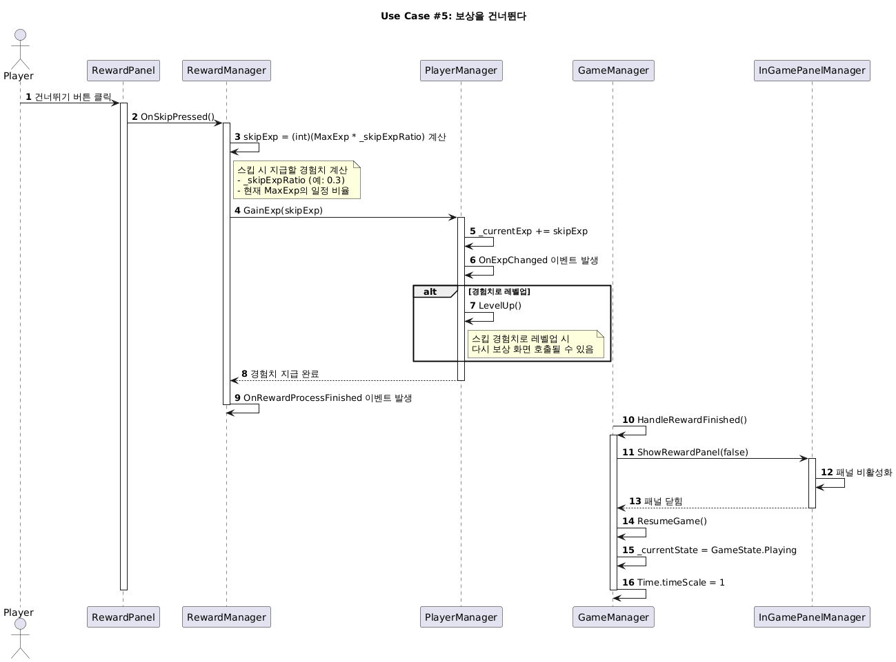

&ensp;위 그림은 사용자가 보상화면을 건너뛰는 Use Case를 나타내는 Sequence Diagram이다. Player가 보상을 받지 않고 '스킵' 버튼을 누르면 RewardManager의 OnSkipPressed()가 호출된다. RewardManager에서는 스킵 시 지급할 경험치를 계산한다. 계산된 경험치를 PlayerManager의 GainExp()를 통해 플레이어에게 지급하고, 경험치가 증가하면 OnExpChanged 이벤트가 발생한다. 만약 지급된 경험치로 레벨업이 발생하면 다시 보상 화면이 호출될 수 있다. 경험치 지급이 완료되면 OnRewardProcessFinished 이벤트가 발생하고, GameManager가 HandleRewardFinished()를 호출하여 InGamePanelManager의 ShowRewardPanel()로 보상 화면을 닫고, ResumeGame()으로 게임을 재개한다.

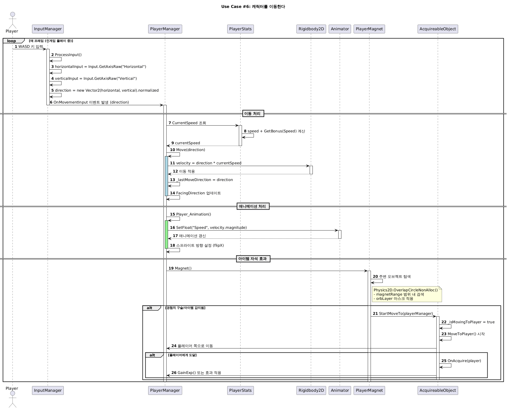

&ensp;위 그림은 '캐릭터를 이동한다' Use Case를 나타내는 Sequence Diagram이다.
이 상호작용은 loop(인게임 플레이 중) 프레그먼트(fragment) 내에서 발생하며, 게임 플레이 중에 지속적으로 반복된다.
매 프레임마다 InputManager는 ProcessInput()을 통해 플레이어의 키보드 입력(WASD)을 감지하고, 수평/수직 입력 값을 조합하여 방향 벡터를 계산한다.
이 방향 값은 OnMovementInput 이벤트를 통해 PlayerManager에 전달된다.

PlayerManager는 PlayerStats에서 현재 이동 속도(기본 속도 + 보너스)를 조회하고, Move(direction) 메서드를 통해 캐릭터를 이동시킨다.
이동 방향에 따라 FacingDirection을 업데이트하여 sprite의 방향을 결정하고, Player_Animation()을 호출해 Animator에 속도 값을 전달하여 이동 애니메이션을 재생한다.
또한 PlayerMagnet의 Magnet()을 호출해 주변의 경험치 구슬이나 아이템을 탐색하고, 범위 내에 있으면 StartMoveTo()를 통해 오브젝트를 플레이어 쪽으로 끌어당겨 획득 처리한다.

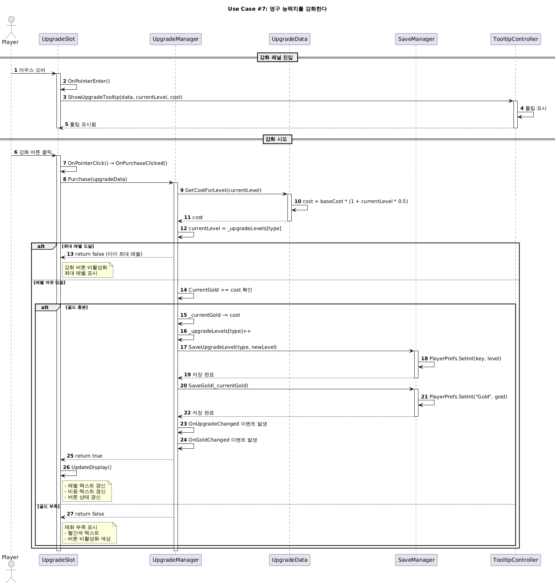

&ensp;위 그림은 플레이어가 영구 능력치를 강화할 때를 나타내는 Sequence Diagram이다.
플레이어가 강화 패널에서 특정 능력치 슬롯에 마우스를 올리면 UpgradeSlot의 OnPointerEnter()가 호출되어 TooltipController를 통해 해당 능력치의 상세 정보(현재 레벨, 비용, 효과)를 툴팁으로 표시한다.

플레이어가 강화 버튼을 클릭하면 OnPointerClick()을 통해 OnPurchaseClicked()가 호출되고, UpgradeManager의 Purchase(upgradeData)를 실행한다.
UpgradeManager는 먼저 UpgradeData의 GetCostForLevel()을 통해 현재 레벨에서의 강화 비용을 계산하고, 최대 레벨 도달 여부와 골드 보유량을 확인한다.
골드가 충분하고 최대 레벨이 아니면 골드를 차감하고 레벨을 증가시킨 뒤, SaveManager를 통해 강화 레벨과 골드를 저장한다.
OnUpgradeChanged와 OnGoldChanged 이벤트를 발생시켜 UI를 갱신한다.
골드가 부족하거나 최대 레벨이면 강화는 실패하고 해당 상태를 UI에 표시한다.

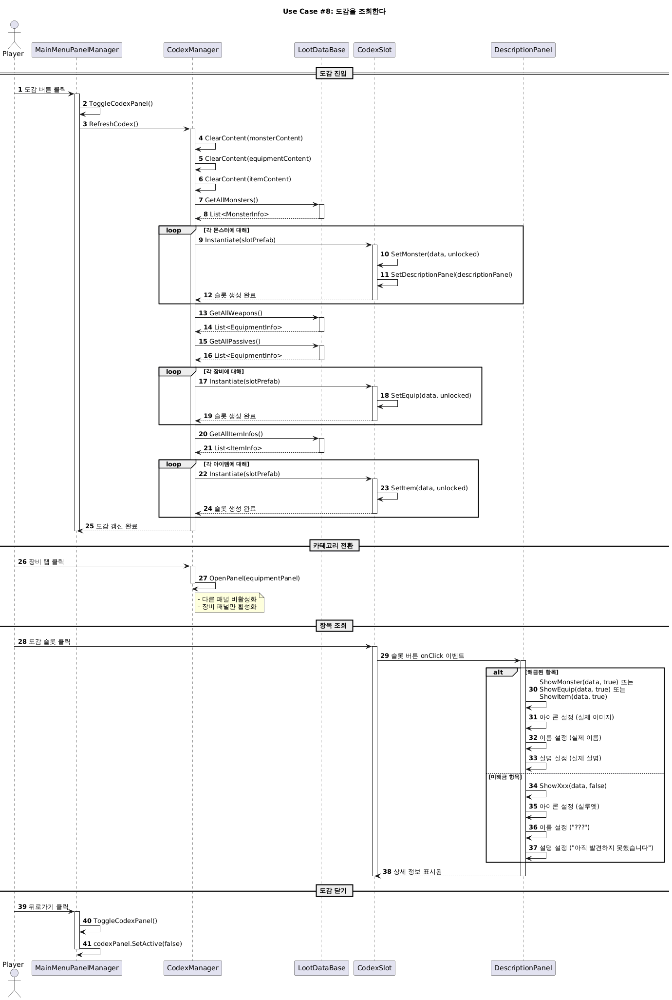

&ensp;위 그림은 플레이어가 메인 메뉴에서 도감을 조회하는 과정을 나타낸 Sequence Diagram이다.
플레이어가 도감 버튼을 누르면 MainMenuPanelManager의 ToggleCodexPanel()이 호출되어 도감 패널을 활성화하고, CodexManager의 RefreshCodex()를 통해 도감 데이터를 갱신한다.
RefreshCodex()는 먼저 기존 슬롯들을 모두 제거(ClearContent)한 뒤, LootDataBase에서 모든 몬스터, 장비(무기/패시브), 아이템 정보를 조회하고 각각에 대해 CodexSlot을 동적으로 생성하여 배치한다.

이후 플레이어가 카테고리 탭(몬스터/장비/아이템)을 클릭하면 CodexManager의 OpenPanel()이 해당 패널만 활성화하고 나머지는 비활성화한다.
플레이어가 특정 도감 슬롯을 클릭하면 CodexSlot이 DescriptionPanel에 상세 정보 표시를 요청한다.
해금된 항목이면 실제 아이콘, 이름, 설명이 표시되고, 미해금 항목이면 실루엣 아이콘과 "???" 이름, "아직 발견하지 못했습니다" 설명이 표시된다.
뒤로가기를 누르면 도감 패널이 닫히고 메인 메뉴로 돌아간다.

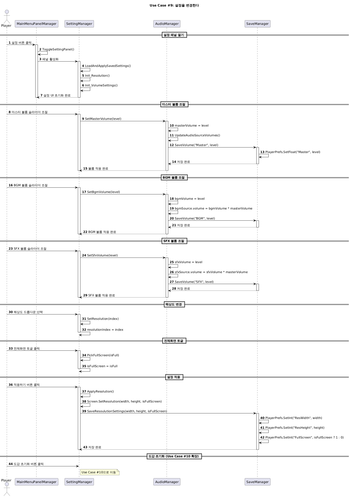

&ensp;위 그림은 플레이어가 설정을 변경하는 상황의 Sequence Diagram이다.
플레이어가 '설정' 버튼을 누르면 MainMenuPanelManager의 ToggleSettingPanel()을 호출하여 설정 UI를 표시한다.
SettingManager는 LoadAndApplySavedSettings()를 통해 저장된 설정을 로드하고 UI를 초기화한다.

플레이어가 마스터/BGM/SFX 볼륨 슬라이더를 조절하면 SettingManager가 AudioManager의 SetMasterVolume(), SetBgmVolume(), SetSfxVolume()을 각각 호출하여 볼륨을 적용하고 SaveManager를 통해 PlayerPrefs에 저장한다.
해상도 드롭다운을 선택하거나 전체화면 토글을 클릭하면 SettingManager가 해당 값을 저장해두고, '적용하기' 버튼을 클릭하면 ApplyResolution()을 통해 Screen.SetResolution()으로 실제 해상도를 변경하고 SaveManager를 통해 영구 저장한다.
'도감 초기화' 버튼을 클릭하면 Use Case #10으로 이동한다.

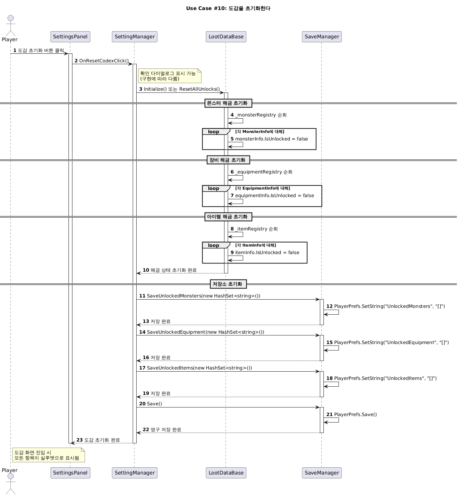

&ensp;위 그림은 플레이어가 도감을 초기화하는 상황의 Sequence diagram이다. 플레이어가 설정 화면에서 '도감 초기화' 버튼을 누르면 SettingManager의 OnResetCodexClick이 호출되고 CodexManager의 ResetCodex를 호출하여 도감을 초기화한다.

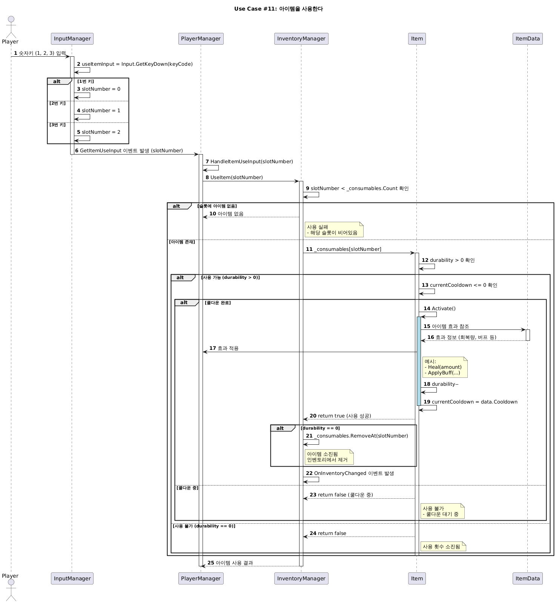

&ensp;위 그림은 사용자가 아이템을 사용하는 Use case를 나타내는 Sequence diagram이다.

게임 플레이 중 얻은 아이템은 PlayerManager가 보낸 AddItem 신호를 통해 ItemManager가 관리한다. 게임 플레이 중 사용자가 아이템을 사용하기위해 GetItemUseInput 신호를 보내면 UseItem, ActivateItem 신호로 PlayerManager를 거쳐 ItemManager가 관리하고 있던 아이템이 사용된다. 아이템 사용 신호를 받은 후 ItemManager가 Item에게 Activate 신호를 보내면 Item에서 그 아이템의 durability를 확인한다. 만약 durability가 0보다 크면 정상적으로 아이템이 사용되고, 그렇지 않으면 아이템이 사용되지 않는다. 아이템이 사용된 경우에 UpdateCooldown을 통해 아이템의 쿨타임을 적용하고 durability를 1 감소시킨 후, 사용된 아이템에 따른 효과를 PlayerManager에서 반영한다.

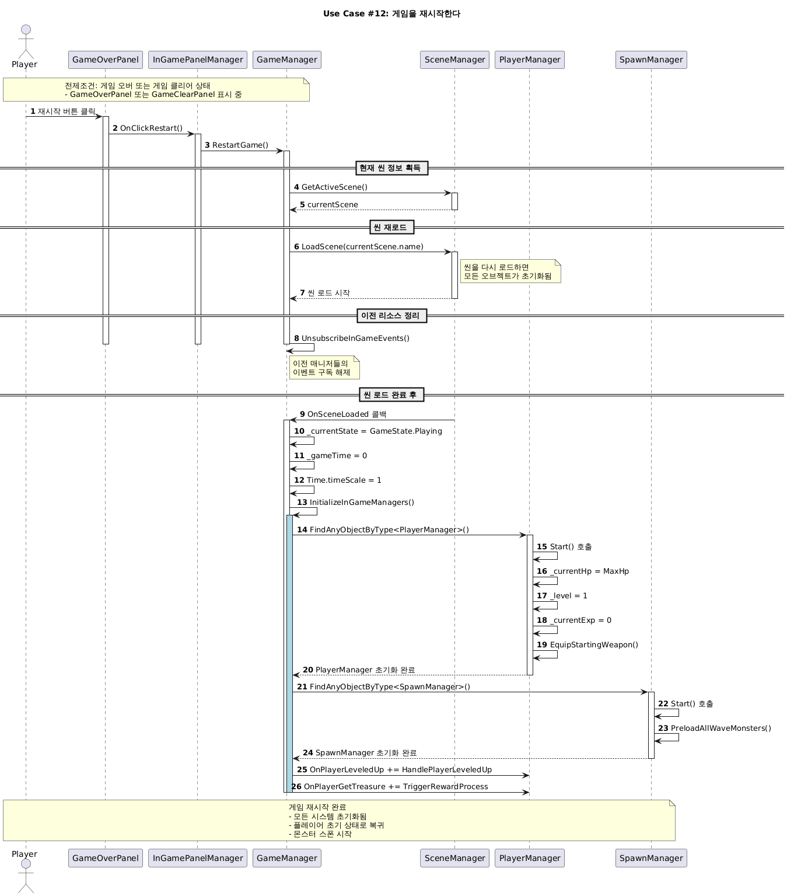

&ensp;위 그림은 플레이어가 결과 화면에서 게임을 재시작 할 때를 나타내는 Sequence diagram이다. 플레이어가 InGAME Panel의 'Restart' 버튼을 누르면 InGamePanelManager가 이벤트를 받아 GameManager에게 Restart 함수를 실행 시킨다. GameManager는 열려있는 결과 화면창을 닫고 시스템을 초기화한 이후에 게임씬을 다시 시작한다.

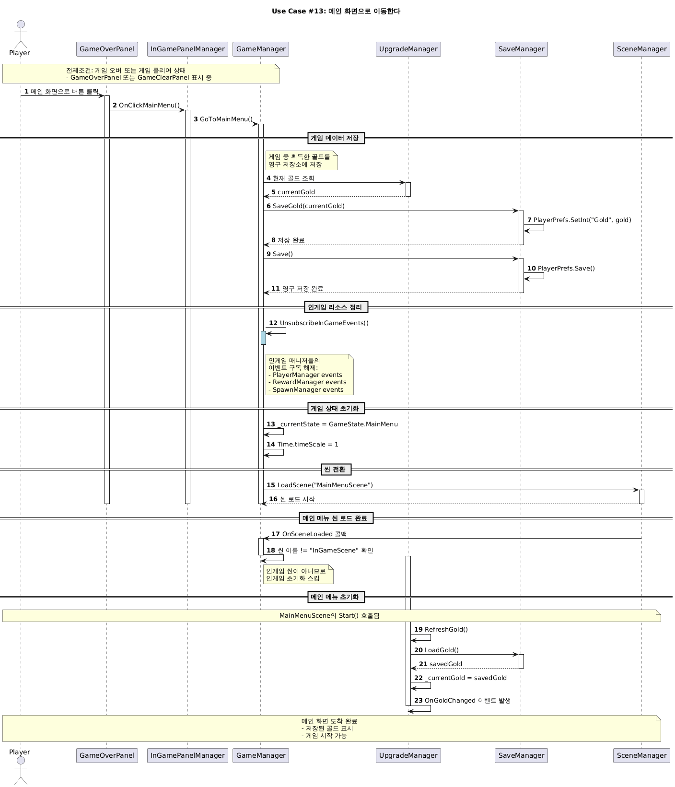

&ensp;위 그림은 플레이어가 결과 화면에서 메인 메뉴로 넘어갈 떄를 나타내는 Sequence diagram이다. 플레이어가 InGamePanel의 'Main menu' 버튼을 누르면 InGamePanelManager가 이벤트를 받아 GameManager에게 GoToMain 함수를 실행시킨다.GameManager는 현재 게임씬에서 메인 화면씬으로 전환한다.

---

# 5. State machine diagram

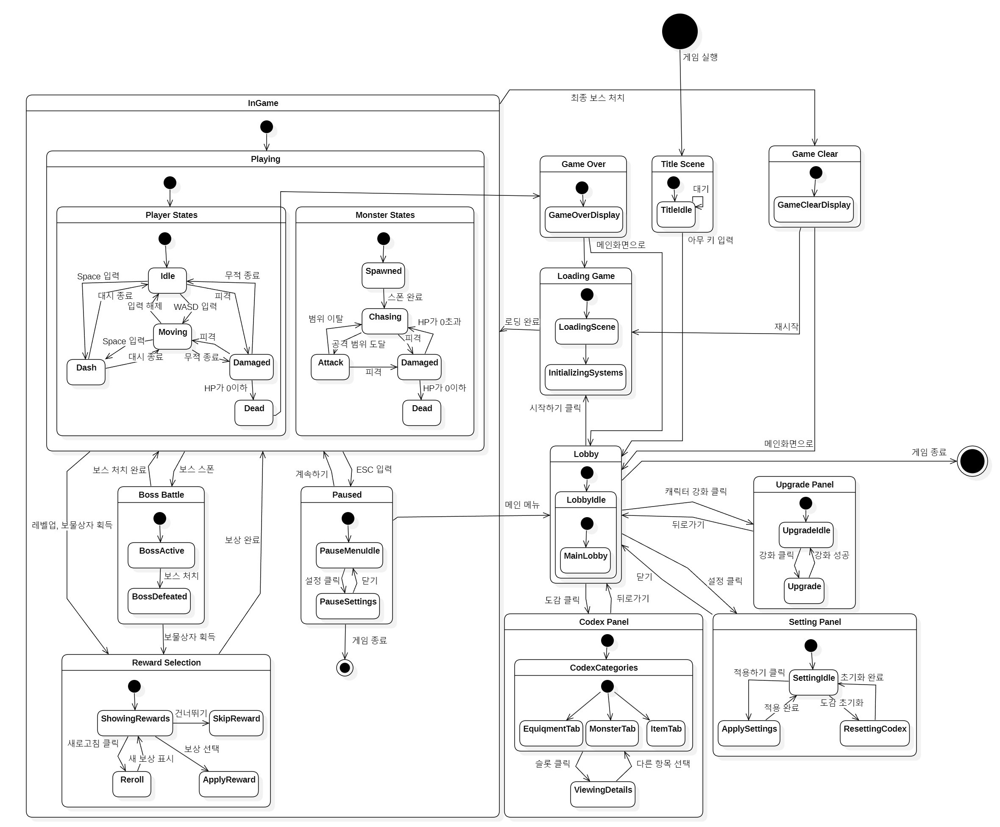

* 각 State는 게임에서 어떤 Scene을 보여주고 있는지에 대한 상태이고, Game Scene 내에서는 플레이어와 몬스터의 행동에 따라 캐릭터의 상태가 어떻게 바뀌는지 나타낸다. 게임의 최상위 상태는 [GameManager](cci:2://file:///d:/Develop/SE%20Project/SE-Fork/roguelike/Assets/01_Scripts/_Core/GameManager.cs:18:0-443:1)의 `GameState` enum(MainMenu, Playing, Paused, GameOver, GameClear)으로 관리된다.

&ensp;이 프로젝트의 State는 크게 Title Scene, Lobby, Upgrade Panel, Codex Panel, Setting Panel, Loading Game, InGame(Playing, Paused, Reward Selection, Boss Battle), Game Over, Game Clear가 있다. 게임을 실행하면 Title Scene에서 시작한다. Title 화면에서 아무 키나 누르면 `MainMenuPanelManager.HandleLobbyInput()`이 호출되어 Lobby 화면으로 이동한다. 

&ensp;Lobby 화면에서는 여러 버튼을 통해 다양한 패널로 이동할 수 있다. '캐릭터 강화' 버튼을 누르면 Upgrade Panel로 이동하여 게임에서 획득한 골드로 캐릭터의 영구 능력치를 강화할 수 있다. '도감' 버튼을 누르면 Codex Panel로 이동하여 게임을 플레이하면서 발견한 몬스터, 장비, 아이템의 정보를 확인할 수 있으며, 미발견 항목은 실루엣으로 표시된다. '설정' 버튼을 누르면 Setting Panel로 이동하여 해상도, 볼륨 등을 조절하거나 도감을 초기화할 수 있다. 각 패널에서 뒤로가기를 누르면 Lobby로 돌아온다. '시작하기' 버튼을 누르면 `GameManager.StartGame()`이 호출되어 Loading Game 상태를 거쳐 InGame Scene으로 진입한다.

&ensp;InGame에 들어가면 본격적으로 게임을 플레이할 수 있으며, 여러 하위 상태가 존재한다. 기본 Playing 상태에서 Player는 WASD 키 입력에 따라 Idle(정지) 또는 Moving(이동) 상태로 전환되며, Space 키를 누르면 쿨다운이 완료된 경우 Dashing(대시) 상태로 전환된다. 몬스터에게 피격당하면 Damaged 상태가 되어 무적 시간 동안 깜빡임 효과가 적용되고, HP가 0 이하가 되면 Dead 상태로 전환된다.

&ensp;시스템 내부적으로 Enemy는 `SpawnManager`에 의해 Wave 기반으로 Player 주변에 Spawn된다. Spawned 상태 이후 페이드인 효과와 함께 Chasing 상태로 전환되어 Player 방향으로 이동한다. Player와 충돌하거나 공격 범위 내에 들어오면 Attacking 상태로 전환되어 접촉 데미지 또는 원거리 공격을 수행한다. Player의 공격에 맞으면 Damaged 상태가 되어 붉은 깜빡임 효과가 적용되고, HP가 0 이하가 되면 Dead 상태로 전환되어 경험치 구슬을 드롭하고 오브젝트 풀로 반환된다.

&ensp;Playing 상태에서 ESC 키를 누르면 `GameManager.PauseGame()`이 호출되어 `Time.timeScale`이 0이 되고 Paused 상태로 전환된다. 일시정지 메뉴에서 '계속하기'를 누르면 [ResumeGame()](cci:1://file:///d:/Develop/SE%20Project/SE-Fork/roguelike/Assets/01_Scripts/_Core/GameManager.cs:176:4-191:5)으로 Playing 상태로 복귀하고, '메인 화면으로'를 누르면 [GoToMainMenu()](cci:1://file:///d:/Develop/SE%20Project/SE-Fork/roguelike/Assets/01_Scripts/_Core/GameManager.cs:277:4-285:5)로 Lobby로 돌아간다. 레벨업하거나 보물상자를 획득하면 Reward Selection 상태로 전환되어 3개의 보상 중 하나를 선택하거나 리롤/스킵할 수 있으며, 선택 완료 시 [HandleRewardFinished()](cci:1://file:///d:/Develop/SE%20Project/SE-Fork/roguelike/Assets/01_Scripts/_Core/GameManager.cs:352:4-363:5)가 호출되어 Playing 상태로 복귀한다. 보스 몬스터가 스폰되면 Boss Battle 상태로 전환되어 타이머가 정지하고 보스 HP바가 표시되며, 보스를 처치하면 보물상자가 드롭된다.

&ensp;Player가 Dead 상태가 되면 `GameManager.GameOver()`가 호출되어 Game Over 상태로 전환된다. Game Over 화면에서는 플레이 시간, 획득 골드, 처치 수, 장착 장비가 표시되며, '재시작' 버튼을 누르면 [RestartGame()](cci:1://file:///d:/Develop/SE%20Project/SE-Fork/roguelike/Assets/01_Scripts/_Core/GameManager.cs:287:4-294:5)으로 InGame을 처음부터 다시 시작할 수 있고, '메인 화면으로' 버튼을 누르면 [GoToMainMenu()](cci:1://file:///d:/Develop/SE%20Project/SE-Fork/roguelike/Assets/01_Scripts/_Core/GameManager.cs:277:4-285:5)로 Lobby로 돌아갈 수 있다. 마지막 보스를 처치하면 `GameManager.GameClear()`가 호출되어 Game Clear 상태로 전환되며, Game Over와 마찬가지로 재시작하거나 Lobby로 돌아갈 수 있다. 게임은 Game Clear나 Game Over가 되면 종료되며, 획득한 골드는 `SaveManager`를 통해 영구 저장되어 다음 플레이에서 강화에 사용할 수 있다.

---

# 6. User interface prototype

&ensp; 본 6장은 구현할 UI의 구조와 UI 안의 각 구성요소를 설명한다. 프로토타입이기 때문에 UI 디자인은 일부 달라질 수 있지만 내용 및 구성은 거의 동일하다.

## 6.1 타이틀 화면 (Title)

* 아래 그림은 게임을 맨 처음 실행하면 등장하는 타이틀 화면이다.

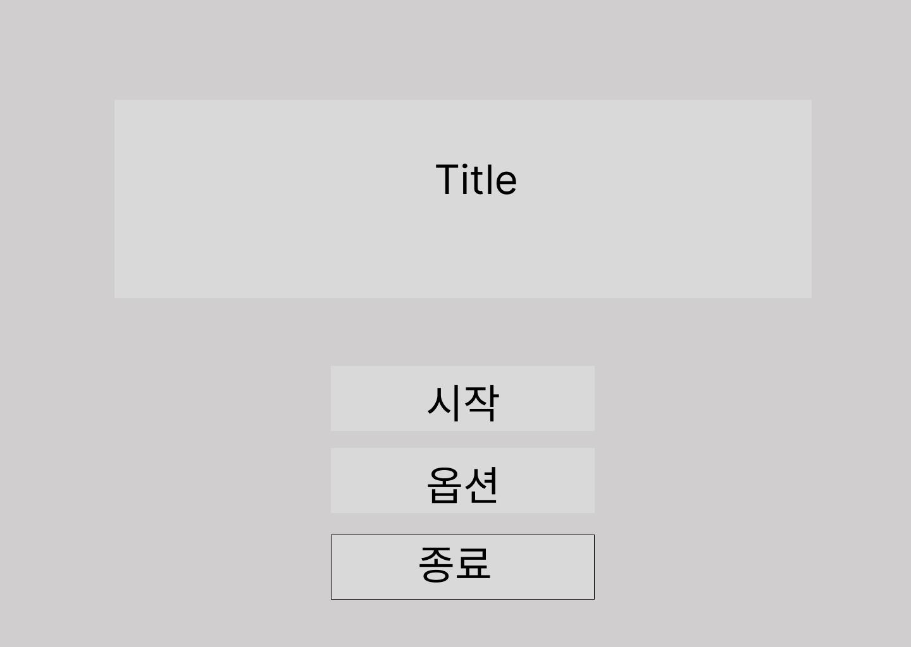

&ensp;게임을 실행하면 처음으로 나타나는 타이틀 화면이다. 아무 키나 누르면 로비 화면으로 넘어간다.

## 6.2 환경설정 화면
* 아래 그림은 타이틀 화면에서 옵션창을 눌렀을 때 나오는 화면이다.

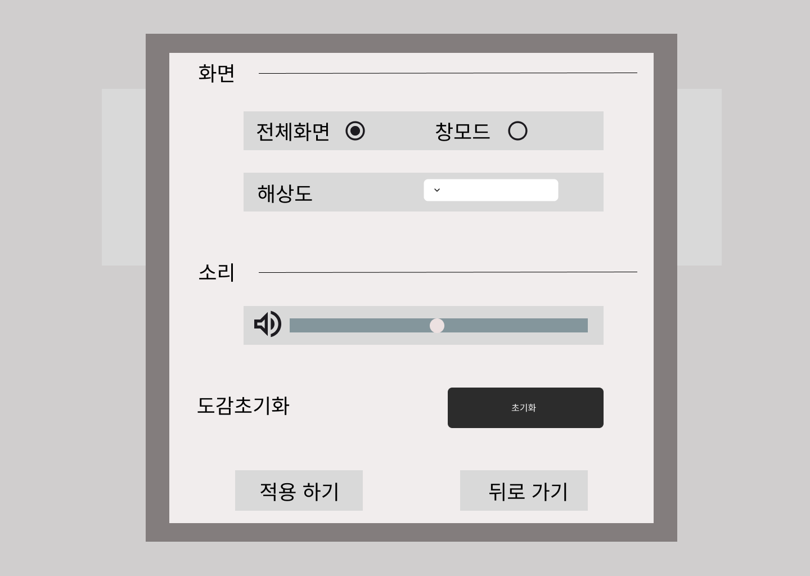

&ensp;옵션을 선택하면 설정창을 팝업으로 띄워준다. 화면, 소리, 도감 초기화 부분에서 상세설정을 진행할 수 있다. 화면 부분에선 전체화면을 선택해 모니터 전체에 게임화면을 맞추거나 창모드를 선택해 해상도에 따른 창크기로 표시할 수도 있다. 화면모드, 해상도, 음향 크기를 원하는대로 설정한 후 적용하기 버튼을 누르면 입력한 설정대로 바뀌게 된다. 또한, ‘도감 초기화‘ 버튼을 누르면 플레이어가 해금한 도감의 내용들을 처음 상태로 되돌릴 수 있다. 설정이 끝나면 뒤로가기를 눌러 설정창을 닫을 수 있다.

## 6.3 로비 화면
* 아래 그림은 타이틀 화면에서 시작을 눌렀을 때 나오는 메인로비이다.

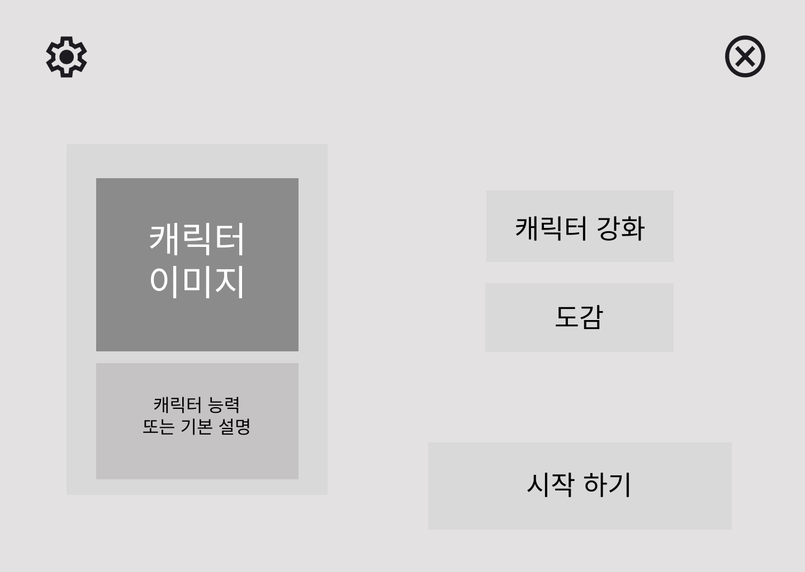

&ensp;메인 화면에서는 게임을 진행할 캐릭터의 이미지와 설명을 보여준다. 설명 부분에서는 캐릭터의 고유 능력과 게임을 시작할 때 가지는 기본 장비를 알려준다. ‘캐릭터 강화’ 버튼을 누르면 게임 안에서 획득한 골드를 통해 영구적으로 캐릭터의 스탯을 강화할 수 있다. ‘도감’ 버튼을 눌러 몬스터, 장비, 아이템에 대한 간략한 설명을 볼 수 있으며, ‘시작하기’ 버튼을 눌러 게임을 시작할 수 있다.

## 6.4 도감 화면
* 아래 그림은 메인 로비에서 도감을 선택했을 때 나오는 도감화면이다.
  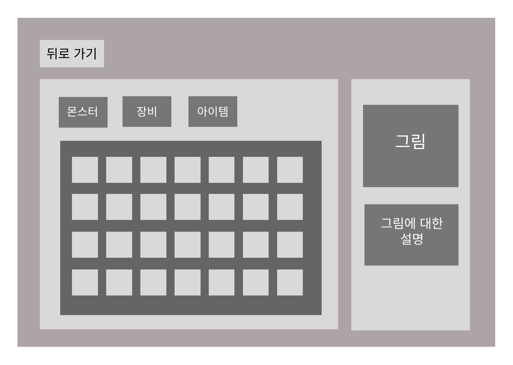

&ensp;도감에서는 게임에 등장하는 오브젝트를 유형별로 구분하여 각 버튼을 선택하면 몬스터, 장비, 아이템들을 모아서 볼 수 있다. 잡거나 획득했던적이 있는 오브젝트들은 클릭하여 오른쪽 화면에서 그림과 함께 상세정보를 확인할 수 있고, 그렇지 않은 오브젝트들은 실루엣으로 표시되어 상세정보를 확인할 수 없다. 좌측상단의 뒤로가기를 눌러 메인 화면으로 돌아갈 수 있다.

## 6.5 특성 선택 화면
* 아래 그림은 메인로비에서 캐릭터 강화를 선택했을 때 나오는 화면이다.
  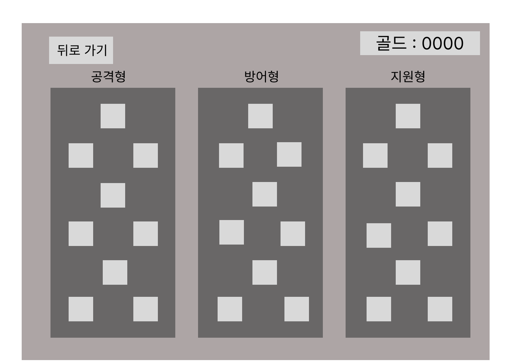

&ensp;캐릭터 강화 화면에선 게임을 통해 획득한 골드를 사용하여 캐릭터의 능력치를 영구적으로 강화할 수 있다. 원하는 능력치에 마우스를 올리면 해당 능력치에 대한 상세 정보를 표시해준다. 좌측상단의 뒤로가기를 눌러 메인 화면으로 돌아갈 수 있다.

## 6.6 특성 설명 화면
* 아래 그림은 캐릭터 강화하면에서 능력치에 마우스를 올려놓았을 때 상세설명을 보여주는 화면이다.
  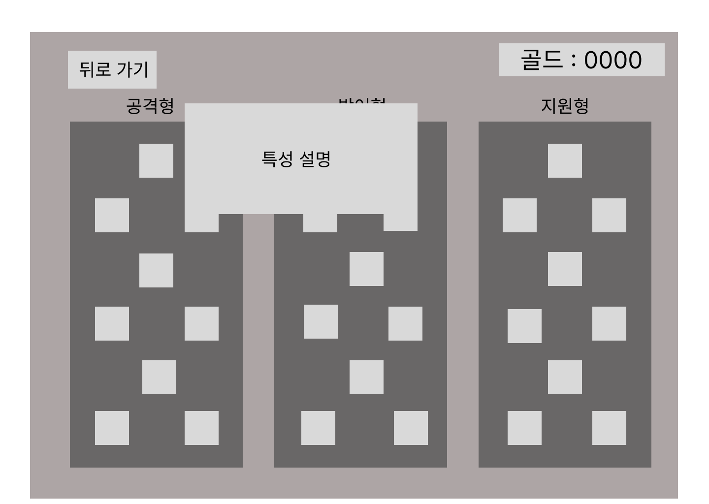

## 6.7 인게임 기본 화면
*아래 그림은 게임을 시작했을 때 나오는 인게임 UI프로토타입이다.

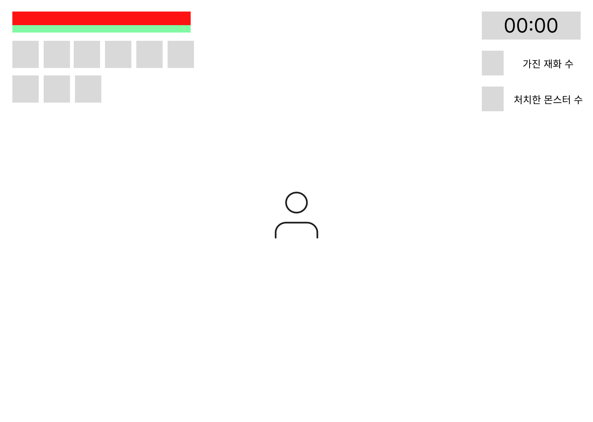

&ensp;인게임 UI 프로토타입을 보여준다. 좌측 상단에는 플레이어의 체력(HP)과 경험치(EXP)를 나타내는 바가 배치되어 있다. 그 하단에는 획득한 장비를 나타내는 6개의 슬롯 과 소모성 아이템을 표시하는 3개의 슬롯이 나란히 정렬되어 있다. 우측 상단에는 타이머가 남은 시간을 표시하며, 그 아래로는 플레이어가 보유한 총 재화와 몬스터 처치 수가 실시간으로 집계되어 나타난다.

## 6.8 인게임 Pause 화면
* 아래 그림은 인게임 진행중에 ESC를 눌렀을 때 나오는 UI 프로토타입이다.

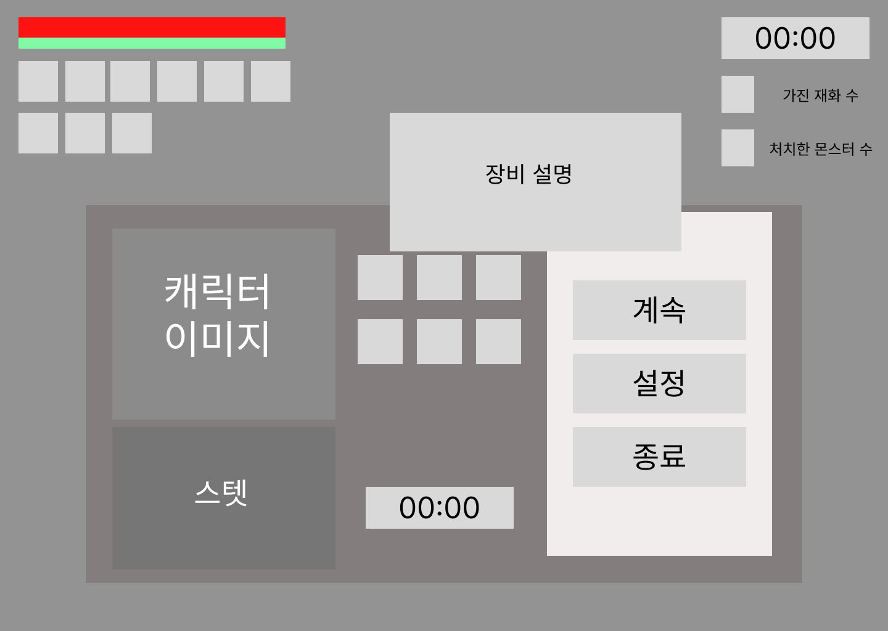

&ensp;ESC 키를 누르면 화면이 어두워지며 게임이 일시 정지되고, 위 그림과 같은 메뉴 창이 나타난다. 좌측에는 '캐릭터 이미지'와 그 하단에 플레이어의 '종합 능력치(스탯)'가 표시된다. 중앙 상단에는 플레이어가 착용한 '장비' 슬롯이 있으며, 각 장비 아이콘에 마우스를 올리면 '장비 설명'란에 상세 정보가 나타난다. 중앙 하단에는 현재 '진행 시간'이 표시된다. 우측에는 게임을 '계속'하거나, '설정' 창을 열거나, 게임을 '종료'하고 시작 화면으로 돌아갈 수 있는 메뉴 버튼이 제공된다.

## 6.9 플레이어 데미지 받는 화면
* 아래 그림은 인게임 진행중 몬스터에게 공격받을 때의 UI 프로토타입이다.

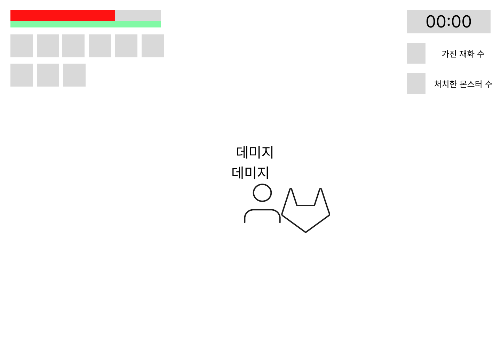

    [그림 6-9]-데미지 받는 화면

&ensp;플레이어의 캐릭터가 몬스터에게 닿거나 공격받으면 일정 수치의 데미지가 캐릭터 위에 표시되고 플레이어의 체력이 데미지 만큼 감소된다. 플레이어의 체력이 0이 되면 캐릭터가 사망하고 게임오버가 된다.

## 6.10 플레이어 공격 화면
* 아래 그림은 인게임 진행중 플레이어가 몬스터를 공격할 때의 UI 프로토타입이다.

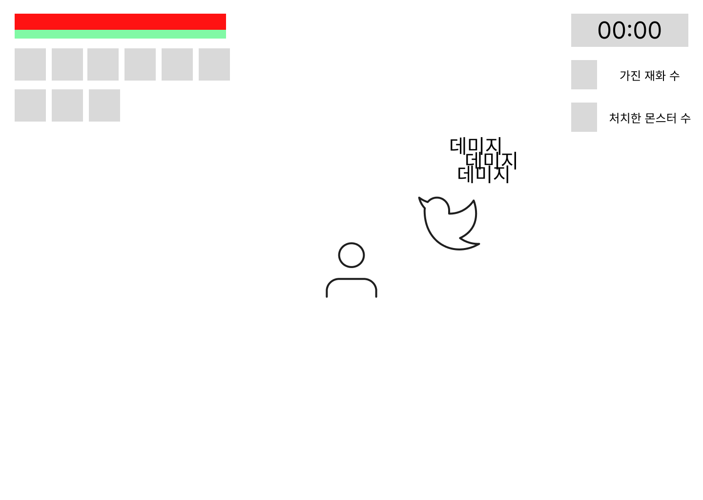

&ensp;몬스터를 공격하면 일정 수치의 데미지가 몬스터 위에 표시되고 몬스터의 체력이 데미지 만큼 감소한다. 몬스터 체력이 0이 되면 몬스터는 사망한다.

## 6.11 적처치 보상 오브젝트 화면
* 아래 그림은 인게임 진행중 플레이어가 몬스터를 처치할 때의 UI 프로토타입이다.

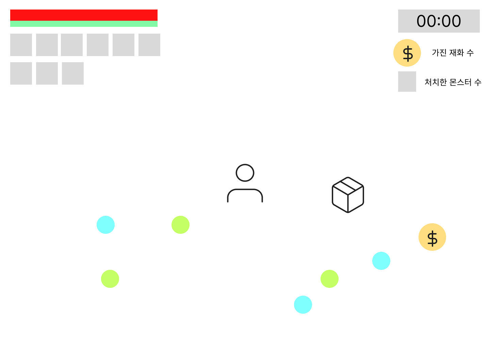

&ensp;몬스터가 사망하면 플레이어가 일정량의 경험치를 획득할 수 있는 구슬이 나타난다. 구슬은 색깔별로 다른 경험치를 제공한다. 아이템과 장비를 획득하는 보물상자와 캐릭터를 강화할 수 있는 골드 또한 일정 확률로 나타난다.

## 6.12 보스 등장 화면
* 아래 그림은 인게임 진행중 보스 몬스터가 등장할 때의 UI 프로토타입이다.

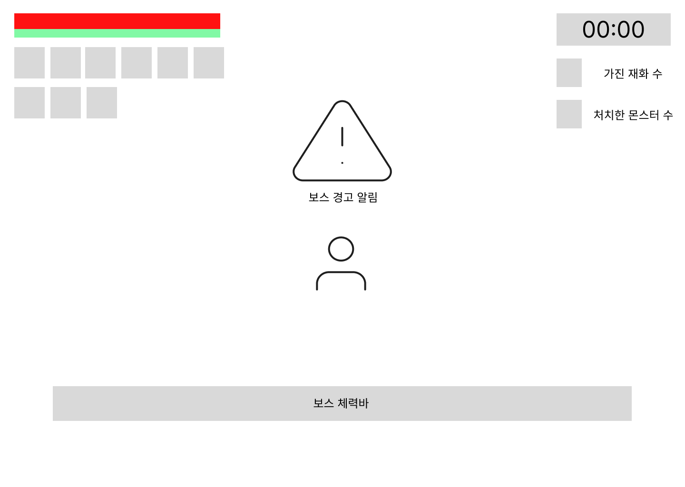

&ensp;게임을 진행하다 보면 일정 시간마다 보스 몬스터가 출현한다. 보스 몬스터가 나타나면 화면 중앙에 보스 몬스터 등장 경고가 나타나고, 보스 몬스터 체력을 나타내는 보스 체력바가 화면에 나타난다. 보스 몬스터가 출현하고 있다면 타이머는 정지한다. 플레이어가 보스 몬스터를 처치하면 아이템과 장비를 획득하는 보물상자와 플레이어 레벨을 올려주는 경험치 구슬, 캐릭터 강화에 필요한 골드 등을 획득할 수 있다. 플레이어가 마지막 보스 몬스터를 처치하면 게임이 클리어된다.

## 6.13 거점 보호 이벤트 발생 화면
* 아래 그림은 인게임 진행중 거점 이벤트가 발생할 때의 UI 프로토타입이다.

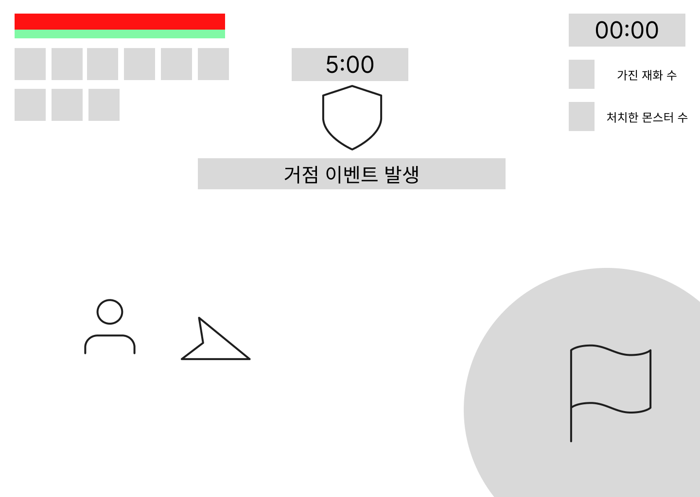

&ensp;게임 진행 중 일정 확률로 거점 이벤트가 발생한다. 이때 플레이어는 정해진 구역을 몬스터의 공격으로부터 보호해야 하며 그 위치는 캐릭터 주변의 화살표를 통해 표시된다. 거점 이벤트는 5분간 진행되며 몬스터의 공격으로부터 보호 성공 시 아이템과 장비를 획득하는 보물상자를 얻을 수 있다.

## 6.14 보상 선택 화면
* 아래 그림은 보상 화면을 나타내는 UI 프로토타입이다.

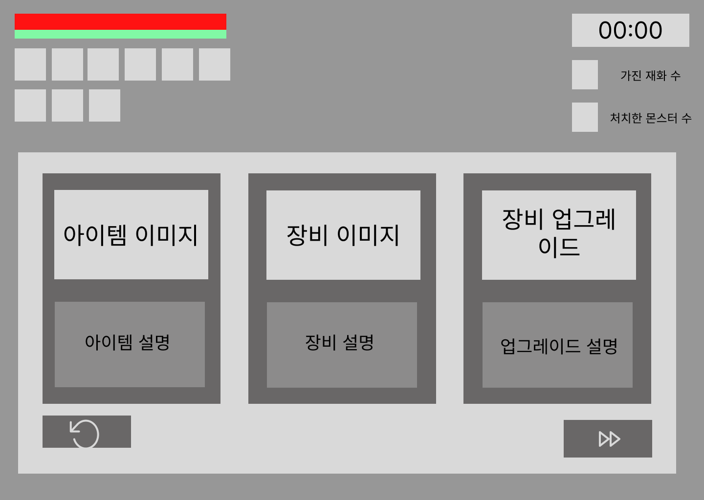

&ensp;플레이어가 경험치를 획득하여 레벨 업을 하거나 보스 처치 이벤트 성공을 했을 때 나오는 상자를 먹으면 게임 화면이 어두워지며 위의 그림과 같은 창이 나타난다.
총 3개의 선택할 수 있는 선택지가 제시되며, 각 선택지는 이미지와 설명을 포함한다. 보상의 유형은 ‘소모형 아이템 획득’, ‘신규 장비 획득’ 또는 ‘보유 장비 업그레이드’ 등이 나올 수 있다.
보상 화면의 좌측 하단의 버튼을 누르면 위의 보상 목록을 변경할 수 있다. 우측 상단의 버튼을 누르면 보상을 포기하는 대신 경험치(EXP)를 획득할 수 있다.

## 6.15 장비/아이템 획득 화면
*아래 그림은 보상을 획득했을 때 장비나 아이템이 표시되는 화면이다.

&ensp;필드에 나타나는 보물상자를 통해 얻은 아이템과 장비 등을 착용하게 되면 캐릭터 체력바 밑의 '장비'슬롯에 착용한 장비의 아이콘이 표시된다. 각 장비 아이콘에 마우스를 올리면 '장비 설명'란에 상세 정보가 나타난다.

## 6.16 게임 클리어 화면
*아래의 그림은 게임을 클리어 시 나오는 UI 프로토타입이다.

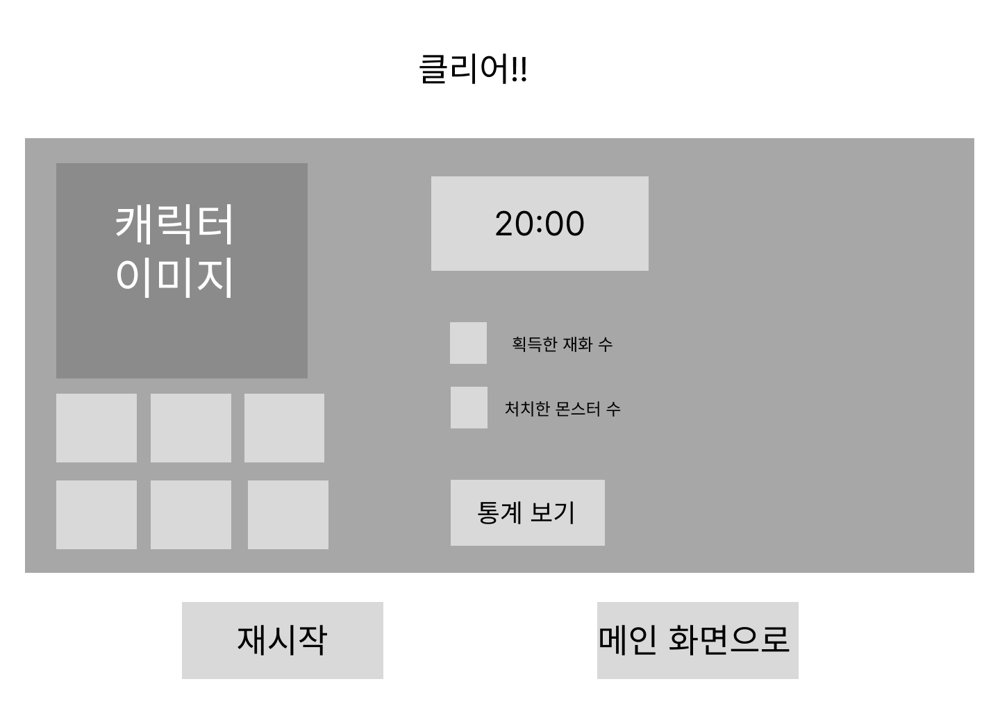

&ensp;상단 중앙에 클리어 메시지를 출력하여 게임이 끝났다는 것을 알려준다. 좌측에는 플레이한 캐릭터의 이미지와 장착한 장비들을 보여준다. 우측에는 플레이한 시간, 획득한 재화 그리고 처치한 몬스터의 수를 보여준다. 하단의 재시작 버튼을 누르면 게임을 처음부터 다시 시작한다. 메인 화면 버튼을 누르면 메인 화면으로 넘어간다.

## 6.17 게임 오버 화면
*아래 그림은 게임오버 되었을 때 나타나는 UI 프로토타입이다.

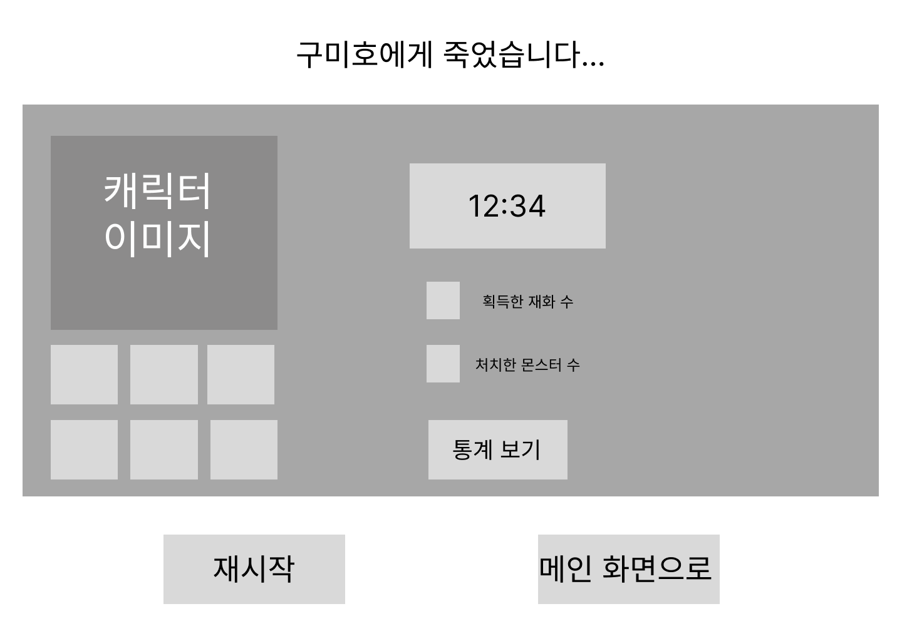

&ensp;상단 중앙에 ‘'플레이어를 처치한 몬스터'에게 죽었습니다.’ 메시지를 출력한다. 나머지는 클리어 UI와 동일하다.

---

# 7. Implementation requirements

* **개발 환경 (Development Environment):**
    * **Engine:** Unity 6000.0.62
    * **IDE:** Visual Studio 2022, JetBrain Rider 2025.2.4
    * **Language:** C#
    * **Version Control:** Git, GitHub

---

# 8. Glossary

| 용어                    | 설명                                                        |
|:----------------------|:----------------------------------------------------------|
| **HUD**               | (Heads-Up Display) 게임 플레이 중 화면에 상시 표시되는 UI (체력 바, 타이머 등). |
| **Prefab**            | Unity 엔진에서 사용되는, 미리 구성된 게임 오브젝트의 원본 템플릿.                  |
| **Scene**             | Unity 엔진에서 게임의 특정 화면이나 레벨을 구성하는 단위.                       |
| **Roguelike (로그라이크)** | 게임의 장르 중 하나로, 본 프로젝트가 지향하는 탑다운 액션 게임의 기반이 된다.             |

---

# 9. References

* Unity 공식 문서 - https://docs.unity3d.com/