# [로그라이크 프로젝트]

## 💻 팀원 목록

| 학번 | 이름 | 이메일 |
| :--- | :--- | :--- |
| 22012139 | 김도경 | kjkkjs5252@gmail.com |
| 22012140 | 김병규 | rlaqudrbabcd@gmail.com |
| 22112089 | 백승헌 | hun4758@gmail.com |
| 22213499 | 정태현 | ghgh036034@gmail.com |
| 22311884 | 유민서 | winteryu21@gmail.com |
| 22313530 | 배원일 | dnjsdlf325@gmail.com |

## 📜 Revision history

| Revision date | Version # | Description | Author |
| :--- | :--- | :--- | :--- |
| 10/29/2025 | 1.00 | Use Case Diagram 및 Description 작성 | 유민서 |
| 11/04/2025 | 1.10 | (예시)Class Diagram 초안 작성 | OOO |
| 11/05/2025 | 1.20 | (예시)Class Diagram 상세 명세 양식 반영 | OOO |

## = Contents =

* [1. Introduction](#1-introduction)
* [2. Use case analysis](#2-use-case-analysis)
* [3. Class diagram](#3-class-diagram)
* [4. Sequence diagram](#4-sequence-diagram)
* [5. State machine diagram](#5-state-machine-diagram)
* [6. User interface prototype](#6-user-interface-prototype)
* [7. Implementation requirements](#7-implementation-requirements)
* [8. Glossary](#8-glossary)
* [9. References](#9-references)

---

## 1. Introduction

> * Summarize the contents of this document.
> * Describe the important points of your design.

대충 내용

---

## 2. Use case analysis

> * Build a use case diagram.
> * Make detailed description for each use case (Use case description).

### 2.1 Use Case Diagram

다이어그램에 대한 설명

### 2.2 Use Case Descriptions

**(유스케이스 템플릿 - 이 템플릿을 복사해서 유스케이스별로 작성!)**

#### Use case #[Number] : [Use Case Name]

| **GENERAL CHARACTERISTICS** | |
| :--- | :--- |
| **Summary** | (기능 요약) |
| **Scope** | (시스템 범위, 예: 로그라이크 게임) |
| **Level** | User level |
| **Author** | (작성자 이름) |
| **Last Update** | (작성일) |
| **Status** | Analysis |
| **Primary Actor** | (주 행위자, 예: 플레이어) |
| **Preconditions** | (선행 조건) |
| **Trigger** | (유스케이스 시작 계기) |
| **Success Post Condition** | (성공 시 결과) |
| **Failed Post Condition** | (실패 시 결과) |

| **MAIN SUCCESS SCENARIO** | |
| :--- | :--- |
| **Step** | **Action** |
| S | (시나리오 시작) |
| 1 | (행위자 행동) |
| 2 | (시스템 응답) |
| 3 | ... |
| 4 | (시나리오 종료) |

| **EXTENSION SCENARIOS** | |
| :--- | :--- |
| **Step** | **Branching Action** |
| 2 | 2a. (예외 상황)   ...2a1. (시스템 응답) |

| **RELATED INFORMATION** | |
| :--- | :--- |
| **Performance** | (성능 요구사항) |
| **Frequency** | (발생 빈도) |
| **Concurrency** | (동시성) |
| **Due Date** | (개발 마감일) |

#### Use case #[1] : 게임을 시작한다

| **GENERAL CHARACTERISTICS** | |
| :--- | :--- |
| **Summary** | 플레이어가 메인 화면에서 '게임 시작' 버튼을 눌러 인게임 씬으로 진입하는 기능 |
| **Scope** | 메인 화면 |
| **Level** | User level |
| **Author** | 유민서 |
| **Last Update** | 2025. 10. 29 |
| **Status** | Analysis |
| **Primary Actor** | 플레이어 |
| **Preconditions** | 플레이어가 '메인화면' 씬에 있어야 한다. |
| **Trigger** | 플레이어가 '게임 시작' 버튼을 클릭했을 때 |
| **Success Post Condition** | 현재 씬이 '인게임'으로 전환된다. |
| **Failed Post Condition** | 실패 조건 없음 |

| **MAIN SUCCESS SCENARIO** | |
| :--- | :--- |
| **Step** | **Action** |
| S | 플레이어가 게임을 시작한다. |
| 1 | 이 Use case는 플레이어가 메인 화면에서 '게임 시작' 버튼을 누를 때 시작된다. |
| 2 | 시스템은 씬을 '메인 화면'에서 '인게임'으로 전환한다. |
| 3 | 시스템은 인게임 시스템(타이머, 몬스터 스폰 등)을 초기화하고 동작시킨다. |
| 4 | 이 Use case는 인게임 씬이 성공적으로 로드되면 종료된다. |

| **RELATED INFORMATION** | |
| :--- | :--- |
| **Performance** | 씬 로딩 시간 ≤ 3초 |
| **Frequency** | 세션 당 1회 |
| **Concurrency** | |
| **Due Date** | |

#### Use case #[2] : [Use Case Name]

| **GENERAL CHARACTERISTICS** | |
| :--- | :--- |
| **Summary** | (기능 요약) |
| **Scope** | (시스템 범위, 예: 로그라이크 게임) |
| **Level** | User level |
| **Author** | (작성자 이름) |
| **Last Update** | (작성일) |
| **Status** | Analysis |
| **Primary Actor** | (주 행위자, 예: 플레이어) |
| **Preconditions** | (선행 조건) |
| **Trigger** | (유스케이스 시작 계기) |
| **Success Post Condition** | (성공 시 결과) |
| **Failed Post Condition** | (실패 시 결과) |

| **MAIN SUCCESS SCENARIO** | |
| :--- | :--- |
| **Step** | **Action** |
| S | (시나리오 시작) |
| 1 | (행위자 행동) |
| 2 | (시스템 응답) |
| 3 | ... |
| 4 | (시나리오 종료) |

| **EXTENSION SCENARIOS** | |
| :--- | :--- |
| **Step** | **Branching Action** |
| 2 | 2a. (예외 상황)   ...2a1. (시스템 응답) |

| **RELATED INFORMATION** | |
| :--- | :--- |
| **Performance** | (성능 요구사항) |
| **Frequency** | (발생 빈도) |
| **<Concurrency>** | (동시성) |
| **Due Date** | (개발 마감일) |

---

## 3. Class diagram

> * Draw class diagrams.
> * Describe each class in detail (attributes, methods, others) (table type).

### 3.1 Class Diagram

설명

### 3.2 Class Descriptions

**(클래스 템플릿 - 이 템플릿을 복사해서 클래스별로 작성!)**

#### Class: [ClassName]
* **Description:** (클래스에 대한 상세 설명, 예: 예약 정보 DB)

**Attributes (속성)**
| Name | Description | Type | Visibility |
| :--- | :--- | :--- | :--- |
| `[FieldName]` | (필드에 대한 설명, 예: 고유 식별자) | `[FieldType]` | `Private/Public` |
| `currentState` | 현재 게임 상태 | `GameState` | `Private` |
| `currentTime` | 현재 플레이 시간 | `float` | `Private` |
| `playerManager` | 플레이어 매니저 참조 | `PlayerManager` | `Private` |
| `...` | | | |

**Operations (메서드)**
| Name | Description | Type (Return) | Visibility |
| :--- | :--- | :--- | :--- |
| `[MethodName]([param]: [Type])` | (메서드에 대한 설명, 예: 게임 일시정지) | `[ReturnType]` | `Public/Private` |
| `PauseGame()` | 게임을 일시정지 상태로 변경 | `void` | `Public` |
| `UpdateGameState(deltaTime: float)` | 게임 상태를 매 프레임 갱신 | `void` | `Public` |
| `...` | | | |

---

## 4. Sequence diagram

> * Draw sequence diagrams for the whole functions of your system.
> * Explain each sequence diagram.

**(시퀀스 다이어그램 템플릿 - 주요 유스케이스/기능별로 작성하세요)**

### 4.1 [시나리오 1: 예) 플레이어 레벨 업]

``

* **Explanation:** (해당 시퀀스 다이어그램에 대한 상세 설명)
    1. `PlayerManager`가 경험치를 획득하여 `LevelUp()` 메서드를 호출합니다.
    2. `PlayerManager`는 `GameManager`의 `PauseGame()`을 호출하여 게임을 일시 정지시킵니다.
    3. `GameManager`는 `InGamePanelManager`의 `ShowRewardPanel()`을 호출합니다.
    4. ...

---

## 5. State machine diagram

> * 5장은 게임 시스템 State machine diagram을 그리고 설명한다. 아래 [그림5-1]은 본 프로젝트에서 제작한 게임 시스템의 State machine diagram이다.

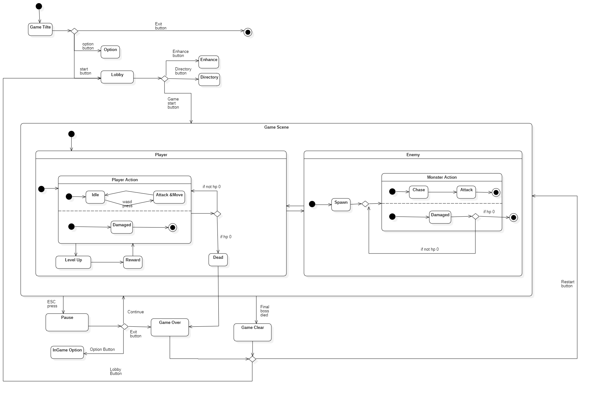

    [그림 5-1] - State machine diagram

* 각 State는 게임에서 어떤 Scene을 보여주고 있는지에 대한 상태이고, Game Scene 내에서는 플레이어의 행동에 따라 캐릭터의 상태가 어떻게 바뀌는지 나타낸다.

&ensp;이 프로젝트의 State는 크게 Title Scene, Lobby, Option, Directory, Enhance, Game Scene, Game Over, Game Clear가 있다.
게임을 시작하게 되면 Title Scene에서 시작한다. Option 버튼을 누르면 옵션으로 그리고 Exit 버튼을 누르면 게임을 종료할 수 있다. 게임 하기 위해서 Game start 버튼을 누르면 로비 화면으로 들어간다. Lobby에서는 도감 버튼을 눌러서 플레이어가 게임을 플레이하면서 모은 오브젝트들의 정보를 확인 할 수 있으며, 강화 버튼을 통해 Enhance로 가서 플레이할 캐릭터의 능력치를 플레이어가 원하는 대로 강화할 수 있다. 그리고 Start 버튼을 누르면 Game Scene으로 들어간다. 

&ensp;Game Scene에 들어가면 본격적으로 게임을 플레이할 수 있다. 게임 특성상 공격은 자동으로 나가기 때문에 Player는 기본적으로 움직이는 Move 상태, 움직이지 않는 idle 상태, Enemy에게 데미지를 입은 Damaged 상태, 그리고 피가 0 이하면 죽는 Dead 상태가 있다. 시스템 내부적으로 Enemy는 Player의 주변에서 Spawn 된다. Spawn 상태 이후에 Player가 있는 방향으로 이동하는 Chase 상태, Player와 충돌하거나 공격 범위 내에 있을 때 공격하는 Attack 상태, 그리고 Player의 공격에 맞았을 때 데미지를 받는 Damaged 상태가 있다. 이 Enemy의 모든 행동은 Enemy의 hp가 0이 아닐 때 작동하며 hp가 0 이하가 되면 Enemy는 사라진다. 만약 Player가 Dead 상태가 되면 Game Over로 넘어간다. Game Over에서는 재시작 버튼을 눌러 다시 Game Scene으로 돌아가 게임을 할 수 있고 로비 버튼을 통해 Lobby로 돌아갈 수도 있다. 또한 플레이어가 마지막 보스를 쓰러뜨리면 Game Clear로 간다. Game Clear에서도 마찬가지로 Game Scene이나 Lobby로 돌아갈 수 있다. 게임은 Game Clear나 Game Over가 되면 끝난다. 

---

## 6. User interface prototype

> * 6장은 구현할 UI의 구조와 UI 안의 각 구성요소를 설명한다. 프로토타입이기 때문에 UI 디자인은 일부 달라질 수 있지만 내용 및 구성은 거의 동일하다.

### 6.1 메인 화면 (Main Menu)

* 아래 [그림 6-1]은 게임을 맨 처음 실행하면 등장하는 타이틀 화면이다.

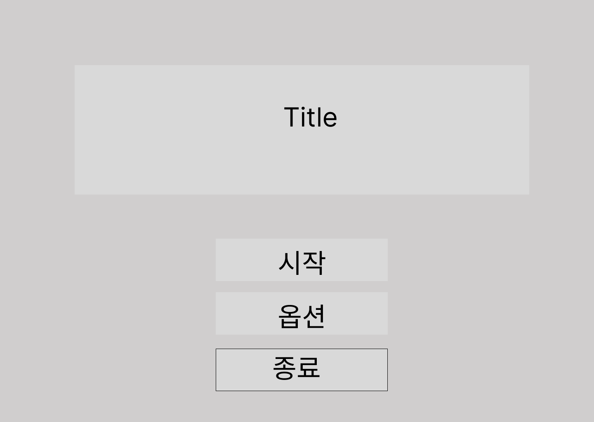

    [그림 6-1]-타이틀 화면

 &ensp;게임을 실행하면 처음으로 나타나는 타이틀 화면이다. ‘시작’ 버튼으로 메인 로비로 넘어갈 수 있고, ‘옵션’ 버튼으로 게임의 화면, 소리와 관련된 상세 설정을 할 수 있다. ‘종료’ 버튼을 누르면 게임을 바로 종료할 수도 있다.

### 6.2 환경설정 화면
* 아래 [그림 6-2]는 타이틀 화면에서 옵션창을 눌렀을 때 나오는 화면이다.

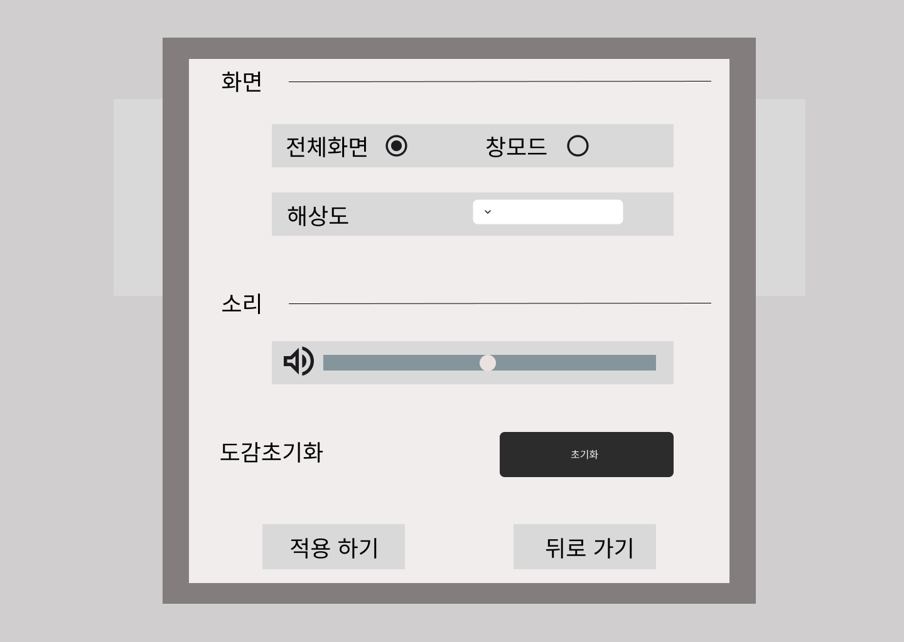

    [그림 6-2]-환경설정 화면

### 6.3 로비 화면
*

    [그림 6-3]-로비 화면

### 6.4 도감 화면
*
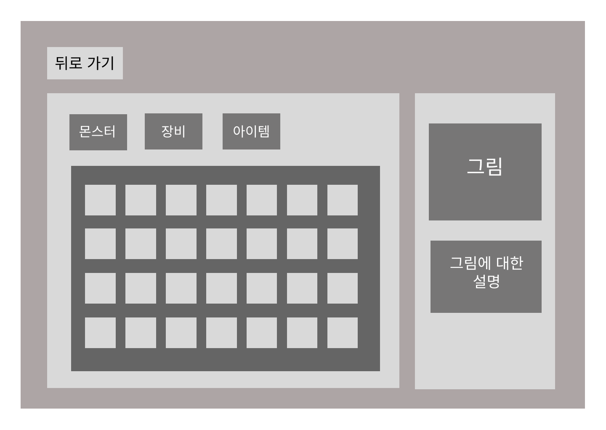

    [그림 6-4]-도감 화면

### 6.5 특성 선택 화면
*
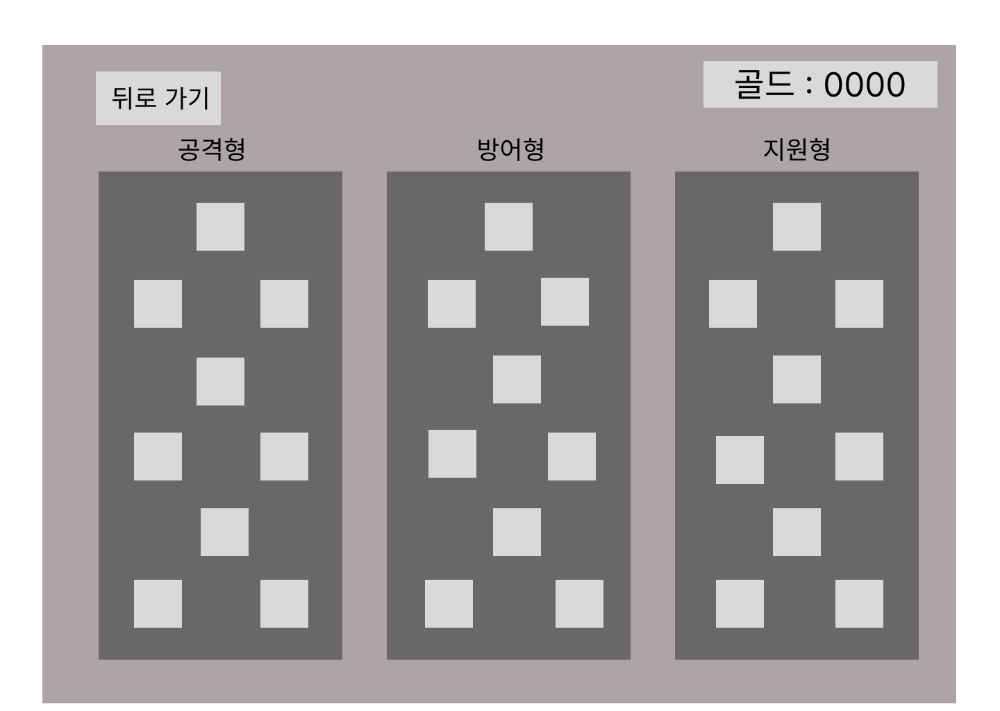

    [그림 6-5]-특성 선택 화면

### 6.6 특성 설명 화면
*
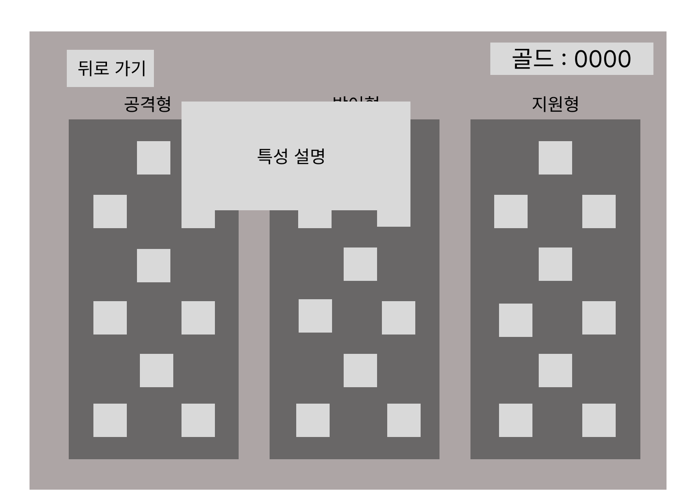

    [그림 6-6]-특성 설명 화면

### 6.7 인게임 기본 화면
*아래 [그림 6-7]은 게임을 시작했을 때 나오는 인게임 UI프로토타입이다.

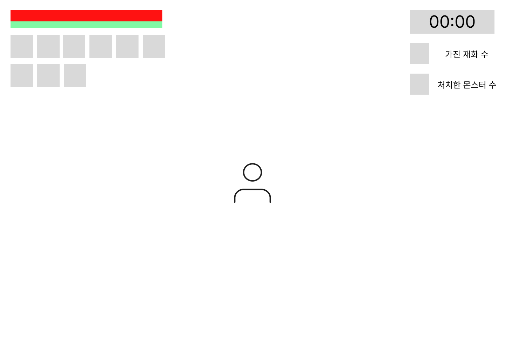

    [그림 6-7]-인게임 기본 화면 

 &ensp;인게임 UI 프로토타입을 보여준다. 좌측 상단에는 플레이어의 체력(HP)과 경험치(EXP)를 나타내는 바가 배치되어 있다. 그 하단에는 획득한 장비를 나타내는 6개의 슬롯 과 소모성 아이템을 표시하는 3개의 슬롯이 나란히 정렬되어 있다. 우측 상단에는 타이머가 남은 시간을 표시하며, 그 아래로는 플레이어가 보유한 총 재화와 몬스터 처치 수가 실시간으로 집계되어 나타난다.

### 6.8 인게임 Pause 화면 
* 아래 [그림 6-8]은 인게임 진행중에 ESC를 눌렀을 때 나오는 UI 프로토타입이다.

    [그림 6-8]-인게임 Pause 화면

 &ensp;ESC 키를 누르면 화면이 어두워지며 게임이 일시 정지되고, 위 그림과 같은 메뉴 창이 나타난다. 좌측에는 '캐릭터 이미지'와 그 하단에 플레이어의 '종합 능력치(스탯)'가 표시된다. 중앙 상단에는 플레이어가 착용한 '장비' 슬롯이 있으며, 각 장비 아이콘에 마우스를 올리면 '장비 설명'란에 상세 정보가 나타난다. 중앙 하단에는 현재 '진행 시간'이 표시된다. 우측에는 게임을 '계속'하거나, '설정' 창을 열거나, 게임을 '종료'하고 시작 화면으로 돌아갈 수 있는 메뉴 버튼이 제공된다.

### 6.9 플레이어 데미지 받는 화면
*

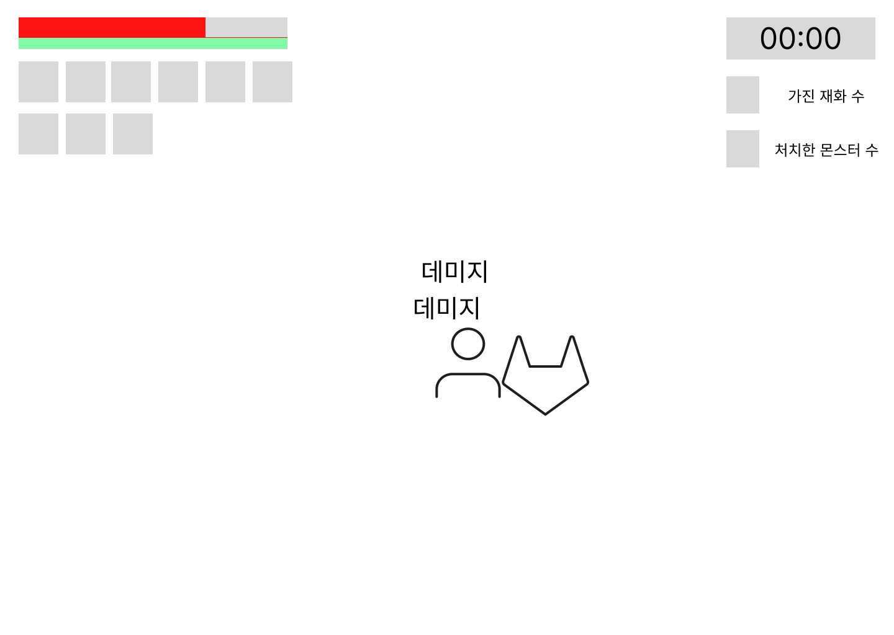

    [그림 6-9]-데미지 받는 화면
---

### 6.10 플레이어 공격 화면
*
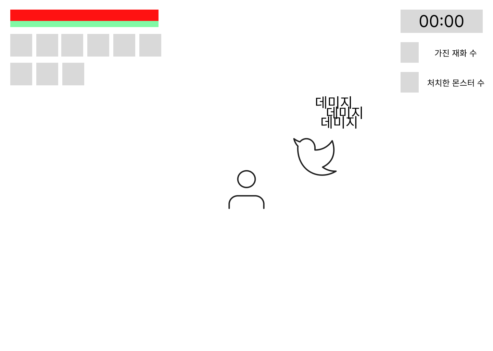

    [그림 6-10]-플레이어 공격 화면

### 6.11 적처치 보상 오브젝트 화면
*
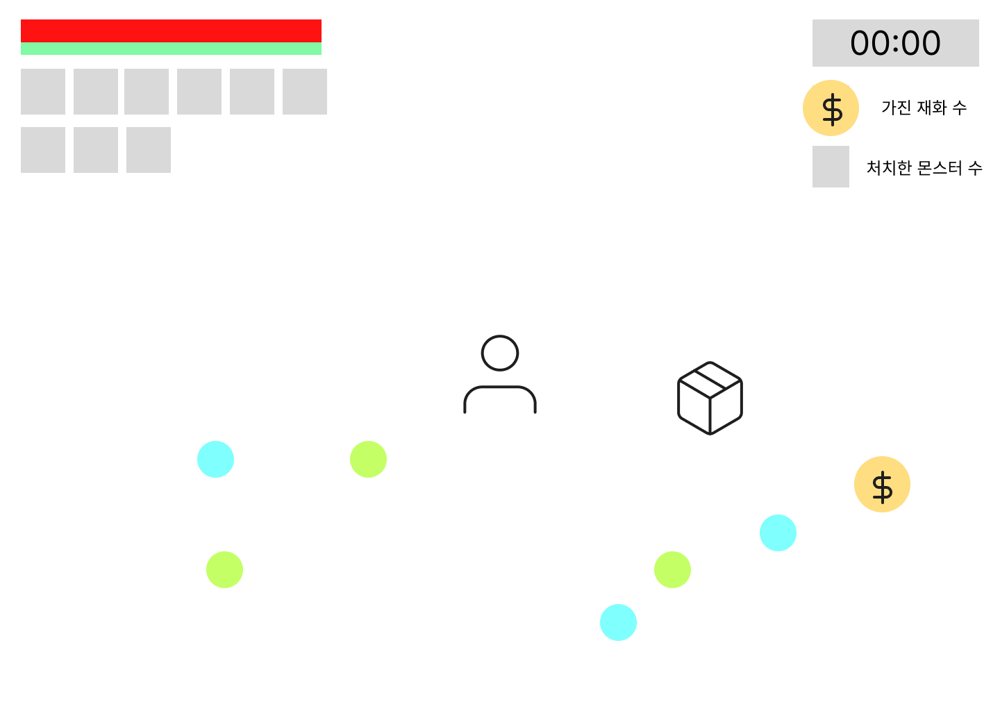

    [그림 6-11]-경험치 및 재화 획득 화면

### 6.12 보스 등장 화면
*
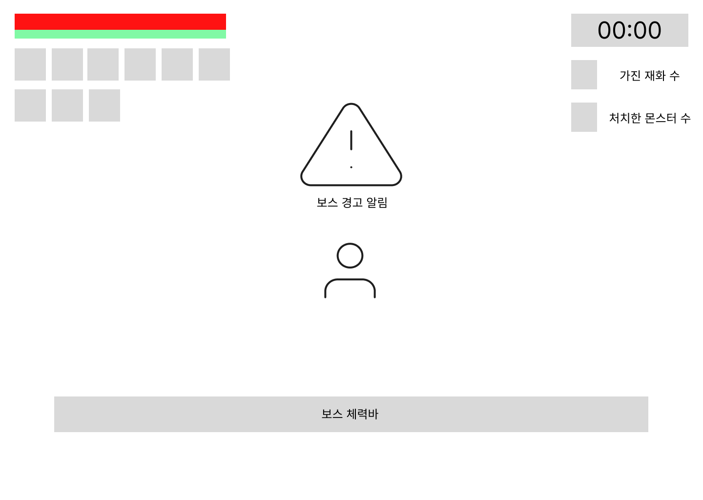

    [그림 6-12] 보스 등장 화면

### 6.13 거점 보호 이벤트 발생 화면
*
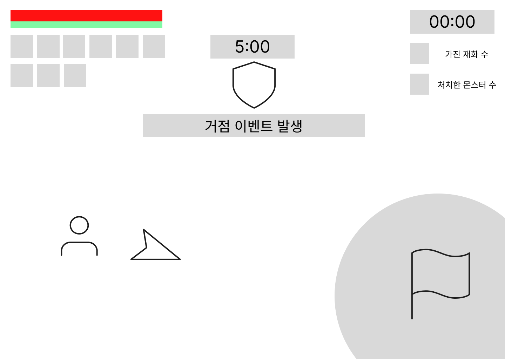

    [그림 6-13] 거점 이벤트 발생 화면

### 6.14 보상 선택 화면
* 아래 [그림 6-14]은 보상 화면을 나타내는 UI 프로토타입이다.

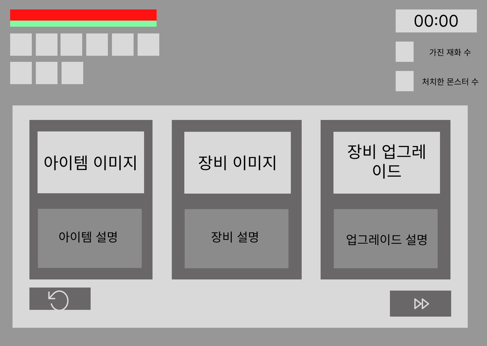

    [그림 6-14] 보상 선택 화면

&ensp;플레이어가 경험치를 획득하여 레벨 업을 하거나 보스 처치 이벤트 성공을 했을 때 나오는 상자를 먹으면 게임 화면이 어두워지며 위의 그림과 같은 창이 나타난다. 
총 3개의 선택할 수 있는 선택지가 제시되며, 각 선택지는 이미지와 설명을 포함한다. 보상의 유형은 ‘소모형 아이템 획득’, ‘신규 장비 획득’ 또는 ‘보유 장비 업그레이드’ 등이 나올 수 있다. 
보상 화면의 좌측 하단의 버튼을 누르면 위의 보상 목록을 변경할 수 있다. 우측 상단의 버튼을 누르면 보상을 포기하는 대신 경험치(EXP)를 획득할 수 있다.

### 6.15 장비/아이템 획득 화면 
*아래 [그림 6-15]은 보상을 획득했을 때 장비나 아이템이 표시되는 화면이다.

    [그림 6-15] 아이템 및 장비 획득 표시 화면

### 6.16 게임 클리어 화면
*아래의 [그림 6-16]은 게임을 클리어 시 나오는 UI 프로토타입이다.

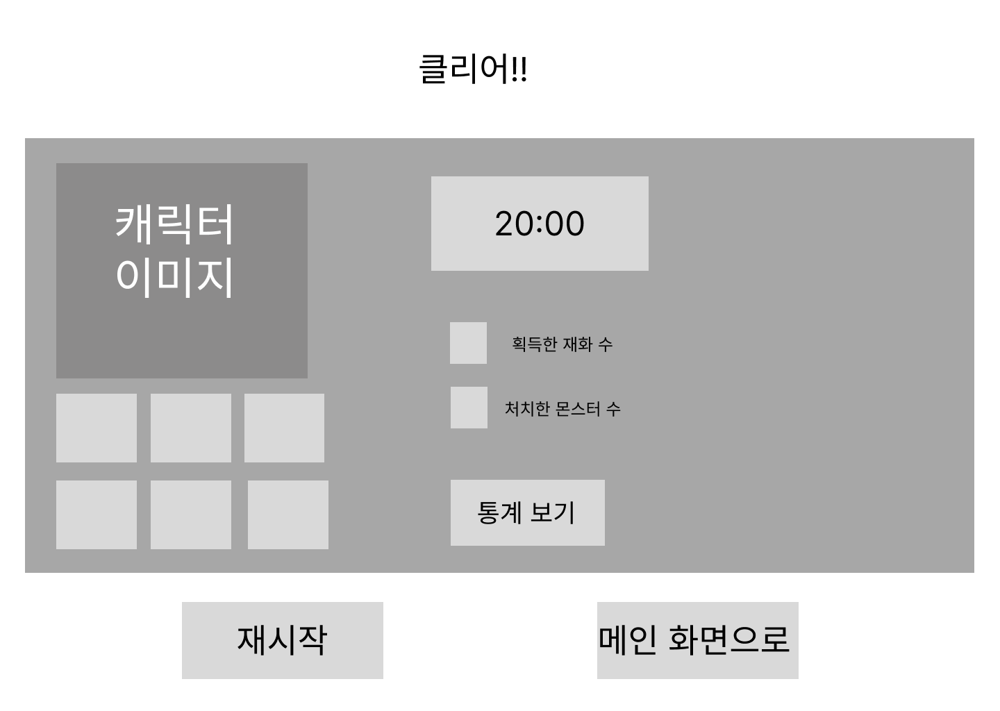

    [그림 6-16] 게임 클리어 화면

&ensp;상단 중앙에 클리어 메시지를 출력하여 게임이 끝났다는 것을 알려준다. 좌측에는 플레이한 캐릭터의 이미지와 장착한 장비들을 보여준다. 우측에는 플레이한 시간, 획득한 재화 그리고 처치한 몬스터의 수를 보여준다. 통계 보기 버튼을 누르면 통계 창으로 넘어간다. 하단의 재시작 버튼을 누르면 게임을 처음부터 다시 시작한다. 메인 화면 버튼을 누르면 메인 화면으로 넘어간다.

### 6.17 게임 오버 화면
*아래 [그림 6-17]은 게임오버 되었을 때 나타나는 UI 프로토타입이다.

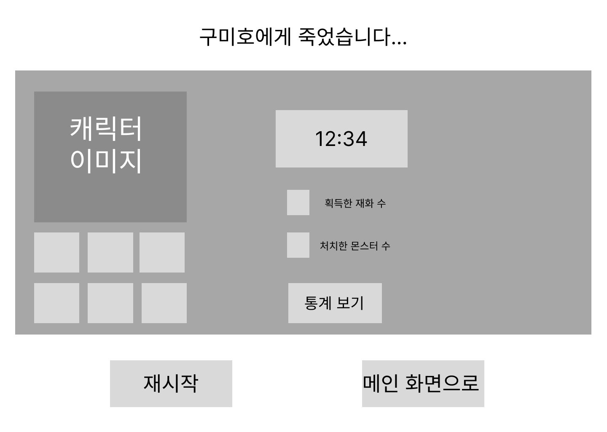

    [그림 6-17] 게임 오버 화면

&ensp;상단 중앙에 ‘플레이어를 죽인 몹에게 죽었습니다.’ 메시지를 출력한다. 나머지는 클리어 UI와 동일하다.

### 6.18 게임 통계 화면 
*아래 [그림 6-18]은 '게임 클리어'나 '게임 오버' UI에서 '통계 보기' 버튼을 눌렀을 때 나타나는 상세 통계 UI 프로토타입입니다.

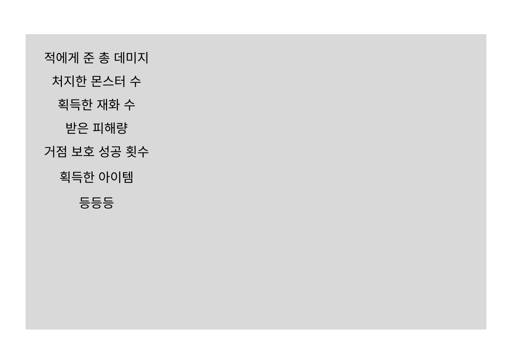

    [그림 6-18] 게임 통계 화면

&ensp;통계화면은 '적에게 준 총 데미지', '처치한 몬스터 수', '획득한 재화 수', '받은 피해량' 등과 같이 게임 플레이 중에 집계된 여러 통계 자료의 정확한 수치들을 자세히 보여줍니다.

---

## 7. Implementation requirements

> * Describe operating environments to implement your system.

* **개발 환경 (Development Environment):**
    * **Engine:** Unity 2022.3.x
    * **IDE:** Visual Studio 2022
    * **Language:** C# 11 (.NET 7)
    * **Version Control:** Git, GitHub
* **실행 환경 (Operating Environment):**
    * **OS:** Windows 10 / Windows 11
    * **CPU:** (예: Intel Core i5 이상)
    * **RAM:** (예: 8GB 이상)

---

## 8. Glossary

> * Specifically describe all of the terms used in this documents.

* **SRP (Single Responsibility Principle):** 단일 책임 원칙. 클래스는 하나의 책임만을 가져야 한다는 설계 원칙.
* **HUD (Heads-Up Display):** 게임 플레이 중 화면에 상시 표시되는 UI (체력 바, 타이머 등).
* **Prefab:** Unity 엔진에서 사용되는, 미리 구성된 게임 오브젝트의 원본 템플릿.

---
## 9. References

> * Describe all of your references (book, paper, technical report etc).

* (예: [게임 디자인 패턴] - Robert Nystrom)
* (예: Unity 공식 문서 - https://docs.unity3d.com/)