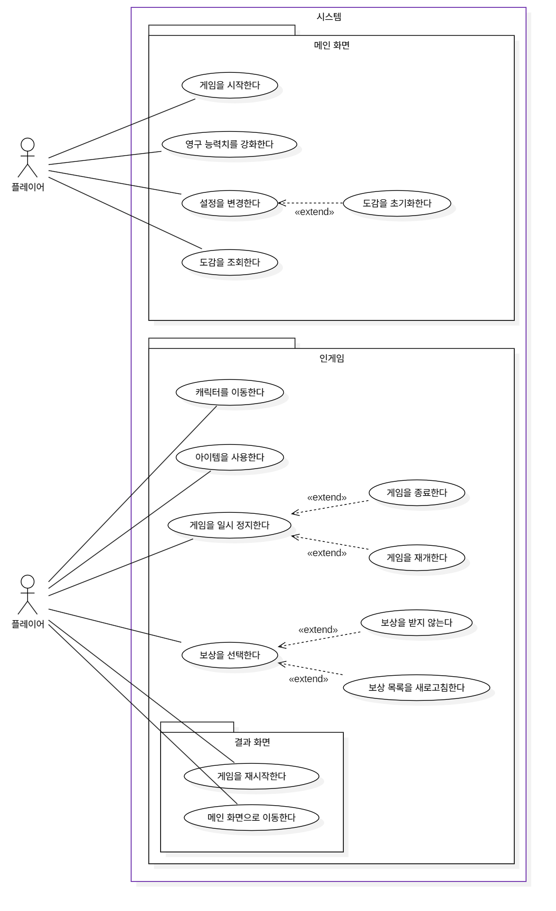
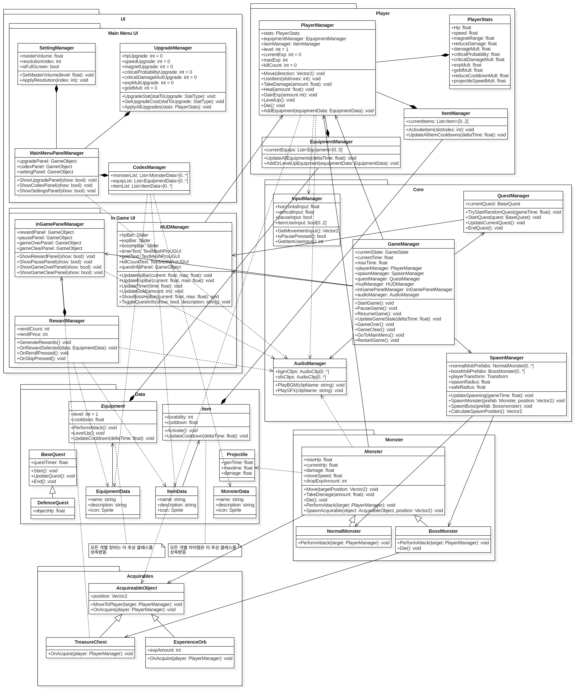

# [로그라이크 프로젝트]

## 💻 팀원 목록

| 학번       | 이름  | 이메일                    |
|:---------|:----|:-----------------------|
| 22012139 | 김도경 | kjkkjs5252@gmail.com   |
| 22012140 | 김병규 | rlaqudrbabcd@gmail.com |
| 22112089 | 백승헌 | hun4758@gmail.com      |
| 22213499 | 정태현 | ghgh036034@gmail.com   |
| 22311884 | 유민서 | winteryu21@gmail.com   |
| 22313530 | 배원일 | dnjsdlf325@gmail.com   |

## 📜 Revision history

| Revision date | Version # | Description                       | Author |
|:--------------|:----------|:----------------------------------|:-------|
| 10/29/2025    | 1.00      | Use Case Diagram 및 Description 작성 | 유민서    |
| 11/04/2025    | 1.10      | (예시)Class Diagram 초안 작성           | OOO    |
| 11/05/2025    | 1.20      | (예시)Class Diagram 상세 명세 양식 반영     | OOO    |

## = Contents =

* [1. Introduction](#1-introduction)
* [2. Use case analysis](#2-use-case-analysis)
* [3. Class diagram](#3-class-diagram)
* [4. Sequence diagram](#4-sequence-diagram)
* [5. State machine diagram](#5-state-machine-diagram)
* [6. User interface prototype](#6-user-interface-prototype)
* [7. Implementation requirements](#7-implementation-requirements)
* [8. Glossary](#8-glossary)
* [9. References](#9-references)

---

## 1. Introduction

본 문서는 우리 팀이 개발하고자 하는 탑다운 시점 로그라이크 액션 게임 프로젝트의 Software Design Specification(SDS)이다. 게임 개발 과정에서 필요한 기능적 요구사항을 구체화하고, 시스템의 구조적 및 동작적 설계 내용을 명확히 제시하는 것을 목적으로 한다. SDS는 게임의 핵심 시스템과 주요 기능을 정의하여 프로젝트 구성원이 공통된 이해를 바탕으로 일관성 있는 개발을 진행할 수 있도록 지원하며, 향후 유지보수 및 확장 개발 시 표준 참조 문서로 활용된다.
Use Case Analysis는 사용자 관점에서의 주요 기능 및 시나리오를 정의하였고, Class Diagram은 시스템의 구조 및 클래스 간 관계를 나타낸다. Sequence Diagram과 State Machine Diagram은 게임 시스템의 동작 흐름 및 상태 전이 과정을 기술하며, User Interface 설계는 게임의 화면 구성과 사용자 인터페이스 동작을 묘사하였다.
본 SDS 문서에서는 각 다이어그램과 구성 요소 간의 일관성 검토를 중요하게 생각했다. 특히, 메서드 명칭이나 호출 구조의 불일치는 설계 및 구현상의 오류로 이어질 수 있기 때문에 Class Diagram에 정의된 메서드 이름이 Sequence Diagram에서 동일하게 사용되었는지를 검토했다. 또한, UI Prototype의 화면 전환 흐름이 GameManager의 State Machine Diagram과 일치하는지 검토해야 하며, 게임의 상태가 UI 설계와 정확히 대응되어야 한다.
본 프로젝트는 다음과 같은 개발 환경과 도구를 기반으로 진행된다. 게임 엔진은 Unity를 사용하고, 개발 언어는 C#을 사용한다. Unity 엔진을 활용한 개발은 빠른 프로토타이핑과 다양한 플랫폼 지원을 가능하게 한다. GitHub을 통한 형상 관리는 협업 효율성과 버전 추적의 용이성을 제공한다. 

---

## 2. Use case analysis

> * Build a use case diagram.
> * Make detailed description for each use case (Use case description).

### 2.1 Use Case Diagram

다이어그램에 대한 설명

### 2.2 Use Case Descriptions

**(유스케이스 템플릿 - 이 템플릿을 복사해서 유스케이스별로 작성!)**

#### Use case #[Number] : [Use Case Name]

| **GENERAL CHARACTERISTICS** |                       |
|:----------------------------|:----------------------|
| **Summary**                 | (기능 요약)               |
| **Scope**                   | (시스템 범위, 예: 로그라이크 게임) |
| **Level**                   | User level            |
| **Author**                  | (작성자 이름)              |
| **Last Update**             | (작성일)                 |
| **Status**                  | Analysis              |
| **Primary Actor**           | (주 행위자, 예: 플레이어)      |
| **Preconditions**           | (선행 조건)               |
| **Trigger**                 | (유스케이스 시작 계기)         |
| **Success Post Condition**  | (성공 시 결과)             |
| **Failed Post Condition**   | (실패 시 결과)             |

| **MAIN SUCCESS SCENARIO** |            |
|:--------------------------|:-----------|
| **Step**                  | **Action** |
| S                         | (시나리오 시작)  |
| 1                         | (행위자 행동)   |
| 2                         | (시스템 응답)   |
| 3                         | ...        |
| 4                         | (시나리오 종료)  |

| **EXTENSION SCENARIOS** |                                   |
|:------------------------|:----------------------------------|
| **Step**                | **Branching Action**              |
| 2                       | 2a. (예외 상황)   ...2a1. (시스템 응답) |

| **RELATED INFORMATION** |           |
|:------------------------|:----------|
| **Performance**         | (성능 요구사항) |
| **Frequency**           | (발생 빈도)   |
| **Concurrency**         | (동시성)     |
| **Due Date**            | (개발 마감일)  |

#### Use case #[1] : 게임을 시작한다

| **GENERAL CHARACTERISTICS** |                                              |
|:----------------------------|:---------------------------------------------|
| **Summary**                 | 플레이어가 메인 화면에서 '게임 시작' 버튼을 눌러 인게임 씬으로 진입하는 기능 |
| **Scope**                   | 메인 화면                                        |
| **Level**                   | User level                                   |
| **Author**                  | 유민서                                          |
| **Last Update**             | 2025. 10. 29                                 |
| **Status**                  | Analysis                                     |
| **Primary Actor**           | 플레이어                                         |
| **Preconditions**           | 플레이어가 '메인화면' 씬에 있어야 한다.                      |
| **Trigger**                 | 플레이어가 '게임 시작' 버튼을 클릭했을 때                     |
| **Success Post Condition**  | 현재 씬이 '인게임'으로 전환된다.                          |
| **Failed Post Condition**   | 실패 조건 없음                                     |

| **MAIN SUCCESS SCENARIO** |                                                  |
|:--------------------------|:-------------------------------------------------|
| **Step**                  | **Action**                                       |
| S                         | 플레이어가 게임을 시작한다.                                  |
| 1                         | 이 Use case는 플레이어가 메인 화면에서 '게임 시작' 버튼을 누를 때 시작된다. |
| 2                         | 시스템은 씬을 '메인 화면'에서 '인게임'으로 전환한다.                  |
| 3                         | 시스템은 인게임 시스템(타이머, 몬스터 스폰 등)을 초기화하고 동작시킨다.        |
| 4                         | 이 Use case는 인게임 씬이 성공적으로 로드되면 종료된다.              |

| **RELATED INFORMATION** |              |
|:------------------------|:-------------|
| **Performance**         | 씬 로딩 시간 ≤ 3초 |
| **Frequency**           | 세션 당 1회      |
| **Concurrency**         |              |
| **Due Date**            |              |

#### Use case #[2] : [Use Case Name]

| **GENERAL CHARACTERISTICS** |                       |
|:----------------------------|:----------------------|
| **Summary**                 | (기능 요약)               |
| **Scope**                   | (시스템 범위, 예: 로그라이크 게임) |
| **Level**                   | User level            |
| **Author**                  | (작성자 이름)              |
| **Last Update**             | (작성일)                 |
| **Status**                  | Analysis              |
| **Primary Actor**           | (주 행위자, 예: 플레이어)      |
| **Preconditions**           | (선행 조건)               |
| **Trigger**                 | (유스케이스 시작 계기)         |
| **Success Post Condition**  | (성공 시 결과)             |
| **Failed Post Condition**   | (실패 시 결과)             |

| **MAIN SUCCESS SCENARIO** |            |
|:--------------------------|:-----------|
| **Step**                  | **Action** |
| S                         | (시나리오 시작)  |
| 1                         | (행위자 행동)   |
| 2                         | (시스템 응답)   |
| 3                         | ...        |
| 4                         | (시나리오 종료)  |

| **EXTENSION SCENARIOS** |                                   |
|:------------------------|:----------------------------------|
| **Step**                | **Branching Action**              |
| 2                       | 2a. (예외 상황)   ...2a1. (시스템 응답) |

| **RELATED INFORMATION** |           |
|:------------------------|:----------|
| **Performance**         | (성능 요구사항) |
| **Frequency**           | (발생 빈도)   |
| **<Concurrency>**       | (동시성)     |
| **Due Date**            | (개발 마감일)  |

---

## 3. Class diagram

> * Draw class diagrams.
> * Describe each class in detail (attributes, methods, others) (table type).

### 3.1 Class Diagram

설명

### 3.2 Class Descriptions

**(클래스 템플릿 - 이 템플릿을 복사해서 클래스별로 작성!)**

#### Class: [ClassName]
* **Description:** (클래스에 대한 상세 설명, 예: 예약 정보 DB)

**Attributes (속성)**

| Name            | Description            | Type            | Visibility       |
|:----------------|:-----------------------|:----------------|:-----------------|
| `[FieldName]`   | (필드에 대한 설명, 예: 고유 식별자) | `[FieldType]`   | `Private/Public` |
| `currentState`  | 현재 게임 상태               | `GameState`     | `Private`        |
| `currentTime`   | 현재 플레이 시간              | `float`         | `Private`        |
| `playerManager` | 플레이어 매니저 참조            | `PlayerManager` | `Private`        |
| `...`           |                        |                 |                  |

**Operations (메서드)**

| Name                                | Description              | Type (Return)  | Visibility       |
|:------------------------------------|:-------------------------|:---------------|:-----------------|
| `[MethodName]([param]: [Type])`     | (메서드에 대한 설명, 예: 게임 일시정지) | `[ReturnType]` | `Public/Private` |
| `PauseGame()`                       | 게임을 일시정지 상태로 변경          | `void`         | `Public`         |
| `UpdateGameState(deltaTime: float)` | 게임 상태를 매 프레임 갱신          | `void`         | `Public`         |
| `...`                               |                          |                |                  |

### 3.2.1 Core Class

#### Class: [GameManager]
* **Description:** Manager 클래스들을 종합 관리하는 마스터 클래스

**Attributes (속성)**

| Name                 | Description     | Type                 | Visibility |
|:---------------------|:----------------|:---------------------|:-----------|
| `currentState`       | 현재 게임 상태        | `GameState`          | `Private`  |
| `currentTime`        | 현재 플레이 시간       | `float`              | `Private`  |
| `maxTime`            | 최대 플레이 시간       | `float`              | `Private`  |
| `playerManager`      | 플레이어 매니저 참조     | `PlayerManager`      | `Private`  |
| `spawnManager`       | 스폰 매니저 참조       | `SpawnManager`       | `Private`  |
| `questManager`       | 퀘스트 매니저 참조      | `QuestManager`       | `Private`  |
| `hudManager`         | HUD 매니저 참조      | `HUDManager`         | `Private`  |
| `inGamePanalManager` | 인게임 씬 패널 매니저 참조 | `InGamePanelManager` | `Private`  |
| `audioManager`       | 오디오 매니저 참조      | `AudioManager`       | `Private`  |

**Operations (메서드)**

| Name                                | Description          | Type (Return) | Visibility |
|:------------------------------------|:---------------------|:--------------|:-----------|
| `StartGame()`                       | 게임 시작                | `void`        | `Public`   |
| `PauseGame()`                       | 게임을 일시정지 상태로 변경      | `void`        | `Public`   |
| `ResumeGame()`                      | 일시정지 상태에서 게임을 재개     | `void`        | `Public`   |
| `UpdateGameState(deltaTime: float)` | 게임 상태를 매 프레임 갱신      | `void`        | `Public`   |
| `GameOver()`                        | 게임 오버 처리             | `void`        | `Public`   |
| `GameClear()`                       | 게임 클리어 처리            | `void`        | `Public`   |
| `GoToMainMenu()`                    | 인게임 씬에서 메인 메뉴 씬으로 전환 | `void`        | `Public`   |
| `RestartGame()`                     | 게임 세션을 처음부터 다시 시작    | `void`        | `Public`   |

#### Class: [InputManager]
* **Description:** 사용자의 입력을 관리하는 매니저 클래스

**Attributes (속성)**

| Name               | Description   | Type            | Visibility |
|:-------------------|:--------------|:----------------|:-----------|
| `horizontallInput` | 수평 입력 값       | `float`         | `Private`  |
| `verticalInput`    | 수직 입력 값       | `float`         | `Private`  |
| `pauseInput`       | 일시 정지 입력 값    | `bool`          | `Private`  |
| `itemUseInput`     | 아이템 사용 키 입력 값 | `PlayerManager` | `Private`  |

**Operations (메서드)**

| Name                 | Description    | Type (Return) | Visibility |
|:---------------------|:---------------|:--------------|:-----------|
| `GetMovementInput()` | 플레이어 이동 입력 처리  | `Vector2`     | `Public`   |
| `IsPausePressed()`   | 일시 정지 입력 처리    | `bool`        | `Public`   |
| `GetItemUseInput()`  | 아이템 사용 키 입력 처리 | `int`         | `Public`   |

#### Class: [SpawnManager]
* **Description:** 몬스터 생성을 관리하는 매니저 클래스

**Attributes (속성)**

| Name               | Description     | Type                  | Visibility |
|:-------------------|:----------------|:----------------------|:-----------|
| `normalMobPrefabs` | 일반 몬스터 프리팹      | `NormalMonster[0..*]` | `Private`  |
| `bossMobPrefabs`   | 보스 몬스터 프리팹      | `BossMonster[0..*]`   | `Private`  |
| `playerTransform`  | 플레이어 위치         | `Transform`           | `Private`  |
| `spawnRadius`      | 몬스터 객체 생성 범위    | `float`               | `Private`  |
| `safeRadius`       | 몬스터 객체 생성 제외 범위 | `float`               | `Private`  |

**Operations (메서드)**

| Name                                             | Description      | Type (Return) | Visibility |
|:-------------------------------------------------|:-----------------|:--------------|:-----------|
| `UpdateSpawning(gameTime:float)`                 | 시간에 맞는 몬스터 생성 처리 | `void`        | `Public`   |
| `SpawnMonster(prefab:Monster, position:Vector2)` | 실제 몬스터 생성        | `void`        | `Public`   |
| `SpawnBoss(prefab:Bossmonster)`                  | 보스 몬스터 생성        | `void`        | `Public`   |
| `CalculateSpawnPosition()`                       | 몬스터 생성 위치 계산     | `Vector2`     | `Public`   |

#### Class: [QuestManager]
* **Description:** 돌발 이벤트를 관리하는 매니저 클래스

**Attributes (속성)**

| Name           | Description | Type        | Visibility |
|:---------------|:------------|:------------|:-----------|
| `currentQuest` | 현재 퀘스트 정보   | `BaseQuest` | `Private`  |

**Operations (메서드)**

| Name                                  | Description   | Type (Return) | Visibility |
|:--------------------------------------|:--------------|:--------------|:-----------|
| `TryStartRandomQuest(gameTime:float)` | 돌발 이벤트 활성화 시도 | `void`        | `Public`   |
| `StartQuest(quest: BaseQuest)`        | 돌발 이벤트 시작     | `void`        | `Public`   |
| `UpdateCurrentQuest()`                | 이벤트 완료 여부 검사  | `void`        | `Public`   |
| `EndQuest()`                          | 이벤트 완료 처리     | `Vector2`     | `Public`   |

#### Class: [AudioManager]
* **Description:** 게임의 모든 사운드를 관리하는 매니저 클래스

**Attributes (속성)**

| Name       | Description | Type              | Visibility |
|:-----------|:------------|:------------------|:-----------|
| `bgmClips` | 배경 음악 리스트   | `AudipClip[0..*]` | `Private`  |
| `sfxClips` | 효과음 리스트     | `AudipClip[0..*]` | `Private`  |

**Operations (메서드)**

| Name                        | Description | Type (Return) | Visibility |
|:----------------------------|:------------|:--------------|:-----------|
| `PlayBGM(clipName: string)` | 배경 음악 재생    | `void`        | `Public`   |
| `PlaySFX(clipName: string)` | 효과음 재생      | `void`        | `Public`   |

### 3.2.2 Player Class

#### Class: [PlayerManager]
* **Description:** 플레이어 객체를 관리하는 매니저 클래스

**Attributes (속성)**

| Name               | Description  | Type               | Visibility |
|:-------------------|:-------------|:-------------------|:-----------|
| `stats`            | 플레이어의 능력치 참조 | `PlayerStats`      | `Private`  |
| `equipmentManager` | 플레이어 장비 참조   | `EquipmentManager` | `Private`  |
| `itemManager`      | 플레이어 아이템 참조  | `itemManager`      | `Private`  |
| `level`            | 플레이어 레벨      | `int`              | `Private`  |
| `currentExp`       | 플레이어의 현재 경험치 | `int`              | `Private`  |
| `maxExp`           | 플레이어의 최대 경험치 | `int`              | `Private`  |
| `killCount`        | 플레이어의 적 처치 수 | `int`              | `Private`  |

**Operations (메서드)**

| Name                                         | Description | Type (Return) | Visibility |
|:---------------------------------------------|:------------|:--------------|:-----------|
| `Move(direction: Vector2)`                   | 플레이어 이동 처리  | `void`        | `Public`   |
| `UseItem(slotIndex: int)`                    | 아이템 사용      | `void`        | `Public`   |
| `TakeDamage(amount: float)`                  | 입은 피해 처리    | `void`        | `Public`   |
| `Heal(amount: float)`                        | Hp 회복 처리    | `void`        | `Public`   |
| `GainExp(amount: int)`                       | 경험치 회복      | `void`        | `Public`   |
| `LevelUp()`                                  | 레벨 증가       | `void`        | `Public`   |
| `Die()`                                      | 플레이어 사망 처리  | `void`        | `Public`   |
| `AddEquipment(equipmentData: EquipmentData)` | 플레이어 장비 추가  | `void`        | `Public`   |

#### Class: [PlayerStats]
* **Description:** 플레이어의 능력치를 관리하는 데이터 클래스

**Attributes (속성)**

| Name                   | Description   | Type    | Visibility |
|:-----------------------|:--------------|:--------|:-----------|
| `Hp`                   | 체력            | `float` | `Private`  |
| `speed`                | 이동 속도         | `float` | `Private`  |
| `magnetRange`          | 드랍 오브젝트 획득 범위 | `float` | `Private`  |
| `reduceDamage`         | 입는 피해 감소      | `float` | `Private`  |
| `damageMult`           | 입히는 피해 배수     | `float` | `Private`  |
| `ciriticalProbability` | 치명타 확률        | `float` | `Private`  |
| `criticalDamageMult`   | 치명타 피해 배율     | `float` | `Private`  |
| `expMult`              | 획득 경험치 배율     | `float` | `Private`  |
| `goldMult`             | 획득 재화 배율      | `float` | `Private`  |
| `reduceCooldownMult`   | 장비 쿨다운 감소 배율  | `float` | `Private`  |
| `projectileSpeedMult`  | 투사체 속도 배율     | `float` | `Private`  |

#### Class: [EquipmentManager]
* **Description:** 플레이어의 장비를 관리하는 매니저 클래스

**Attributes (속성)**

| Name            | Description | Type                    | Visibility |
|:----------------|:------------|:------------------------|:-----------|
| `currentEquips` | 보유 장비 리스트   | `List<Equipment>[0..5]` | `Private`  |

**Operations (메서드)**

| Name                                                  | Description       | Type (Return) | Visibility |
|:------------------------------------------------------|:------------------|:--------------|:-----------|
| `UpdateAllEquipments(deltaTime: float)`               | 장비의 쿨다운, 자동 공격 갱신 | `void`        | `Public`   |
| `AddOrLevelUpEquipment(equipmentData: EquipmentData)` | 장비 획득 처리          | `void`        | `Public`   |

#### Class: [ItemManager]
* **Description:** 플레이어의 아이템을 관리하는 매니저 클래스

**Attributes (속성)**

| Name           | Description | Type               | Visibility |
|:---------------|:------------|:-------------------|:-----------|
| `currentItems` | 보유 장비 리스트   | `List<Item>[0..2]` | `Private`  |

**Operations (메서드)**

| Name                                       | Description | Type (Return) | Visibility |
|:-------------------------------------------|:------------|:--------------|:-----------|
| `ActivateItem(slotIndex: int)`             | 아이템 사용      | `void`        | `Public`   |
| `UpdateAllItemCooldowns(deltaTime: float)` | 아이템 쿨다운 갱신  | `void`        | `Public`   |

### 3.2.3 UI Class

#### Class: [HUDManager]
* **Description:** 인게임 씬의 실시간 정보 인터페이스를 관리하는 클래스

**Attributes (속성)**

| Name             | Description    | Type              | Visibility |
|:-----------------|:---------------|:------------------|:-----------|
| `hpBar`          | 플레이어의 체력 바     | `Slider`          | `Private`  |
| `expBar`         | 플레이어의 경험치 바    | `Slider`          | `Private`  |
| `bossHpBar`      | 보스 몬스터의 체력 바   | `Slider`          | `Private`  |
| `timerText    `  | 게임이 진행된 시간 텍스트 | `TextMeshProUGUI` | `Private`  |
| `goldText`       | 보유 중인 재화 텍스트   | `TextMeshProUGUI` | `Private`  |
| `killCountText`  | 처치한 적의 수 텍스트   | `TextMeshProUGUI` | `Private`  |
| `questInfoPanel` | 돌발 이벤트의 정보 패널  | `GameObject`      | `Private`  |

**Operations (메서드)**

| Name                                               | Description  | Type (Return) | Visibility |
|:---------------------------------------------------|:-------------|:--------------|:-----------|
| `UpdateHpBar(current: float, max: float)`          | 체력 바 갱신      | `void`        | `Public`   |
| `UpdateExpBar(current: float, max: float)`         | 경험치 바 갱신     | `void`        | `Public`   |
| `UpdateTimer(time: float)`                         | 시간 텍스트 갱신    | `void`        | `Public`   |
| `UpdateGold(amount: float)`                        | 보유 재화 텍스트 갱신 | `void`        | `Public`   |
| `ShowBossHpBar(current: float, max: float)`        | 보스 체력 바 표시   | `void`        | `Public`   |
| `ToggleQuestInfo(show: bool, description: string)` | 돌발 이벤트 정보 표시 | `void`        | `Public`   |

#### Class: [InGamePanelManager]
* **Description:** 인게임 씬의 패널 UI를 관리하는 클래스

**Attributes (속성)**

| Name             | Description | Type         | Visibility |
|:-----------------|:------------|:-------------|:-----------|
| `rewardPanel`    | 보상 패널       | `GameObject` | `Private`  |
| `pausePanel`     | 일시 정지 패널    | `GameObject` | `Private`  |
| `gameOverPanel`  | 게임 오버 패널    | `GameObject` | `Private`  |
| `gameClearPanel` | 게임 클리어 패널   | `GameObject` | `Private`  |

**Operations (메서드)**

| Name                             | Description  | Type (Return) | Visibility |
|:---------------------------------|:-------------|:--------------|:-----------|
| `ShowRewardPanel(show: bool)`    | 보상 패널 호출     | `void`        | `Public`   |
| `ShowPausePanel(show: bool)`     | 일시 정지 패널 호출  | `void`        | `Public`   |
| `ShowGameOverPanel(show: bool)`  | 게임 오버 패널 호출  | `void`        | `Public`   |
| `ShowGameClearPanel(show: bool)` | 게임 클리어 패널 호출 | `void`        | `Public`   |

#### Class: [RewardManager]
* **Description:** 보상 시스템을 관리하는 클래스

**Attributes (속성)**

| Name          | Description | Type  | Visibility |
|:--------------|:------------|:------|:-----------|
| `rerollCount` | 현재 새로고침 횟수  | `int` | `Private`  |
| `rerollPrice` | 새로고침 비용     | `int` | `Private`  |

**Operations (메서드)**

| Name                                    | Description | Type (Return) | Visibility |
|:----------------------------------------|:------------|:--------------|:-----------|
| `GenerateRewards()`                     | 보상 선택지 생성   | `void`        | `Public`   |
| `OnRewardSelected(data: EquipmentData)` | 보상 선택       | `void`        | `Public`   |
| `OnRerollPressed()`                     | 보상 선택지 새로고침 | `void`        | `Public`   |
| `OnSkipPressed()`                       | 보상 안 받고 넘기기 | `void`        | `Public`   |

#### Class: [MainMenuPanelManager]
* **Description:** 메인 메뉴 씬의 패널 UI를 관리하는 클래스

**Attributes (속성)**

| Name           | Description  | Type         | Visibility |
|:---------------|:-------------|:-------------|:-----------|
| `upgradePanel` | 캐릭터 영구 강화 패널 | `GameObject` | `Private`  |
| `codexPanel`   | 도감 패널        | `GameObject` | `Private`  |
| `settingPanel` | 설정 화면 패널     | `GameObject` | `Private`  |

**Operations (메서드)**

| Name                            | Description     | Type (Return) | Visibility |
|:--------------------------------|:----------------|:--------------|:-----------|
| `ShowUpgradePanel(show: bool)`  | 캐릭터 영구 강화 패널 호출 | `void`        | `Public`   |
| `ShowCodexPanel(show: bool)`    | 도감 패널 호출        | `void`        | `Public`   |
| `ShowSettingsPanel(show: bool)` | 설정 화면 패널 호출     | `void`        | `Public`   |

#### Class: [UpgradeManager]
* **Description:** 캐릭터 능력치 영구 강화를 관리하는 클래스

**Attributes (속성)**

| Name                         | Description  | Type  | Visibility |
|:-----------------------------|:-------------|:------|:-----------|
| `hpUpgrade`                  | 체력 강화 단계     | `int` | `Private`  |
| `speedUpgrade`               | 이동 속도 강화 단계  | `int` | `Private`  |
| `magnetUpgrade`              | 드롭 획득 범위 증가  | `int` | `Private`  |
| `criticalProbabilityUpgrade` | 치명타 확률 증가    | `int` | `Private`  |
| `criticalDamageMultUpgrade`  | 치명타 피해 배율 증가 | `int` | `Private`  |
| `expMultUpgrade`             | 경험치 획득 배율 증가 | `int` | `Private`  |
| `goldMult`                   | 재화 획득 배율 증가  | `int` | `Private`  |

**Operations (메서드)**

| Name                                      | Description    | Type (Return) | Visibility |
|:------------------------------------------|:---------------|:--------------|:-----------|
| `UpgradeStat(statToUpgrade: StatType)`    | 능력치 강화         | `void`        | `Public`   |
| `GetUpgradeCose(statToUpgrade: StatType)` | 능력치 강화 비용 계산   | `void`        | `Public`   |
| `ApplyAllUpgrades(stats: PlayerStats)`    | 강화된 능력치 인게임 적용 | `void`        | `Public`   |

#### Class: [CodexManager]
* **Description:** 도감 메뉴를 관리하는 클래스

**Attributes (속성)**

| Name            | Description       | Type                        | Visibility |
|:----------------|:------------------|:----------------------------|:-----------|
| `monsterList`   | 조우한 몬스터 리스트       | `List<MonsterData>[0..*]`   | `Private`  |
| `equipmentList` | 획득 이력이 있는 장비 리스트  | `List<EquipmentData>[0..*]` | `Private`  |
| `itemList`      | 획득 이력이 있는 아이템 리스트 | `List<ItemData>[0..*]`      | `Private`  |

#### Class: [SettingManager]
* **Description:** 설정 메뉴를 관리하는 클래스

**Attributes (속성)**

| Name              | Description | Type    | Visibility |
|:------------------|:------------|:--------|:-----------|
| `masterVolume`    | 마스터 불륨      | `float` | `Private`  |
| `resolutionIndex` | 해상도         | `int`   | `Private`  |
| `isFullScreen`    | 전체 화면 여부    | `bool`  | `Private`  |

**Operations (메서드)**

| Name                            | Description | Type (Return) | Visibility |
|:--------------------------------|:------------|:--------------|:-----------|
| `SetMasterVolume(level: float)` | 불륨 설정       | `void`        | `Public`   |
| `ApplyResolution(index: int)`   | 해상도 설정      | `void`        | `Public`   |

### 3.2.4 Data Class

#### Class: [Equipment]
* **Description:** 모든 장비가 상속받는 추상 클래스

**Attributes (속성)**

| Name       | Description | Type    | Visibility |
|:-----------|:------------|:--------|:-----------|
| `level`    | 장비 레벨       | `int`   | `Private`  |
| `cooldown` | 쿨다운         | `float` | `Private`  |

**Operations (메서드)**

| Name                               | Description | Type (Return) | Visibility |
|:-----------------------------------|:------------|:--------------|:-----------|
| `PerformAttack()`                  | 자동 공격       | `void`        | `Public`   |
| `LevelUp()`                        | 장비 레벨 증가    | `void`        | `Public`   |
| `UpdateCooldown(deltaTime: float)` | 쿨다운 갱신      | `void`        | `Public`   |

#### Class: [Item]
* **Description:** 모든 아이템이 상속받는 추상 클래스

**Attributes (속성)**

| Name         | Description | Type    | Visibility |
|:-------------|:------------|:--------|:-----------|
| `durability` | 최대 사용 횟수    | `int`   | `Private`  |
| `cooldown`   | 쿨다운         | `float` | `Private`  |

**Operations (메서드)**

| Name                               | Description | Type (Return) | Visibility |
|:-----------------------------------|:------------|:--------------|:-----------|
| `Activate()`                       | 아이템 사용      | `void`        | `Public`   |
| `UpdateCooldown(deltaTime: float)` | 쿨다운 갱신      | `void`        | `Public`   |

#### Class: [EquipmentData]
* **Description:** 장비의 이름, 설명, 아이콘 정보를 담는 클래스

**Attributes (속성)**

| Name          | Description | Type     | Visibility |
|:--------------|:------------|:---------|:-----------|
| `name`        | 이름          | `string` | `Private`  |
| `description` | 설명          | `string` | `Private`  |
| `icon`        | 장비 스프라이트    | `Sprite` | `Private`  |

#### Class: [ItemData]
* **Description:** 아이템의 이름, 설명, 아이콘 정보를 담는 클래스

**Attributes (속성)**

| Name          | Description | Type     | Visibility |
|:--------------|:------------|:---------|:-----------|
| `name`        | 이름          | `string` | `Private`  |
| `description` | 설명          | `string` | `Private`  |
| `icon`        | 아이템 스프라이트   | `Sprite` | `Private`  |

#### Class: [MonsterData]
* **Description:** 몬스터의 이름, 설명, 외형 정보를 담는 클래스

**Attributes (속성)**

| Name          | Description | Type     | Visibility |
|:--------------|:------------|:---------|:-----------|
| `name`        | 이름          | `string` | `Private`  |
| `description` | 설명          | `string` | `Private`  |
| `icon`        | 몬스터 스프라이트   | `Sprite` | `Private`  |

#### Class: [Projectile]
* **Description:** 투사체의 정보를 담는 클래스

**Attributes (속성)**

| Name      | Description | Type    | Visibility |
|:----------|:------------|:--------|:-----------|
| `genTime` | 객체가 생성된 시간  | `float` | `Private`  |
| `maxTime` | 객체가 소멸하는 시간 | `float` | `Private`  |
| `damage`  | 투사체 피해량     | `float` | `Private`  |

#### Class: [BaseQuest]
* **Description:** 모든 돌발 이벤트가 상속받는 추상 클래스

**Attributes (속성)**

| Name         | Description | Type    | Visibility |
|:-------------|:------------|:--------|:-----------|
| `questTimer` | 이벤트 지속 시간   | `float` | `Private`  |

**Operations (메서드)**

| Name            | Description  | Type (Return) | Visibility |
|:----------------|:-------------|:--------------|:-----------|
| `Start()`       | 이벤트 시작       | `void`        | `Public`   |
| `UpdateQuest()` | 이벤트 완료 여부 갱신 | `void`        | `Public`   |
| `End()`         | 이벤트 종료       | `void`        | `Public`   |

---

## 4. Sequence diagram

> * Draw sequence diagrams for the whole functions of your system.
> * Explain each sequence diagram.

**(시퀀스 다이어그램 템플릿 - 주요 유스케이스/기능별로 작성하세요)**

### 4.1 [시나리오 1: 예) 플레이어 레벨 업]

``

* **Explanation:** (해당 시퀀스 다이어그램에 대한 상세 설명)
    1. `PlayerManager`가 경험치를 획득하여 `LevelUp()` 메서드를 호출합니다.
    2. `PlayerManager`는 `GameManager`의 `PauseGame()`을 호출하여 게임을 일시 정지시킵니다.
    3. `GameManager`는 `InGamePanelManager`의 `ShowRewardPanel()`을 호출합니다.
    4. ...

---

## 5. State machine diagram

> * 5장은 게임 시스템 State machine diagram을 그리고 설명한다. 아래 [그림5-1]은 본 프로젝트에서 제작한 게임 시스템의 State machine diagram이다.

* 각 State는 게임에서 어떤 Scene을 보여주고 있는지에 대한 상태이고, Game Scene 내에서는 플레이어의 행동에 따라 캐릭터의 상태가 어떻게 바뀌는지 나타낸다.

&ensp;이 프로젝트의 State는 크게 Title Scene, Lobby, Option, Directory, Enhance, Game Scene, Game Over, Game Clear가 있다.
게임을 시작하게 되면 Title Scene에서 시작한다. Title 화면에서 아무키나 누르면 Lobby화면으로 이동한다. Lobby화면에서 Option 버튼을 누르면 옵션으로 그리고 Exit 버튼을 누르면 게임을 종료할 수 있다. Lobby에서는 도감 버튼을 눌러서 플레이어가 게임을 플레이하면서 모은 오브젝트들의 정보를 확인 할 수 있으며, 강화 버튼을 통해 Enhance로 가서 플레이할 캐릭터의 능력치를 플레이어가 원하는 대로 강화할 수 있다. 그리고 게임을 하기 위해서 Start 버튼을 누르면 Game Scene으로 들어간다. 

&ensp;Game Scene에 들어가면 본격적으로 게임을 플레이할 수 있다. 게임 특성상 공격은 자동으로 나가기 때문에 Player는 기본적으로 움직이는 Move 상태, 움직이지 않는 idle 상태, Enemy에게 데미지를 입은 Damaged 상태, 그리고 피가 0 이하면 죽는 Dead 상태가 있다. 시스템 내부적으로 Enemy는 Player의 주변에서 Spawn 된다. Spawn 상태 이후에 Player가 있는 방향으로 이동하는 Chase 상태, Player와 충돌하거나 공격 범위 내에 있을 때 공격하는 Attack 상태, 그리고 Player의 공격에 맞았을 때 데미지를 받는 Damaged 상태가 있다. 이 Enemy의 모든 행동은 Enemy의 hp가 0이 아닐 때 작동하며 hp가 0 이하가 되면 Enemy는 사라진다. 만약 Player가 Dead 상태가 되면 Game Over로 넘어간다. Game Over에서는 재시작 버튼을 눌러 다시 Game Scene으로 돌아가 게임을 할 수 있고 로비 버튼을 통해 Lobby로 돌아갈 수도 있다. 또한 플레이어가 마지막 보스를 쓰러뜨리면 Game Clear로 간다. Game Clear에서도 마찬가지로 Game Scene이나 Lobby로 돌아갈 수 있다. 게임은 Game Clear나 Game Over가 되면 끝난다. 

---

## 6. User interface prototype

> * 6장은 구현할 UI의 구조와 UI 안의 각 구성요소를 설명한다. 프로토타입이기 때문에 UI 디자인은 일부 달라질 수 있지만 내용 및 구성은 거의 동일하다.

### 6.1 타이틀 화면 (Title)

* 아래 [그림 6-1]은 게임을 맨 처음 실행하면 등장하는 타이틀 화면이다.

 &ensp;게임을 실행하면 처음으로 나타나는 타이틀 화면이다. 아무 키나 누르면 로비 화면으로 넘어간다.
### 6.2 환경설정 화면
* 아래 [그림 6-2]는 타이틀 화면에서 옵션창을 눌렀을 때 나오는 화면이다.

 &ensp;옵션을 선택하면 설정창을 팝업으로 띄워준다. 화면, 소리, 도감 초기화 부분에서 상세설정을 진행할 수 있다. 화면 부분에선 전체화면을 선택해 모니터 전체에 게임화면을 맞추거나 창모드를 선택해 해상도에 따른 창크기로 표시할 수도 있다. 화면모드, 해상도, 음향 크기를 원하는대로 설정한 후 적용하기 버튼을 누르면 입력한 설정대로 바뀌게 된다. 또한, ‘도감 초기화‘ 버튼을 누르면 플레이어가 해금한 도감의 내용들을 처음 상태로 되돌릴 수 있다. 설정이 끝나면 뒤로가기를 눌러 설정창을 닫을 수 있다.

### 6.3 로비 화면
* 아래 [그림 6-3]은 타이틀 화면에서 시작을 눌렀을 때 나오는 메인로비이다.

 &ensp;메인 화면에서는 게임을 진행할 캐릭터의 이미지와 설명을 보여준다. 설명 부분에서는 캐릭터의 고유 능력과 게임을 시작할 때 가지는 기본 장비를 알려준다. ‘캐릭터 강화’ 버튼을 누르면 게임 안에서 획득한 골드를 통해 영구적으로 캐릭터의 스탯을 강화할 수 있다. ‘도감’ 버튼을 눌러 몬스터, 장비, 아이템에 대한 간략한 설명을 볼 수 있으며, ‘시작하기’ 버튼을 눌러 게임을 시작할 수 있다.

### 6.4 도감 화면
* 아래 [그림 6-4]는 메인 로비에서 도감을 선택했을 때 나오는 도감화면이다.

 &ensp;도감에서는 게임에 등장하는 오브젝트를 유형별로 구분하여 각 버튼을 선택하면 몬스터, 장비, 아이템들을 모아서 볼 수 있다. 잡거나 획득했던적이 있는 오브젝트들은 클릭하여 오른쪽 화면에서 그림과 함께 상세정보를 확인할 수 있고, 그렇지 않은 오브젝트들은 실루엣으로 표시되어 상세정보를 확인할 수 없다. 좌측상단의 뒤로가기를 눌러 메인 화면으로 돌아갈 수 있다.

### 6.5 특성 선택 화면
* 아래 [그림 6-5]는 메인로비에서 캐릭터 강화를 선택했을 때 나오는 화면이다.

 &ensp;캐릭터 강화 화면에선 게임을 통해 획득한 골드를 사용하여 캐릭터의 능력치를 영구적으로 강화할 수 있다. 원하는 능력치에 마우스를 올리면 해당 능력치에 대한 상세 정보를 표시해준다. 좌측상단의 뒤로가기를 눌러 메인 화면으로 돌아갈 수 있다.

### 6.6 특성 설명 화면
* 아래 [그림 6-6]은 캐릭터 강화하면에서 능력치에 마우스를 올려놓았을 때 상세설명을 보여주는 화면이다.

### 6.7 인게임 기본 화면
*아래 [그림 6-7]은 게임을 시작했을 때 나오는 인게임 UI프로토타입이다.

 &ensp;인게임 UI 프로토타입을 보여준다. 좌측 상단에는 플레이어의 체력(HP)과 경험치(EXP)를 나타내는 바가 배치되어 있다. 그 하단에는 획득한 장비를 나타내는 6개의 슬롯 과 소모성 아이템을 표시하는 3개의 슬롯이 나란히 정렬되어 있다. 우측 상단에는 타이머가 남은 시간을 표시하며, 그 아래로는 플레이어가 보유한 총 재화와 몬스터 처치 수가 실시간으로 집계되어 나타난다.

### 6.8 인게임 Pause 화면 
* 아래 [그림 6-8]은 인게임 진행중에 ESC를 눌렀을 때 나오는 UI 프로토타입이다.

 &ensp;ESC 키를 누르면 화면이 어두워지며 게임이 일시 정지되고, 위 그림과 같은 메뉴 창이 나타난다. 좌측에는 '캐릭터 이미지'와 그 하단에 플레이어의 '종합 능력치(스탯)'가 표시된다. 중앙 상단에는 플레이어가 착용한 '장비' 슬롯이 있으며, 각 장비 아이콘에 마우스를 올리면 '장비 설명'란에 상세 정보가 나타난다. 중앙 하단에는 현재 '진행 시간'이 표시된다. 우측에는 게임을 '계속'하거나, '설정' 창을 열거나, 게임을 '종료'하고 시작 화면으로 돌아갈 수 있는 메뉴 버튼이 제공된다.

### 6.9 플레이어 데미지 받는 화면
* 아래 [그림 6-9]은 인게임 진행중 몬스터에게 공격받을 때의 UI 프로토타입이다.

    [그림 6-9]-데미지 받는 화면

 &ensp;플레이어의 캐릭터가 몬스터에게 닿거나 공격받으면 일정 수치의 데미지가 캐릭터 위에 표시되고 플레이어의 체력이 데미지 만큼 감소된다. 플레이어의 체력이 0이 되면 캐릭터가 사망하고 게임오버가 된다.

### 6.10 플레이어 공격 화면
* 아래 [그림 6-10]은 인게임 진행중 플레이어가 몬스터를 공격할 때의 UI 프로토타입이다.

 &ensp;몬스터를 공격하면 일정 수치의 데미지가 몬스터 위에 표시되고 몬스터의 체력이 데미지 만큼 감소한다. 몬스터 체력이 0이 되면 몬스터는 사망한다.

### 6.11 적처치 보상 오브젝트 화면
* 아래 [그림 6-11]은 인게임 진행중 플레이어가 몬스터를 처치할 때의 UI 프로토타입이다.

 &ensp;몬스터가 사망하면 플레이어가 일정량의 경험치를 획득할 수 있는 구슬이 나타난다. 구슬은 색깔별로 다른 경험치를 제공한다. 아이템과 장비를 획득하는 보물상자와 캐릭터를 강화할 수 있는 골드 또한 일정 확률로 나타난다.

 &ensp;몬스터가 사망하면 플레이어가 일정량의 경험치를 획득할 수 있는 구슬이 나타난다. 구슬은 색깔별로 다른 경험치를 제공한다. 아이템과 장비를 획득하는 보물상자와 캐릭터를 강화할 수 있는 골드 또한 일정 확률로 나타난다.

### 6.12 보스 등장 화면
* 아래 [그림 6-12]은 인게임 진행중 보스 몬스터가 등장할 때의 UI 프로토타입이다.

 &ensp;게임을 진행하다 보면 일정 시간마다 보스 몬스터가 출현한다. 보스 몬스터가 나타나면 화면 중앙에 보스 몬스터 등장 경고가 나타나고, 보스 몬스터 체력을 나타내는 보스 체력바가 화면에 나타난다. 보스 몬스터가 출현하고 있다면 타이머는 정지한다. 플레이어가 보스 몬스터를 처치하면 아이템과 장비를 획득하는 보물상자와 플레이어 레벨을 올려주는 경험치 구슬, 캐릭터 강화에 필요한 골드 등을 획득할 수 있다. 플레이어가 마지막 보스 몬스터를 처치하면 게임이 클리어된다.

 &ensp;게임을 진행하다 보면 일정 시간마다 보스 몬스터가 출현한다. 보스 몬스터가 나타나면 화면 중앙에 보스 몬스터 등장 경고가 나타나고, 보스 몬스터 체력을 나타내는 보스 체력바가 화면에 나타난다. 보스 몬스터가 출현하고 있다면 타이머는 정지한다. 플레이어가 보스 몬스터를 처치하면 아이템과 장비를 획득하는 보물상자와 플레이어 레벨을 올려주는 경험치 구슬, 캐릭터 강화에 필요한 골드 등을 획득할 수 있다. 플레이어가 마지막 보스 몬스터를 처치하면 게임이 클리어된다.

### 6.13 거점 보호 이벤트 발생 화면
* 아래 [그림 6-13]은 인게임 진행중 거점 이벤트가 발생할 때의 UI 프로토타입이다.

 &ensp;게임 진행 중 일정 확률로 거점 이벤트가 발생한다. 이때 플레이어는 정해진 구역을 몬스터의 공격으로부터 보호해야 하며 그 위치는 캐릭터 주변의 화살표를 통해 표시된다. 거점 이벤트는 5분간 진행되며 몬스터의 공격으로부터 보호 성공 시 아이템과 장비를 획득하는 보물상자를 얻을 수 있다.

 &ensp;게임 진행 중 일정 확률로 거점 이벤트가 발생한다. 이때 플레이어는 정해진 구역을 몬스터의 공격으로부터 보호해야 하며 그 위치는 캐릭터 주변의 화살표를 통해 표시된다. 거점 이벤트는 5분간 진행되며 몬스터의 공격으로부터 보호 성공 시 아이템과 장비를 획득하는 보물상자를 얻을 수 있다.

### 6.14 보상 선택 화면
* 아래 [그림 6-14]은 보상 화면을 나타내는 UI 프로토타입이다.

&ensp;플레이어가 경험치를 획득하여 레벨 업을 하거나 보스 처치 이벤트 성공을 했을 때 나오는 상자를 먹으면 게임 화면이 어두워지며 위의 그림과 같은 창이 나타난다. 
총 3개의 선택할 수 있는 선택지가 제시되며, 각 선택지는 이미지와 설명을 포함한다. 보상의 유형은 ‘소모형 아이템 획득’, ‘신규 장비 획득’ 또는 ‘보유 장비 업그레이드’ 등이 나올 수 있다. 
보상 화면의 좌측 하단의 버튼을 누르면 위의 보상 목록을 변경할 수 있다. 우측 상단의 버튼을 누르면 보상을 포기하는 대신 경험치(EXP)를 획득할 수 있다.

### 6.15 장비/아이템 획득 화면 
*아래 [그림 6-15]은 보상을 획득했을 때 장비나 아이템이 표시되는 화면이다.

 &ensp;필드에 나타나는 보물상자를 통해 얻은 아이템과 장비 등을 착용하게 되면 캐릭터 체력바 밑의 '장비'슬롯에 착용한 장비의 아이콘이 표시된다. 각 장비 아이콘에 마우스를 올리면 '장비 설명'란에 상세 정보가 나타난다.

 &ensp;필드에 나타나는 보물상자를 통해 얻은 아이템과 장비 등을 착용하게 되면 캐릭터 체력바 밑의 '장비'슬롯에 착용한 장비의 아이콘이 표시된다. 각 장비 아이콘에 마우스를 올리면 '장비 설명'란에 상세 정보가 나타난다.

### 6.16 게임 클리어 화면
*아래의 [그림 6-16]은 게임을 클리어 시 나오는 UI 프로토타입이다.

&ensp;상단 중앙에 클리어 메시지를 출력하여 게임이 끝났다는 것을 알려준다. 좌측에는 플레이한 캐릭터의 이미지와 장착한 장비들을 보여준다. 우측에는 플레이한 시간, 획득한 재화 그리고 처치한 몬스터의 수를 보여준다. 통계 보기 버튼을 누르면 통계 창으로 넘어간다. 하단의 재시작 버튼을 누르면 게임을 처음부터 다시 시작한다. 메인 화면 버튼을 누르면 메인 화면으로 넘어간다.

### 6.17 게임 오버 화면
*아래 [그림 6-17]은 게임오버 되었을 때 나타나는 UI 프로토타입이다.

&ensp;상단 중앙에 ‘플레이어를 죽인 몹에게 죽었습니다.’ 메시지를 출력한다. 나머지는 클리어 UI와 동일하다.

### 6.18 게임 통계 화면 
*아래 [그림 6-18]은 '게임 클리어'나 '게임 오버' UI에서 '통계 보기' 버튼을 눌렀을 때 나타나는 상세 통계 UI 프로토타입입니다.

&ensp;통계화면은 '적에게 준 총 데미지', '처치한 몬스터 수', '획득한 재화 수', '받은 피해량' 등과 같이 게임 플레이 중에 집계된 여러 통계 자료의 정확한 수치들을 자세히 보여줍니다.

---

## 7. Implementation requirements

> * Describe operating environments to implement your system.

* **개발 환경 (Development Environment):**
    * **Engine:** Unity 2022.3.x
    * **IDE:** Visual Studio 2022
    * **Language:** C# 11 (.NET 7)
    * **Version Control:** Git, GitHub
* **실행 환경 (Operating Environment):**
    * **OS:** Windows 10 / Windows 11
    * **CPU:** (예: Intel Core i5 이상)
    * **RAM:** (예: 8GB 이상)

---

## 8. Glossary

> * Specifically describe all of the terms used in this documents.

* **SRP (Single Responsibility Principle):** 단일 책임 원칙. 클래스는 하나의 책임만을 가져야 한다는 설계 원칙.
* **HUD (Heads-Up Display):** 게임 플레이 중 화면에 상시 표시되는 UI (체력 바, 타이머 등).
* **Prefab:** Unity 엔진에서 사용되는, 미리 구성된 게임 오브젝트의 원본 템플릿.

---
## 9. References

> * Describe all of your references (book, paper, technical report etc).

* (예: [게임 디자인 패턴] - Robert Nystrom)
* (예: Unity 공식 문서 - https://docs.unity3d.com/)